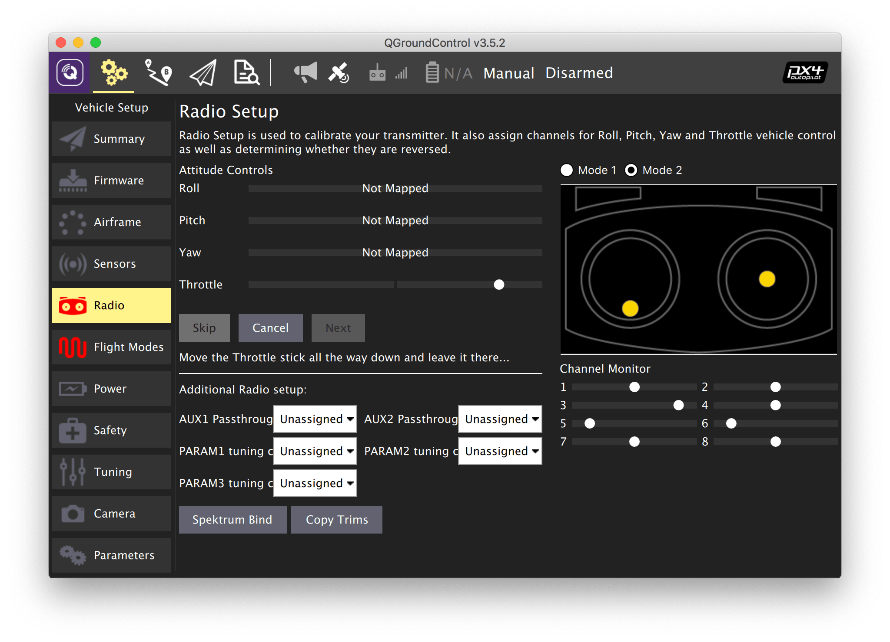

# Настройка пульта

Перед подключением и калибровкой пульта убедитесь, что:

* К коптеру не подключено внешнее питание АКБ.
* Пропеллеры не установлены на моторах.

## Подключение пульта

1. Зайдите во вкладку *Vehicle Setup* и выберите меню *Radio*.
2. Включите пульт, переводя переключатель *POWER* в верхнее положение.
3. Убедитесь, что связь с приемником установлена.

    На ЖК Экране пульта высвечивается индикация:

    

    Светодиод на приемнике должен гореть непрерывно красным. При наличии проблем с подключением читайте статью "[Неисправности радиоаппаратуры](radioerrors.md)".

## Калибровка пульта

1. Нажмите кнопку *Calibrate*.
2. Установите триммеры *Throttle*, *Yaw*, *Pitch*, *Roll* в 0.
   * Триммеры позволяют задавать смещение коптеру.
   * Чтобы установить один из триммеров в 0, необходимо на пульте переместить указатель в центр до длительного звукового сигнала (писка).
3. Нажмите *OK*.

    

4. Переведите левый стик (газа) в минимум и нажмите *Next*.
5. Повторяйте движения стиками вслед за анимацией и читайте подсказки.
6. При появлении надписи *"Move all transmitter switches and/or dials back and forth to their extreme positions"* переключите SwA. SwD, VrA, VrB в их конечные положения.
7. Нажмите *Next*.
8. При появлении надписи *"All settings have been captured. Click Next to write the new parameters to your board"* нажмите *Next*.

Дополнительная информация: https://docs.qgroundcontrol.com/en/SetupView/Radio.html.

**Далее**: [Настройка полетных режимов](modes.md).
