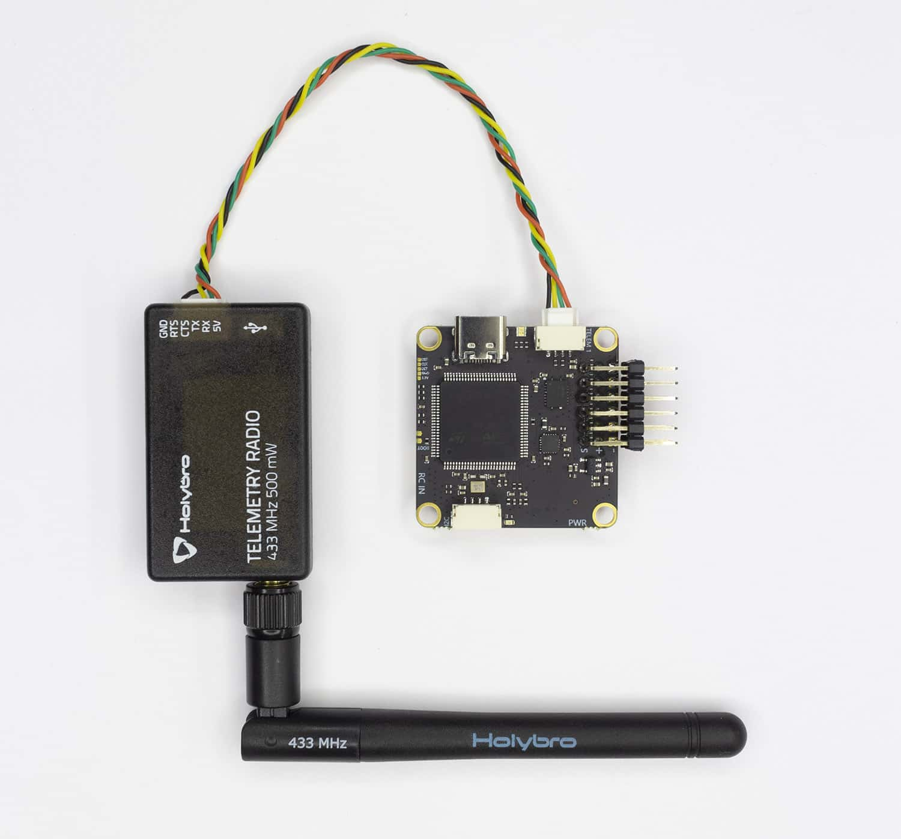

# Использование радио-телеметрии

Радиотелеметрийный приемник позволяет выполнять подключение к полетному контроллеру без использования USB-кабеля или Wi-Fi. 
Это особенно полезно при полетах с GPS в режиме автономных миссий, так как дальность действия радио-телеметрии намного выше, чем у Wi-Fi.

## Подключение радио-телеметрии

Комплект радио-телеметрии состоит из двух модулей, один из которых подключается к компьютеру, а другой - непосредственно к полетному контроллеру.

> **Caution** Перед использованием радио-телеметрии убедитесь, что на обоих модулях установлены антенны. Использование модуля без антенны может привести к выходу его из строя

Подключите один из модулей к разъему "Telem 1" полетного контроллера при помощи кабеля, который поставляется вместе с полетным контроллером.

Второй модуль подключите к компьютеру при помощи кабеля Micro-USB. Непрерывно горящий зеленый светодиод означает что связь между модулям установлена. 
Моргающий красный светодиод означает, что между модулями передаются данные.

Откройте QGroundControl. Если всё было подключено верно, связь с дроном должна установиться без каких-либо дополнительных действий.
