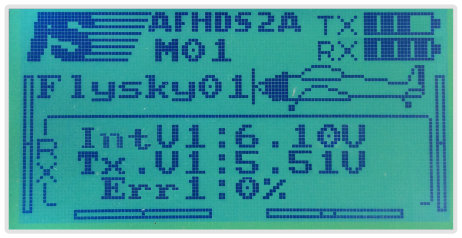

# Неисправности радиоаппаратуры

## Пульт заблокирован

Если пульт заблокирован, то на ЖК Экране будет отображено предупреждение: *Warning. Place all switches in their up position and lower the throttle*.

Для разблокировки пульта необходимо привести все стики и переключатели в исходное положение:

1. Левый стик (1) в центральной нижней позиции.
2. Переключатели A, B, C, D (2) в положение "от себя".
3. Правый стик (3) в центре.

## Нет связи с приемником

Для проверки соединения пульта с приемником, включите пульт и обратите внимание на индикацию на ЖК экране.

1. Соединение с приемником отсутствует:

    

2. Соединение с приемником установлено:

    

Если соединение отсутствует, то:

1. Проверьте, что приемник включен (моргает красный светодиод). Если светодиод горит непрерывно красным, то значит связь установлена с другим пультом.
2. Проведите процедуру сопряжения пульта и приемника.

## Нет связи с полетным контроллером

Если нет связи с полетным контроллером, то на экране монитора компьютера в окне *Channel Monitor* не будут отображаться изменения положения слайдеров при перемещении стиками пульта.

1. Зайдите в меню (удерживайте нажатой кнопку *ОК*).
2. Выберите меню *System setup* (Кнопки Up/Down - для навигации, кнопка *ОК* — подтверждение выбора.
3. Выберите *RX setup* > *PPM OUTPUT* > *“On*.
4. Сохраните изменения (удерживайте нажатой кнопку *CANCEL*).
