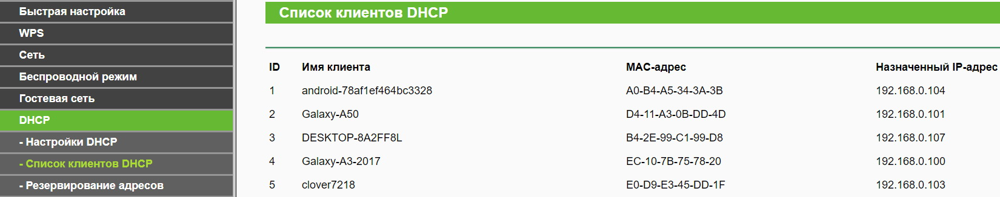

# Разработка системы для управления БПЛА с помощью шлема виртуальной реальности

[CopterHack-2021](copterhack2021.md), команда: **ProCleVeR**.

## Команда

- [Давыденко Галина](https://github.com/GalinaDa), e-mail: [galyadavydenko@yandex.ru](mailto:galyadavydenko@yandex.ru).

## Введение

Сейчас существует несколько способов управления квадрокоптером: первый и самый простой, управление через аппаратуру, у данного метода имеется несколько недостатков, управление идет до тех пор, пока человек может видеть квадрокоптер, или же пока не будет потерян сигнал. Второй способ – FPV, такое управление уже более удобно и наиболее распространено, по сравнению с предыдущим. В данном случае осуществляется не только управление коптером, но и также получения видео-изображения по дополнительному видео-каналу в режиме реального времени. Третий способ, автономный полет - позволяет БПЛА работать в среде, куда не проникает сигнал GPS и без оператора.

Рассмотрев все способы управления, я выявила, что похожим на систему, которую я разрабатываю, будет FPV. В моей разработке присутствует несколько компонентов, квадрокоптер, шлем виртуальной реальности и манипуляторы. И сравнив, то что я хочу получить в итоге и то что есть на данный момент, выявилось, что у моей разработки будут преимущества, например, как я считаю главным минусом FPV управления является то, что коптер не сможет летать на большие расстояния из-за сигнала аппаратуры.

## Разработка

Было принято решение делать систему такой: управление квадрокоптером будет проходить через манипуляторы, а также через шлем виртуальной реальности. Какое же управление идет через шлем? На шлем будет перенесен поворот квадрокоптера по рысканью. При помощи поворота головы, будет поворачиваться коптер.

## Настройка Clover OS

Настройка включает в себя переключение Raspberry из режима точки доступа в режим клиента. На начало работы была установлена [следующая операционная система](https://github.com/CopterExpress/clover). После установки можно было приступить непосредственно к настройкам системы. Как перевести Raspberry Pi в режим клиента, рассказывается в статье: [Настройка Wi-Fi](https://clover.coex.tech/ru/network.html). После того, как была произведена данная настройка Raspberry будет автоматически подключаться к Wi-Fi, после можно подключаться к Raspberry по SSH, также в дальнейшем подключение к Wi-Fi пригодится для подключения к серверу и передачи данных между клиентом и серверу (в разрабатываемой мной системе клиентом является квадрокоптер и сервером – компьютер).

## Подключение и проверка подключения

Для начала проверим и попробуем подключиться к Raspberry по сети Wi-Fi. Узнать подключается ли Raspberry, а также узнать его IP-address для дальнейшей работы. Подключаемся к маршрутизатору по локальному адресу 192.168.0.1, затем переходим к списку подключённых устройств и находим устройство с названием: cloverXXXX, где Х – любое число.



## Удаленное управление

Для дальнейшей работы, будет проходить несколько тестов. Первые два теста используют светодиоды. 1 – отправление и получение данных с проверкой на светодиоде. Данные отправляются с сервера и приходят клиенту, клиент также отправляет данные о своем состоянии серверу.

Для начала подключим библиотеку, используемую при работе со светодиодами – RPi.GPIO. Затем поле того как было получено сообщение от сервера, включаем(выключаем) светодиод, в строке мы будем указывать порт, к которому подключен светодиод, а также значение 1 или 0 в зависимости от того, что требуется сделать со светодиодом. Познакомится с программным управление светодиода можно познакомится здесь.

Далее рассмотрим вариант управлении непосредственно через среду Unity, которая и использовалась при разработке системы. Для данного теста было написано два кода один из низ написан на C# и является сервером в данном подключении, другой на Python – клиент.

Откроем соединение и подключимся к клиенту по протоколу ТСР при помощи следующих строк:

```csharp
IPEndPoint ipPoint = new IPEndPoint(IPAddress.Parse("192.168.0.107"), 9090);
socketServer = new Socket(AddressFamily.InterNetwork, SocketType.Stream, ProtocolType.Tcp);
socketServer.Bind(ipPoint);
```

Для прослушивания каналов используем метод:

```csharp
socketServer.Listen(10);
```

Так как потребуется начать асинхронную операцию, создадим объект асинхронных событий.

```csharp
SocketAsyncEventArgs  e = new  SocketAsyncEventArgs();
```

Для того, чтобы определить нажата ли клавиша, будем использовать следующее:

```csharp
Input.GetKey(KeyCode.Space)
```

Для отправки используем:

```csharp
socketClient.Send(Encoding.ASCII.GetBytes("1"));
```

Для  принятия  данных  используем:

```csharp
socketClient.Receive(Encoding.ASCII.GetBytes("1024"));
```

Видео демонстрации работоспособности результата:

<iframe width="560" height="315" src="https://www.youtube.com/embed/mBE2WYu0zOg" frameborder="0" allow="accelerometer; autoplay; encrypted-media; gyroscope; picture-in-picture" allowfullscreen></iframe>

## Отправка изображения и передача видео в среду Unity

Для начала будем отправлять пакет данных, который содержит в себе информацию: тип передаваемых данных и если это изображение, то его размер. Это делается потому, что клиент(квадрокоптер) помимо изображения будет отправлять данные, например, местоположение, заряд аккумулятора, мощность и так далее. Для этого, было необходимо различать пакеты. В программе это реализуется следующим образом:

```csharp
socketClient.Receive(buffer);
Array.Copy(buffer, 0, image, i, buffer.Length > size - i ? size - i : buffer.Length);
```

Для вывода изображения используем:

```csharp
Texture2D  tex = new  Texture2D(2, 2);
tex.LoadImage(image);
GetComponent<Renderer>().material.mainTexture = tex;
```

В свою очередь клиент отправляет изображение, которое предварительно загрузили на Raspberry.

Для определения размера передаваемого изображения используем:

```python
filesize = os.stat(filename).st_size
```

Пакуем  данные:

```python
d = struct.pack('>bI', 0, filesize)
```

Также для отправки данных может использоваться другой метод:

```python
s.sendall(bytes_read)
```

Перейдем к передаче видеопотока и его отображении:

Для вывода напишем следующие строчки кода:

```csharp
yield return new WaitWhile(() => socketClient.Available < size);
Debug.Log(socketClient.Available);
socketClient.Receive(image, 0, image.Length, SocketFlags.None);
Texture2D tex = new Texture2D(2, 2);
tex.LoadImage(image);
GetComponent<Renderer>().material.mainTexture = tex;
```

У клиента добавляем передачу видео с подключенной камеры:

```python
ret, frame = cam.read() # считываем изображения с камеры
result, frame = cv2.imencode('.jpg', frame, encode_param) # записываем в переменные нужные данные
client_socket.send(struct.pack("<bI", 1, size))
client_socket.sendall(frame)
```

Видеодемонстрация работоспособности результата:

<iframe width="560" height="315" src="https://www.youtube-nocookie.com/embed/1DCW51B4-7E" frameborder="0" allow="accelerometer; autoplay; clipboard-write; encrypted-media; gyroscope; picture-in-picture" allowfullscreen></iframe>

## Функции при управлении

- Индикация управления.

    <iframe width="560" height="315" src="https://www.youtube-nocookie.com/embed/amvE6X-MNOk" frameborder="0" allow="accelerometer; autoplay; clipboard-write; encrypted-media; gyroscope; picture-in-picture" allowfullscreen></iframe>

- Поворот квадрокоптера по рысканью при помощи шлема виртуальной реальности.

## Тестовые запуски системы

- Запуск без индикации.
- Запуск с индикацией.

<iframe width="560" height="315" src="https://www.youtube-nocookie.com/embed/buWxqovM0Rg" frameborder="0" allow="accelerometer; autoplay; clipboard-write; encrypted-media; gyroscope; picture-in-picture" allowfullscreen></iframe>
