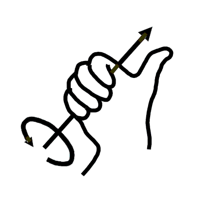

# Соглашения ROS

Чтобы упростить взаимодействие компонентов системы и избежать ошибок, ROS вводит определенное количество соглашений. Программная платформа, где возможно, Клевера соответствует этим соглашениями.

## Системы координат

Все системы координат в ROS должны быть правыми тройками векторов, то есть соответствовать [правилу правой руки](https://ru.wikipedia.org/wiki/Правило_буравчика). Положительное направление вращения вокруг оси определяется правилом буравчика.

## Единцы измерения

Основной REP: https://www.ros.org/reps/rep-0103.html.

Все ноды ROS должны (если возможно) использовать следующие единицы измерения во всех своих внешних интерфейсах.

### Основные единицы

|Наименование|Единица|
|------------|-------|
|Длина|метр|
|Масса|килограмм|
|Время|секунда|
|Сила тока|ампер|

### Производные единицы

|Наименование|Единица|
|------------|-------|
|Угол|радиан|
|Частота|герц|
|Сила|ньютон|
|Мощность|ватт|
|Напряжение|вольт|
|Температура|градус Цельсия|
|Магнитная индукция|тесла|

> **Hint** Распространенной ошибкой является попытка использования градусов в качестве единиц измерения углов в интерфейсах ROS. Правильным является использование [радианов](https://ru.wikipedia.org/wiki/Радиан).

**Далее**: [Продвинутое использование ROS](ros_advanced.md).
