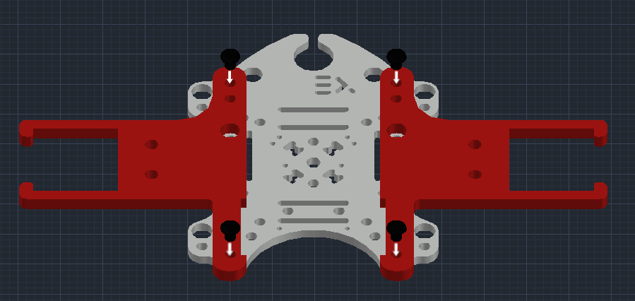
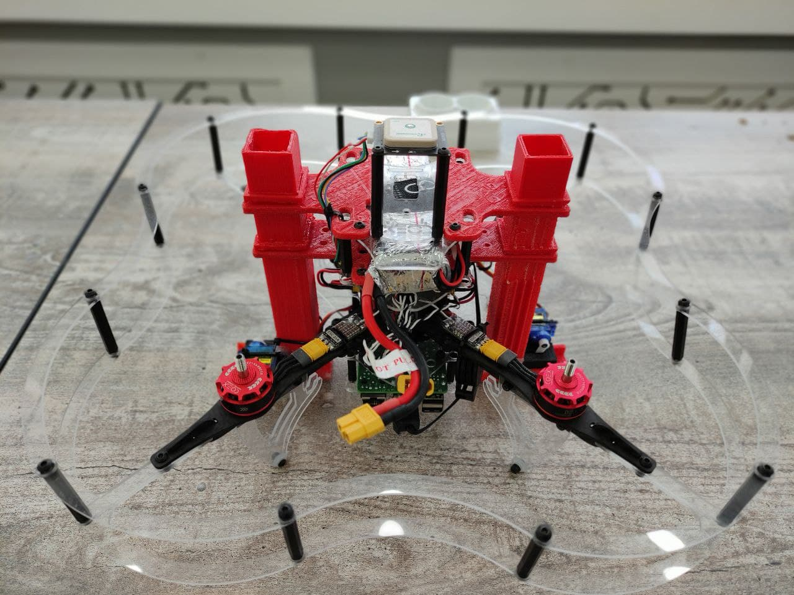
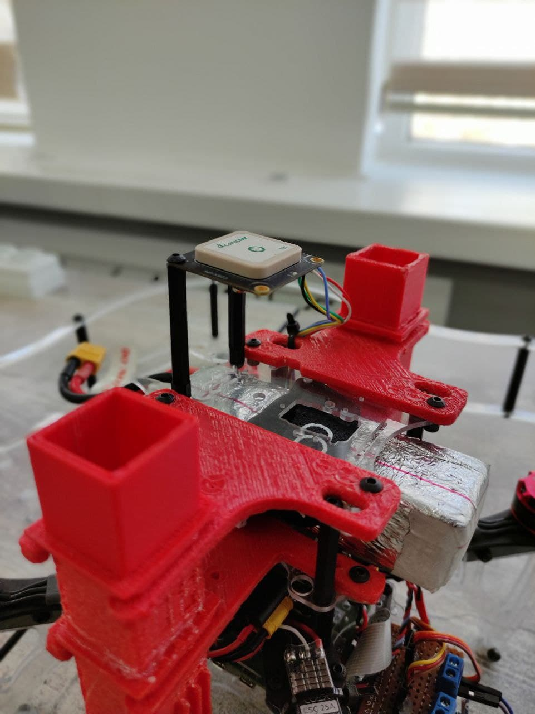
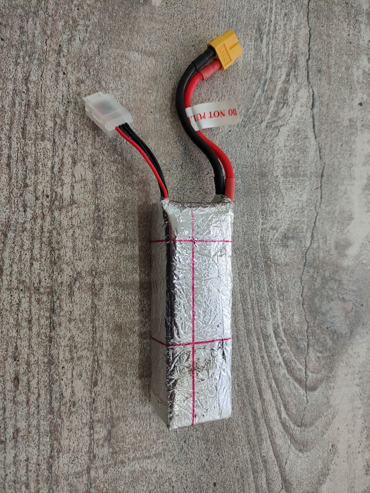

# Дрон для высаживания семян

[CopterHack-2021](copterhack2021.md), команда **MINIONS**.

Вы когда-нибудь задумывались, как будет выглядеть мир без деревьев? Закройте глаза и попробуйте представить себе безлюдную Землю. Деревья являются решающим фактором нашего существования не только потому, что они производят бумагу, пиломатериалы и жевательную резинку, но и потому, что они играют важную роль в углеродном цикле.

Со времени промышленной революции 1760–1840 годов мир пребывает в нескончаемом углеродном хаосе. Деревья и планктон - наши единственные спасители с точки зрения решения этой проблемы, и мы можем контролировать только одно из них - деревья.

Нам нужно спасать деревья, защищая их от разрушительной деятельности человека, такой как вырубка лесов, вырубка лесов в целях урбанизации и т. д. Деревья - легкие для земли. Это важная часть природной экосистемы. Они уравновешивают состав почвы, а также служат барьером для ветра и шторма. Таким образом, они обеспечивают различное использование экосистемы. По этим причинам крайне важно спасать деревья.

Поскольку существует множество опасных и труднодоступных участков для посадки людей, наиболее жизнеспособной альтернативой является использование дронов для посадки в этих регионах.

Как следует из названия, дроны, стреляющие семенами, будут стрелять семенами в плодородную почву, чтобы позволить миллионам деревьев вырасти снова после вырубки для промышленного использования. Если скорость посадки превышает скорость вырубки, в конечном итоге мы восстановим деревья, которые когда-то срубили.


## Наша цель

Мы сделаем дроны способными удерживать семена на борту и сбрасывать их в область, которую мы проехали в специальном приложении. Мы можем контролировать плотность семян и высоту капли. Мы также думали о защите семян от насекомых, животных и обезвоживания. Мы выбираем технику шара земли, изобретенную Масанобу Фукуока, также известную как Техника Фукуока. Этот земной шар содержит все необходимые элементы для выращивания, семена растений и землю для защиты. Когда мы бросаем его на землю, земной шар будет удерживать семена, пока он не получит необходимое количество воды, и семена не начнут прорастать.

Видео с YouTube:

<iframe width="560" height="315" src="https://www.youtube.com/embed/Nz1w59v451U" frameborder="0" allow="accelerometer; autoplay; clipboard-write; encrypted-media; gyroscope; picture-in-picture" allowfullscreen></iframe>

Нам удалось выполнить небольшие посевные миссии, но мы столкнулись с некоторыми проблемами, связанными с автономным полетом с GPS.

Мы покрыли нашу батарею, чтобы защитить ее от холода, посевные работы нужно начинать зимой, так как семена яблони должны оставаться в холодном месте в течение некоторого времени, чтобы акклиматизироваться.

- [Капсулы с семенами](#семенные-капсулы).
- [Как собрать высевающий механизм на дрон Clover 4.2](#как-собрать-высевной-механизм-на-дрон-clover-42).
- [Как управлять механизмом раздачи](#как-управлять-механизмом-высева).
- [Программирование](#программирование).

## Файлы

Ссылка на все файлы, используемые в этом проекте: [https://github.com/Sahinysf/TreeSeedQuad](https://github.com/Sahinysf/TreeSeedQuad).

## Капсулы с семенами

### Техника Фукуока

На юге Японии японский фермер и философ Масанобу Фукуока изобрел технику посадки семенных шариков. Этот метод считается естественной техникой земледелия, не требующей машин, химикатов и очень небольшого количества прополки. При использовании семенных шариков земля обрабатывается без какой-либо подготовки почвы.


### Преимущества семенных шариков

- Делать шарики с семенами проще и проще без использования машин.
- Легче для лесовосстановления и посадки на труднопроходимой местности
- Способствовать защите почвы, окружающей среды и средств к существованию
- Это органический метод, без использования каких-либо химикатов.
- Это недорогой метод по сравнению с традиционными методами облесения / лесовозобновления.
- Требует низких эксплуатационных расходов.

### Какие семена можно использовать?

Любое семя, которое растет в вашем районе (у нас это семя яблока).

Размер и вес семенной капсулы:

Размер и вес семенных коробочек очень важны для этого проекта. После некоторых экспериментов мы решили, что лучший размер - диаметр 16-18 мм, а максимальный вес - 10 грамм.

Необходимые материалы для изготовления семенных шариков:

1. 1 ведро глины;
2. 1 ведро органической темной почвы / компоста;
3. 1 ведро воды (количество воды может варьироваться в зависимости от типа почвы);
4. ¼ ведро семян.

Шаги по изготовлению семенных шариков:

<!-- markdownlint-disable MD044 -->

1. Соберите одинаковое количество глины и органической почвы. Например, если вы используете одно ведро глины, вам следует смешать его с одним ведром органической почвы.
2. Убедитесь, что глина и органические частицы почвы мелкие.
3. Текстура глины и органической почвы должна быть влажной, но не липкой.
4. Возьмите немного смеси и скатайте ее в шарики. Проверьте мяч, бросив его на плоскую поверхность. Если мяч не ломается легко, значит, у него хорошее сцепление.
5. Шарики с семенами должны быть идеально круглой формы, иначе они застрянут при броске квадрокоптером.
6. Вставьте семена (от 1 до 2 семян на семенной шарик для постоянных деревьев, таких как красное дерево, сандал, апельсин, моринга…) (± 5 семян на семенной шарик для овощей, цветов, трав, клевера…)
7. Сушите семенные шарики в течение одного-двух дней в затененном месте, если высохнуть должным образом, семенные шарики будут защищены от внешних хищников, таких как птицы, грызуны…

<!-- markdownlint-enable MD044 -->


Вторая техника - бумажные капсулы с семенами.

На этот метод повлияла корейская газета, в которой были семена, которые можно было посадить на улице после прочтения.
                                                                                                                            Бумажные капсулы с семенами:

Необходимые материалы:

1. любая бумага;
2. вода;
3. блендер;
4. семена.

Шаги по изготовлению шариков из бумаги:

1. Измельчение всей вашей бумаги,
2. Положите бумагу в блендер и добавьте воды, через 2 минуты перемешайте.
3. Выдавить всю воду бумагой,
4. Добавьте семена и придайте круглую форму.
5. Дайте высохнуть на ночь.


Преимущества бумажных шаров:

- легко найти материалы;
- экологически чистый.

## Как собрать высевной механизм для Clover 4.2

1. Установите нижние держатели бака на крепление верхней палубы и закрепите винтами M3x8.

    

2. Установите нейлоновую стойку (40 мм) с 4 сторон крепления для деки.

    

3. Установите поручень и закрепите винтами M3x8.

    

4. Установите верхние держатели бака на верхнее захватное крепление и закрепите винтами M3x8.

    

5. Осторожно подсоедините резервуары к держателям резервуаров.

    

6. Подсоедините серводвигатели SG90 к резервуару с помощью стяжки.

Окончательный вид сеялки дрона:



### Модуль GPS

Мы установили модуль GPS наверх, используя 2 нейлоновые стойки (40 мм).



Мы покрыли аккумулятор, чтобы защитить его от холода.



## Как управлять механизмом высева

Электронная часть механизма высева семян состоит из:

- Raspberry Pi 4 B из COEX Clover 4.
- 2 микро-серводвигателя SG90.
- PDB (блок распределения питания) COEX Clover 4.

Сигнальные контакты серводвигателя подключены к контактам 32 и 33 аппаратной ШИМ Raspberry Pi, а питание снимается с платы распределения питания (5 В).


### Пояснение кода для управления серводвигателями

Сервомоторы управляются с помощью сигнала ШИМ (широтно-импульсной модуляции) от Raspberry Pi. ШИМ контролирует количество времени, когда сигнал ВЫСОКИЙ или НИЗКИЙ в течение определенного периода времени. Рабочий цикл - процент времени, когда сигнал ВЫСОКИЙ.

В таблице ниже представлен рабочий цикл серводвигателя SG90 для каждого угла серводвигателя. Чтобы использовать рабочий цикл в коде, нам нужно преобразовать время в проценты, разделив время рабочего цикла на общий период ШИМ.

Что мы получаем:

- Угол поворота -90° или рабочий цикл 2 мс => 1/20 * 100% =  рабочий цикл 5%.
- Угол поворота 90° или рабочий цикл 2 мс => 2/20 * 100% = рабочий цикл 10%.
- Угол поворота 0° или рабочий цикл 1,5 мс => 1,5 / 20 * 100% = 7,5% рабочий цикл.


Мы сделаем это с помощью библиотеки RPi.GPIO и написания кода Python на Raspberry Pi.

Сначала импортируйте библиотеку RPi.GPIO и функцию сна:

```python
import RPi.GPIO as GPIO
from time import sleep
```

Затем установите режим GPIO как BOARD:

```python
servo = 33
GPIO.setmode(GPIO.BOARD)
GPIO.setup(servo, GPIO.OUT)
```

Далее создайте переменную для сервопривода ШИМ. Затем отправьте сигнал ШИМ 50 Гц на этот вывод GPIO с помощью функции GPIO.PWM(). Начните сигнал с 0.

```python
pwm=GPIO.PWM(servo, 50)
pwm.start(0)
```

Используйте функцию `ChangeDutyCycle()`, чтобы записать проценты рабочего цикла в серводвигатель.

```python
pwm.ChangeDutyCycle(5) # left -90 deg position
sleep(1)
pwm.ChangeDutyCycle(7.5) # neutral position
sleep(1)
pwm.ChangeDutyCycle(10) # right +90 deg position
sleep(1)
```

## Программирование

Чтобы миссия была достигнута наилучшим образом и в пределах нашей досягаемости, от нас требовалось использовать многопоточность в Python.

Простой код миссии.

```python
import threading
import time
import rospy
from clover import srv
from std_srvs.srv import Trigger
import RPi.GPIO as GPIO

rospy.init_node('flight')

get_telemetry = rospy.ServiceProxy('get_telemetry', srv.GetTelemetry)
navigate = rospy.ServiceProxy('navigate', srv.Navigate)
navigate_global = rospy.ServiceProxy('navigate_global', srv.NavigateGlobal)
set_position = rospy.ServiceProxy('set_position', srv.SetPosition)
set_velocity = rospy.ServiceProxy('set_velocity', srv.SetVelocity)
set_attitude = rospy.ServiceProxy('set_attitude', srv.SetAttitude)
set_rates = rospy.ServiceProxy('set_rates', srv.SetRates)
land = rospy.ServiceProxy('land', Trigger)

servo1 = 33        # PWM pins
servo2 = 32

GPIO.setmode(GPIO.BOARD)    #set pin numbering system

GPIO.setup(servo1,GPIO.OUT)
GPIO.setup(servo2,GPIO.OUT)

pwm1 = GPIO.PWM(servo1,50)    #create PWM instance with frequency
pwm2 = GPIO.PWM(servo2,50)

pwm1.start(0)        #start PWM of required Duty Cycle
pwm2.start(0)  


def servo_drop(seconds):   #function to drop seed capsules from 2 tanks
    print("Dropping")

    i = 1                           #variable to choose which tank
    for num in range(seconds/2):
        if(i == 1):                 #first tank
            pwm1.ChangeDutyCycle(10) # release one seed capsule
            time.sleep(0.5)
            pwm1.ChangeDutyCycle(5) # push then drop the capsule
            time.sleep(0.5)
            i = 2                   #changing the variable for to use the second tank in next dropping

        elif(i == 2):               #first tank
            pwm2.ChangeDutyCycle(10) # release one seed capsule
            time.sleep(0.5)
            pwm2.ChangeDutyCycle(5) # push then drop the capsule
            time.sleep(0.5)
            i = 1                   #changing the variable for to use the first tank in next dropping

        print(num)
        time.sleep(2)


if name == "main":
    # Take off and drone 10m above the ground
    navigate(x=0, y=0, z=10, frame_id='body', auto_arm=True)

    # rospy waits for 10 seconds to take off
    rospy.sleep(10)

    # Dropping starts simultaneuously with flying forwards 5 meters
    d = threading.Thread(target=servo_drop, args=(18,))  # 18 is the sum of all the time that the drone hovers after take off
    d.start()

    navigate(x=5, y=0, z=0, frame_id='body')

    #rospy waits for 8 seconds to fly foward
    rospy.sleep(8)

    # Fly right 1 m
    navigate(x=0, y=1, z=0, frame_id='body')

    #rospy waits for 2 seconds to fly right
    rospy.sleep(2)

    # Fly backward 5 m
    navigate(x=-5, y=0, z=0, frame_id='body')

    #rospy waits for 8 seconds to fly backward
    rospy.sleep(8)

    # Perform landing
    land()

pwm1.stop()
pwm2.stop()
GPIO.cleanup()
```

### Литература

- [Deforestation explained](https://www.nationalgeographic.com/environment/article/deforestation)
- http://www.fao.org/fileadmin/templates/rap/files/NRE/Forestry_Group/Landslide_PolicyBrief.pdf
- [Global Forest Change](https://earthenginepartners.appspot.com/)
- https://web.archive.org/web/20090115211020/http://www.rmaf.org.ph/Awardees/Biography/BiographyFukuokaMas.htm
- http://www.guerrillagarpting.org/ggseedbombs.html

## Разработано командой MINIONS

Особая благодарность Международному университету Ала-Тоо за финансирование наборов Clover 4.


