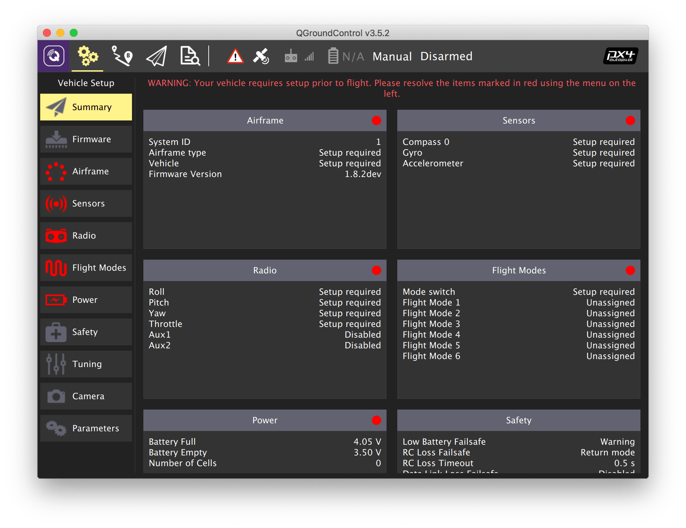

# Первоначальная настройка

## Установка QGroundControl

**QGroundControl** – программное обеспечение, необходимое для прошивки, настройки и калибровки полетного контроллера Клевера.

Скачайте и установите установочный файл для Windows/Linux/macOS с [официального сайта QGroundControl](http://qgroundcontrol.com/downloads/). В случае необходимости согласитесь с установкой дополнительных драйверов при установке.

См. также [основную документацию по QGroundControl](https://docs.qgroundcontrol.com/en/).

## MicroSD-карта

Подготовьте MicroSD-карту для полетного контроллера.

* Установите карту в компьютер (используйте адаптер при необходимости).
* Отформатируйте карту в файловую систему FAT32. Для этого кликните на значок SD-карты в "Проводнике" и нажмите "Форматирование" в Windows. Используйте "Дисковую утилиту" в macOS.
* Выполните "Безопасное извлечение" карты, извлеките карту.
* Установите карту в полетный контроллер.

## Загрузка прошивки в полетный контроллер

Основная статья: https://docs.qgroundcontrol.com/en/SetupView/Firmware.html.

> **Note** Перед осуществлением перепрошивки Pixracer не должен быть подключен к компьютеру по USB.

Для Клевера, в особенности для осуществления автономных полетов, рекомендуется использовать версию прошивки PX4 от Copter Express. Скачайте актуальную версию прошивки на GitHub — **<a class="latest-firmware v4" href="https://github.com/CopterExpress/Firmware/releases">скачать</a>**.

> **Info** Для квадрокоптеров с Pixhawk (Клевер 2) существует отдельная версия прошивки. Подробности смотрите в статье "[Прошивка полетного контроллера](firmware.md)".

Загрузите прошивку в полетный контролер:

1. Запустите программу QGroundControl.
2. Зайдите во вкладку *Vehicle Setup*.
3. Выберите меню *Firmware*.
4. Подключите Pixracer к компьютеру по USB.
5. Дождитесь подключения Pixracer к QGroundControl.
6. Выберите в меню справа *PX4 Flight Stack*.

Для загрузки прошивки от Copter Express (рекомендуется):

* Выберите *Advanced settings*.
* В выпадающем меню выберите *Custom firmware file...*
* Нажмите *OK* и выберите скаченный файл прошивки.

Для загрузки последней версии стандартной прошивки сразу нажмите *OK*.

Дождитесь, пока QGroundControl загрузит прошивку и выполнит перезагрузку полетного контроллера.

> **Warning** Не отключайте полетный контроллер от компьютера в процессе загрузки прошивки.

Дополнительную информацию о прошивке читайте в статье "[Прошивка Pixhawk](firmware.md)".

## Настройка полетного контроллера

> **Hint** Все дальнейшие настройки и калибровки полетного контроллера могут быть выполнены без проводов с применением [доступа к полетному контроллеру по Wi-Fi через Raspberry Pi](gcs_bridge.md).

Обзор главного окна настроек QGroundControl:

1. Параметры, нуждающиеся в настройке: *Airframe*, *Radio*, *Sensors*, *Flight Modes*.
2. Текущая прошивка контроллера.
3. Текущий полетный режим.
4. Сообщения об ошибках.

### Выбор рамы

1. Зайдите во вкладку *Vehicle Setup*.
2. Выберите меню *Airframe*.
3. Выберите тип рамы *Quadrotor X*.
4. Для Клевера 4 выберите подтипа рамы *COEX Clover 4*. В ином случае – *Generic Quadrotor X*.
5. Переместитесь в начало списка и нажмите кнопку *Apply and Restart*, подтвердите нажатием *Apply*.
6. Дождитесь применения настроек и перезагрузки полетного контроллера.

### Параметры

Для настройки параметров полетного контроллера войдите во вкладку *Vehicle Setup* и выберите меню *Parameters*. Вы можете использовать поле *Search* для поиска параметров по имени.

После установки параметра необходимо нажать кнопку *Save*. При необходимости – перезагрузить полетный контроллер, нажав кнопку *Tools*, затем *Reboot vehicle*.

#### Настройка PID-регуляторов

> **Info** Использование типа рамы *COEX Clover 4* не требует ввода коэффициентов PID.

##### Усредненные коэффициенты PID для Клевера 4

* `MC_PITCHRATE_P` = 0.087
* `MC_PITCHRATE_I` = 0.037
* `MC_PITCHRATE_D` = 0.0044
* `MC_PITCH_P` = 8.5
* `MC_ROLLRATE_P` = 0.087
* `MC_ROLLRATE_I` = 0.037
* `MC_ROLLRATE_D` = 0.0044
* `MC_ROLL_P` = 8.5
* `MPC_XY_VEL_P` = 0.11
* `MPC_XY_VEL_D` = 0.013
* `MPC_XY_P` = 1.1
* `MPC_Z_VEL_P` = 0.24
* `MPC_Z_P` = 1.2

##### Усредненные коэффициенты PID для Клевера 3

* `MC_PITCHRATE_P` = 0.145
* `MC_PITCHRATE_I` = 0.050
* `MC_PITCHRATE_D` = 0.0025
* `MC_ROLLRATE_P` = 0.145
* `MC_ROLLRATE_I` = 0.050
* `MC_ROLLRATE_D` = 0.0025

> **Hint** Необходимо учитывать, что для идеального полета параметры PID-регуляторов подбираются вручную для каждого конкретного собранного квадрокоптера. Вы можете узнать больше об этом в статье "[Настройка PID-регуляторов](pid_tuning.md)".

#### Параметры Circuit breaker

1. Чтобы коптер мог летать с подключением по USB, установите параметр `CBRK_USB_CHK` в 197848.
2. Отключите проверку Safety Switch: `CBRK_IO_SAFETY` = 22027.

**Далее**: [Калибровка датчиков](calibration.md).
