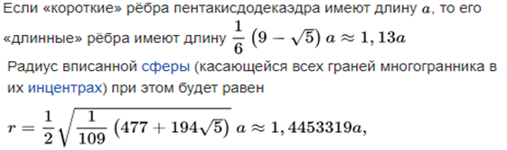
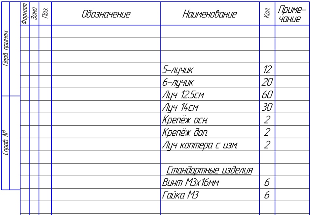
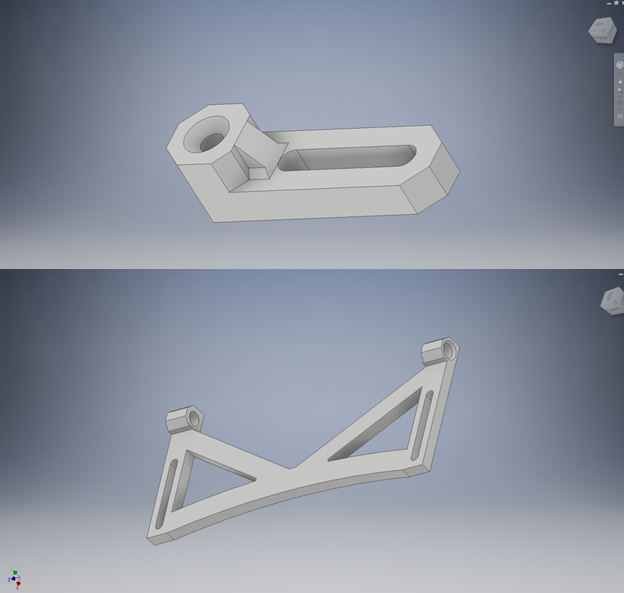
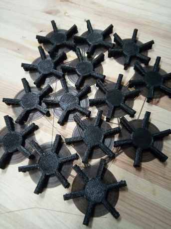
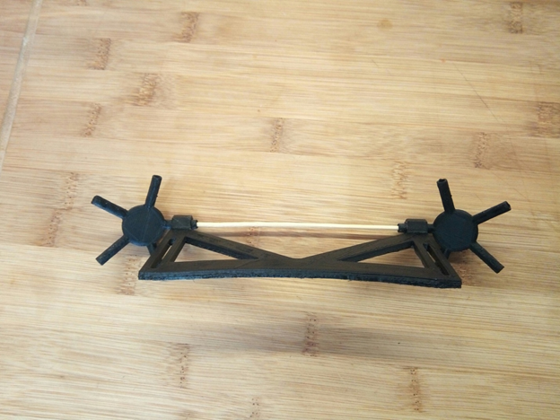
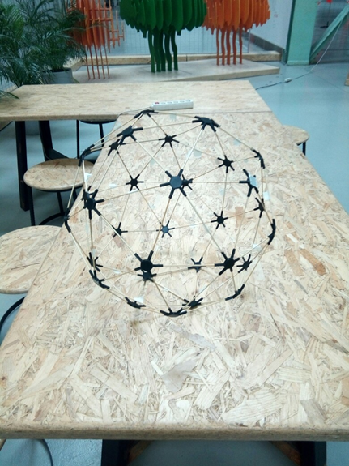
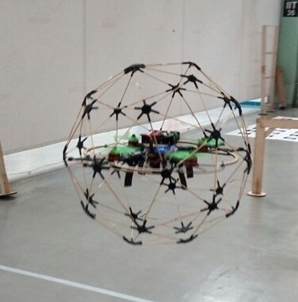

# Шаровая защита коптера

## Введение

Наверное, летать в помещениях приходилось каждому, кто брал в руки коптер. Подобные полеты сопряжены с немалым риском повредить коптер о стены и различные предметы. Даже полеты на относительно больших пространствах связаны с рисками удариться о препятствие: на пути коптера может встать ствол дерева или здание — что уж говорить о полетах в замкнутых пространствах. Подобные «краш-тесты» не очень приятный момент, который может оказаться в лучшем случае причиной потери внушительной суммы денег на ремонт, а в худшем — и вовсе утраты коптера. Тем более неприятны такие ситуации для новичка, который не может своевременно увернуться от препятствия и только учится летать.

Это все подвигло нас к поиску решений. К сожалению, перерыв весь интернет, мы не нашли достаточно легкого и простого в изготовлении решения для простых пользователей, а главное — такого, которое будет всем по карману. Например, защита по контуру пропеллеров неплохо предохраняет сами пропеллеры, но при малейшем касании о препятствие коптер переворачивается и падает. В общем, защита либо не оберегала коптер полностью, либо выглядела несуразно и была слишком узко доступна.

Нами было принято сложное решение: придется делать ее полностью самим и почти с нуля, а также поставлена цель сделать ее простой в изготовлении и максимально легкой.

## Разработка

В результате поиска решения, удовлетворяющего всем нашим требованиям, мы остановились на нескольких схожих вариантах. Было решено сделать защиту в форме полуправильного многогранника (примерами могут служить фуллерен, молекула углерода, или фигура пентакисдодекаэдр) — его мы и выбрали как самый приятный глазу. Кроме того, такая защита легко масштабируема под нужный размер.

При создании такой фигуры используются два вида ребер (далее — лучей): короткие и длинные, их длины рассчитываются исходя из нужного диаметра вписанной в многогранник сферы. Для лучшего понимания я вставлю все необходимые формулы ниже из «Википедии».

С угловыми соединениями (фитингами), тоже не все просто: их также два вида — с пятью гранями при вершине (пять лучей исходят из вершины) и с шестью гранями (шесть лучей исходят из вершины).

## Первые модели

Была составлена спецификация для удобства контроля процесса изготовления, и мы приступили к моделированию.

Сделав несложные расчеты под нужные размеры, мы построили модели в Inventor CAD.

В ходе проектирования мы столкнулись с проблемами в моделировании угловых соединений, но они были решены упрощением конструкции, а разность углов компенсируется гибкостью материалов. Таким образом, все соединения сидят в небольшом натяге.

(Элементы крепления защиты к корпусу)

## Материалы

В ходе проектирования встал вопрос, из чего же все-таки сделать такую защиту, чтобы получилось легко и прочно. Ответ пришел, как всегда, совершенно неожиданно. На глаза попались шпажки из бамбука: они достаточно тонкие, чтобы не повлиять на аэродинамику, имеют достаточную гибкость и при этом достаточно прочные. Далее возник вопрос, из чего и как делать фитинги. Конечно же, 3D-печать! 3D-принтер — это вообще незаменимая вещь, тем более для тех, кто любит что-то делать сам. К тому же они из-за не самой высокой цены получили достаточно широкое распространение. На таком принтере можно делать изделия почти любой сложности. То, что надо!

Готовые модели переводим в .stl, закидываем в слайсер (в нашем случае — Cura), вводим настройки под конкретный принтер и пластик и ставим на печать.

Для уменьшения веса был выбран ABC-пластик как один из самых легких и доступных.

Шпажки были порезаны на расчетные длины и подготовлены к последующей работе.

## Сборка и установка

После того как все было напечатано и порезано, настало время собирать защиту.

Сборка здесь самый ответственный момент, так как требует специального алгоритма.

Из пятилучевого фитинга выходят только короткие лучи, в то время как из шестилучевого — только каждая вторая длинная.

Сборка:

1. Вначале собираем все пятилучевые вершины.
2. На каждый луч, исходящий из пятилучевой вершины, надеваем шестилучевую.
3. Соединяем между собой шестилучевые фитинги длинными шпажками.
4. Присоединяем уже собранные пятилучевые вершины к шестилучевым, учитывая, что в шестилучевом фитинге короткие и длинные лучи чередуются.
5. Повторяем процесс для каждой пятилучевой вершины, пока шар не соберется.

После сборки разделяем шар на две полусферы, устанавливаем крепления на коптер, смотрим, что все подходит.

(Пример установки креплений)

Теперь полусферы можно проклеивать. Между собой полусферы не склеиваются — это нужно для установки коптера внутрь. Мы в качестве клея использовали растворитель для пластиков «Дихлорэтан», но с тем же успехом можно использовать и любой быстросохнущий клей для полимеров.

После высыхания защита готова к установке и первым пробным полетам!

(Пока еще без креплений)

## Первые полеты

Мы делали защиту под коптер «Клевер 2», являющийся обучающим пособием по сборке и настройке квадрокоптеров, и на него она устанавливается без доработок. Защита весит на 70 г больше (139 грамм), чем стандартная, и на управляемость и время полета почти не влияет.

Отдельно стоит сказать, что излишние вибрации, если таковые имеются, можно убрать путем более жесткого крепления защиты к коптеру.

В итоге получилась необычная защита для коптера с небольшим весом и интересным дизайном, открывающая новые горизонты для полетов в тех местах, где летать для коптера раньше было опасно.
