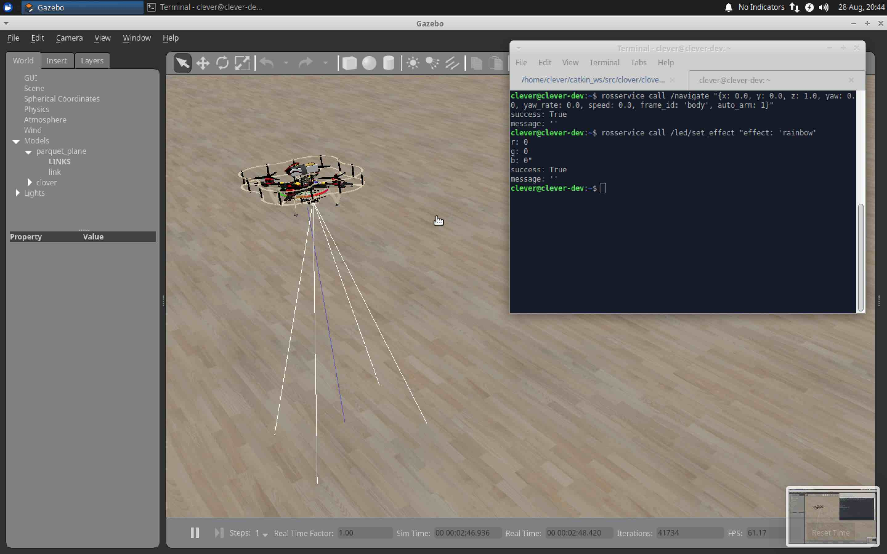

# Симулятор

Среда симуляции Клевера позволяет пользователям запускать и отлаживать свой код в симуляторе, используя большинство функций, доступных на реальном дроне. Симулятор использует [режим PX4 SITL](sitl.md) и тот же код, использующий ROS, что и настоящий дрон. Большинство железа также симулируется.

## Особенности

Устанавливаемая пользователем среда включает в себя:

* высококачественную модель Клевера 4;
* плагины Gazebo для железа Клевера (например, для светодиодной ленты);
* легко изменяемые файлы описания дрона в формате [`xacro`](https://wiki.ros.org/xacro);
* примеры моделей и миров;
* [`roslaunch`](https://wiki.ros.org/roslaunch) файлы для быстрого запуска и настройки.

Кроме того, предоставляется [образ виртуальной машины](simulation_vm.md), который максимально точно имитирует реальный дрон.

Особенности:

* легкий доступ к симулятору;
* установлен и настроен для работы с ROS Visual Studio Code;
* веб-сервер (Monkey) для плагинов Клевера, работающих в браузере;
* постоянно работающий сервис `roscore`;
* средства визуализации (`rviz`, `rqt`).

## Состав симулятора

Симулятор основан на следующих элементах:

* [Gazebo](http://gazebosim.org/), универсальная среда симуляции для любых типов роботов;
* [PX4](https://px4.io/), в частности, его компонент SITL (software-in-the-loop);
* [`sitl_gazebo`](https://github.com/PX4/sitl_gazebo) пакет, содержащий плагины Gazebo для PX4;
* пакеты ROS и плагины Gazebo;

<!-- TODO: Write more, add a diagram, etc -->

## Видео

Краткий видеообзор симулятора:

<iframe width="560" height="315" src="https://www.youtube.com/embed/8HYXREMDfzQ" frameborder="0" allow="accelerometer; autoplay; encrypted-media; gyroscope; picture-in-picture" allowfullscreen></iframe>
