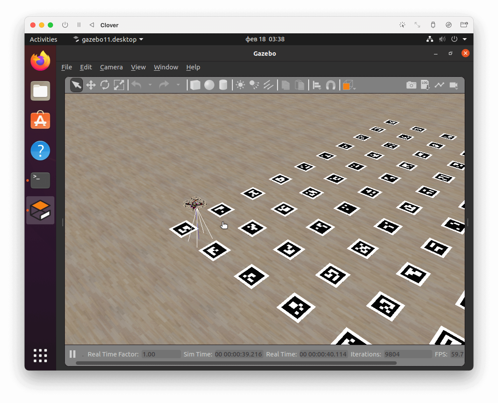
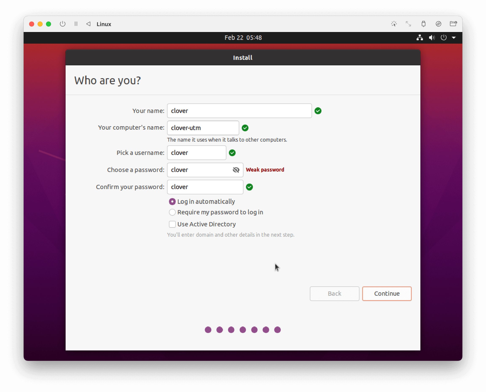

# Симулятор на компьютерах с чипом M1

Для архитектуры ARM64, которую используют компьютеры с чипом M1 (Apple Silicon), [готовый образ с симулятором](simulation_vm.md) не выпускается, поэтому возможна только ручная установка симулятора.

В качестве виртуальной машины рекомендуется использовать бесплатное приложение [**UTM**](https://mac.getutm.app/). Также возможно использование **VMware Fusion Public Tech Preview** с поддержкой M1.

## Установка симулятора с UTM



1. Скачайте UTM с официального сайта [mac.getutm.app](https://mac.getutm.app/) и установите его.
2. Скачайте исходный образ установщика Ubuntu 20.04 для архитектуры ARM64 по ссылке: https://clovervm.ams3.digitaloceanspaces.com/focal-desktop-arm64.iso.
3. Создайте новую виртуальную машину в UTM, выбирая следующие настройки:

    * **Тип**: Virtualize.
    * **Operating System** (ОС): Linux.
    * **Boot ISO Image** (образ для загрузки): выберите скаченный образ `focal-desktop-arm64.iso`.
    * **Memory** (память): 4096 MB или более.
    * **CPU Cores** (ядра процессора): 4 или более.
    * Включите поддержку OpenGL: *Enable hardware OpenGL acceleration*.
    * **Storage** (размер хранилища): 20 GB или более.

4. Запустите созданную виртуальную машину.
5. Выберите пункт *Install Ubuntu* и установите Ubuntu с помощью мастера установки.

    * Рекомендуемый набор ПО: *Minimal installation*.
    * Тип установки: *Erase disk and install Ubuntu*.
    * Введите параметры учетной записи по желанию, например:

        

6. Завершите установку и запустите установленную систему (для этого потребуется извлечь виртуальный CD-диск или выбрать *Boot from next volume* в меню загрузки).
7. Установите симулятор согласно [инструкции по сборке симулятора на собственной машине](simulation_native.md).

### Возможные проблемы при установке

#### Отсутствие картинки

Если при запуске виртуальной машины вместо изображения вы видите черный фон, попробуйте запустить машину с отключенной поддержкой GPU.

В настройках виртуальной машины выберите *Display*, в пункте *Emulated Display Card* выберите *virtio-ramfb*. Запустите машину. При успешном запуске поменяйте настройку обратно на *virtio-ramfb-gl (GPU Supported)* и снова запустите машину.

#### Проблема с `git clone`

При осуществлении команды `git clone` может возникнуть подобная ошибка:

```txt
on git clone if error: RPC failed; curl 56 GnuTLS recv error (-54): Error in the pull function.
fatal: the remote end hung up unexpectedly
fatal: early EOF
fatal: index-pack failed
```

В этом случае поменяйте типа сетевой карты на Bridged. В настройках виртуальной машины выберите *Network*, в пункте *Network Mode* выберите *Bridged (Advanced)*.

В дальнейшем, при возникновении проблем с сетью измените тип сети обратно на *Shared Network*.
