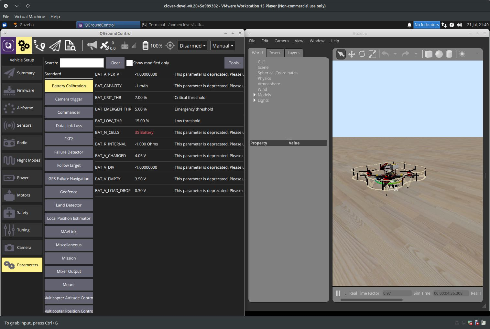
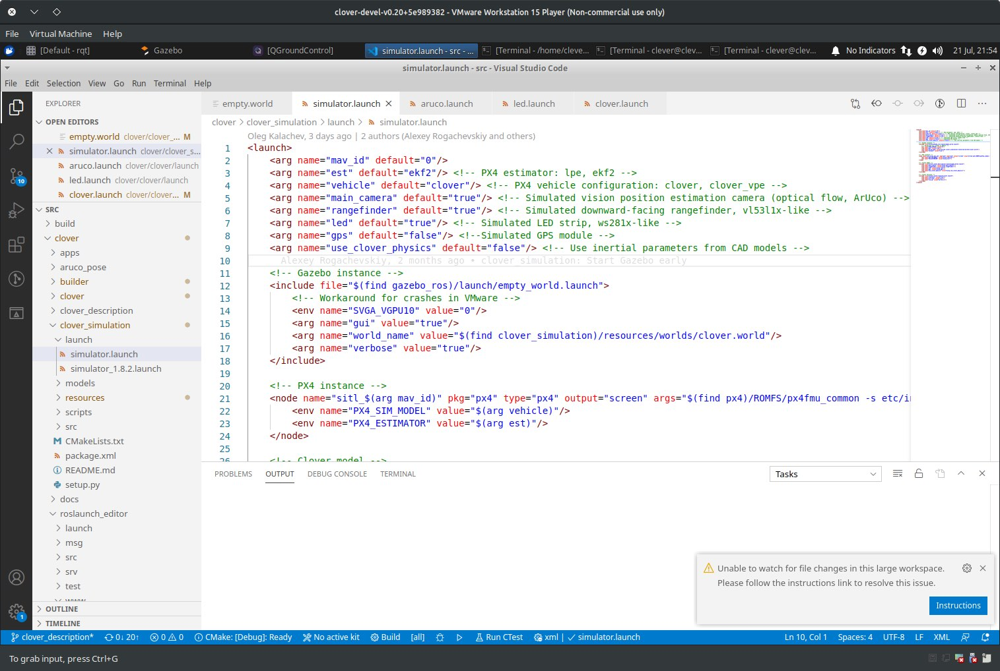

# Использование симулятора

Среда симуляции Клевера позволяет пользователям тестировать свой код без какого-либо риска повреждения оборудования. Кроме того, [виртуальная машинная](simulation_vm.md) среда имеет дополнительные (не относящиеся к ROS) сервисы, которые присутствуют на реальном дроне, например веб-сервер Monkey.

## Запуск симулятора

После [сборки симулятора с нуля](simulation_native.md) или [запуска виртуальной машины](simulation_vm.md), вы можете использовать `roslaunch` для запуска симулятора Gazebo:

```bash
# Не забудьте сначала активировать вашу рабочую область
source ~/catkin_ws/devel/setup.bash
roslaunch clover_simulation simulator.launch
```

> **Note** Кроме того, если вы используете виртуальную машину, просто дважды щелкните `Gazebo PX4` на рабочем столе.  

Это запустит Gazebo сервер и клиент, бинарные файлы PX4 и ноды Клевера. Терминал, в котором была запущена команда, будет отображать отладочные сообщения от нод и PX4, а также принимать входные данные для интерпретатора команд PX4:


Вы также можете использовать QGroundControl для настройки параметров дрона в симуляторе, планирование миссий полета (если GPS также симулируется) и управление дроном с пульта:



Также вы можете использовать [simplified OFFBOARD](simple_offboard.md) для управления дроном, и средства визуализации ROS, например, [rviz and rqt](rviz.md) для анализа состояния дрона:


## Настройка симулятора

Симулятор можно настроить, передав дополнительные аргументы команде `roslaunch` или изменив файл `~/catkin_ws/src/clover/clover_simulation/launch/simulator.launch`. Ноды, обеспечивающие [распознавание ArUco](aruco.md), [расчет optical flow](optical_flow.md) и другие сервисы могут быть настроены изменением соответствующих `.launch` файлов, как на реальном дроне.

### Изменение параметров дрона



Вы можете включить или отключить некоторые датчики дрона, изменив параметры в файле `simulator.launch`. Например, чтобы включить GPS, установите аргумент `gps` в значение `true`:

```xml
    <arg name="gps" value="true"/>
```

Обратите внимание, что это просто включит датчик, вам придется также изменить параметры PX4.

Если вы хотите добавить датчики или изменить их расположение, вам придется изменить файл описания дрона. Этот файл находится в `~/catkin_ws/src/clover/clover_description/urdf/clover/clover4.xacro`, и использует формат [xacro](http://wiki.ros.org/xacro) для сборки описания URDF.

### Изменение мира по умолчанию

Плагины Gazebo для дрона на данный момент требуют, чтобы значение параметра мира `real_time_update_rate` было равно 250, а значение `max_step_size` было равно 0.004. С другими параметрами симулятор не заработает. Используйте файл `~/catkin_ws/src/clover/clover_simulation/resources/worlds/clover.world` как шаблон.
