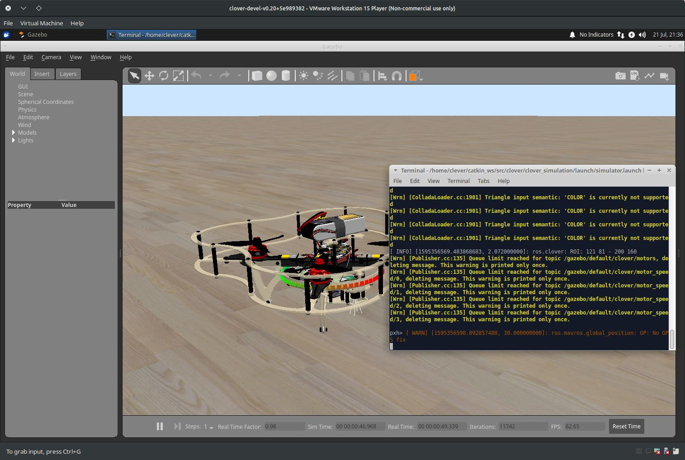
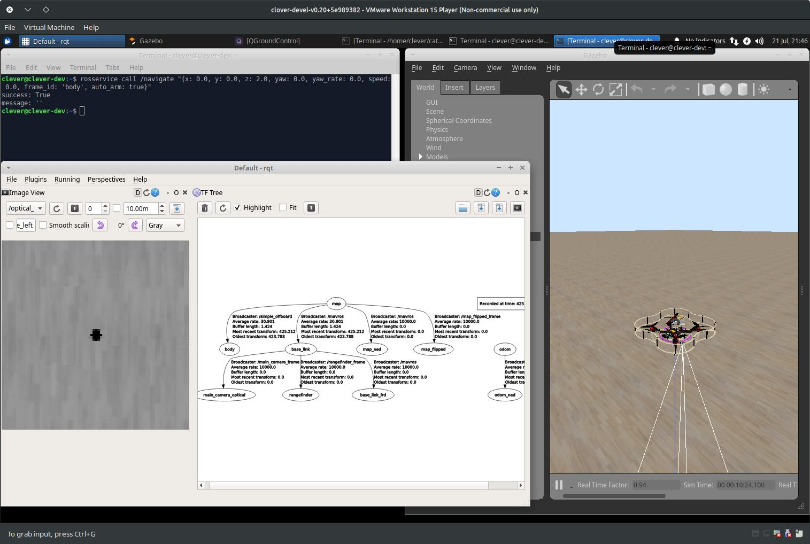
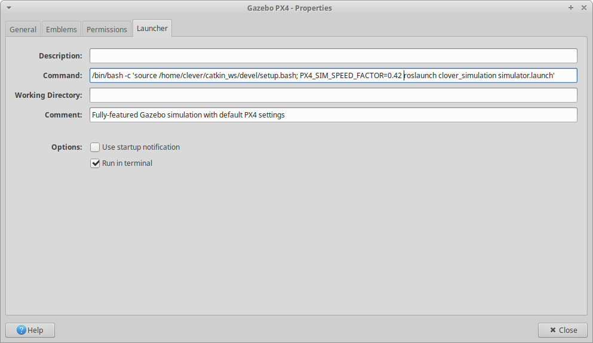

# Использование симулятора

Среда симуляции Клевера позволяет пользователям тестировать свой код без какого-либо риска повреждения оборудования. Кроме того, в [виртуальной машине](simulation_vm.md) по умолчанию запущены дополнительные (не относящиеся к ROS) сервисы, которые присутствуют на реальном дроне, например, веб-сервер Monkey.

## Запуск симулятора

После [сборки симулятора с нуля](simulation_native.md) или [запуска виртуальной машины](simulation_vm.md), вы можете использовать `roslaunch` для запуска симулятора Gazebo:

```bash
# Не забудьте сначала активировать ваше рабочее пространство
source ~/catkin_ws/devel/setup.bash
roslaunch clover_simulation simulator.launch
```

> **Note** Кроме того, если вы используете виртуальную машину, просто дважды щелкните `Gazebo PX4` на рабочем столе.

Это запустит Gazebo сервер и клиент, бинарные файлы PX4 и ноды Клевера. Терминал, в котором была запущена команда, будет отображать отладочные сообщения от нод и PX4, а также принимать входные данные для интерпретатора команд PX4:



Вы также можете использовать QGroundControl для настройки параметров дрона в симуляторе, планирование миссий полета (если GPS также симулируется) и управление дроном с пульта:


Также вы можете использовать [simplified OFFBOARD](simple_offboard.md) для управления дроном, и средства визуализации ROS, например, [rviz and rqt](rviz.md) для анализа состояния дрона:



## Конфигурация симулятора

Симулятор можно настроить, передав дополнительные аргументы команде `roslaunch` или изменив файл `~/catkin_ws/src/clover/clover_simulation/launch/simulator.launch`. Ноды, обеспечивающие [распознавание ArUco](aruco.md), [расчет optical flow](optical_flow.md) и другие сервисы могут быть настроены изменением соответствующих `.launch` файлов, как на реальном дроне.


### Включение GPS

GPS датчик необходим полетов с использованием глобальных координат, а также для использования [полетных миссий](https://docs.px4.io/master/en/flight_modes/mission.html).

Чтобы включить GPS, установите аргумент `gps` в файле `simulator.launch` в значение `true`:

```xml
<arg name="gps" value="true"/>
```

### Камера

При полете по GPS камера может быть не нужна, ее также можно отключить в файле `simulator.launch`:

```xml
<arg name="main_camera" default="false"/>
```

### Другие датчики

Для того, чтобы добавить датчики или изменить их расположение, необходимо изменить файл описания дрона. Этот файл находится в `~/catkin_ws/src/clover/clover_description/urdf/clover/clover4.xacro` и использует формат [xacro](http://wiki.ros.org/xacro) для сборки описания URDF.

### Изменение мира по умолчанию

Плагины Gazebo для дрона на данный момент требуют, чтобы значение параметра мира `real_time_update_rate` было равно 250, а значение `max_step_size` было равно 0.004. С другими параметрами симулятор не заработает. Используйте файл `~/catkin_ws/src/clover/clover_simulation/resources/worlds/clover.world` как шаблон.

## Повышение производительности

Симуляция с использованием Gazebo требовательна к ресурсам, и для нормальной скорости работы требуются мощный процессор и видеокарта. При этом симуляции можно запускать и на менее мощном оборудовании, жертвуя при этом скоростью работы. Ниже приведены рекомендации для компьютеров, на которых симуляция не может работать в реальном времени.

### Использование плагина `throttling_camera`

По умолчанию Gazebo не замедляет симуляцию для достижения требуемой частоты работы визуальных сенсоров. Это можно исправить с помощью плагина `throttling_camera` из пакета `clover_simulation`.

Включение этого плагина происходит путём выставления параметра `maintain_camera_rate` в значение `true` в файле `clover_description/launch/spawn_drone.launch`:

```xml
    <!-- Slow simulation down to maintain camera rate -->
    <arg name="maintain_camera_rate" default="true"/>
```

Этот плагин будет собирать статистику по частоте публикации изображений, и будет замедлять симуляцию до тех пор, пока частота публикации не станет соответствовать или превышать требуемую. При этом значительные замедления симуляции могут негативно сказаться на программном обеспечении, которое подключается к PX4 (например, QGroundControl). Если скорость симуляции опускается ниже, чем 0.5 от реального времени, следует воспользоваться следующей рекомендацией.

### Выставление скорости симуляции

PX4, начиная с версии 1.9, поддерживает [принудительную установку скорости симуляции](https://dev.px4.io/v1.9.0/en/simulation/#simulation_speed) с помощью переменной окружения `PX4_SIM_SPEED_FACTOR`. Выставление этой переменной подготавливает все компоненты симулятора к соответствующему ускорению/замедлению.

Значение этой переменной должно соответствовать величине Real Time Factor (скорости симуляции по отношению к реальному времени), получаемой при использовании `throttling_camera`. Величина Real Time Factor отображается в окне Gazebo на нижней панели:


В данном случае `PX4_SIM_SPEED_FACTOR` следует выставить в значение `0.42` перед запуском симулятора:

```bash
PX4_SIM_SPEED_FACTOR=0.42 roslaunch clover_simulation simulator.launch
```

> **Note** При использовании виртуальной машины удобнее добавить эту переменную в ярлык запуска Gazebo на рабочем столе. Нажмите правой кнопкой на значок Gazebo, выберите "Properties..." и добавьте `PX4_SIM_SPEED_FACTOR=0.42` в поле Command, как показано на иллюстрации:


### Выделение ресурсов для виртуальной машины

Выделение нескольких процессорных ядер для виртуальной машины может значительно повысить производительность симуляции. В наших испытаниях виртуальная машина, для которой было выделено одно ядро, не позволяла работать в симуляторе: окно Gazebo не реагировало на пользовательский ввод, сообщения ROS терялись. После выделения четырёх ядер для этой же виртуальной машины симуляция стала работать со скоростью 0.25 от реального времени.

При этом не следует пытаться выделить для виртуальной машины больше ресурсов, чем доступно на основной системе.
