# Установка виртуальной машины

Для работы с платформой Клевер рекомендуется иметь [установленное окружение ROS](ros.md) на своём компьютере. К сожалению, [установка ROS и симулятора](simulation_native.md) сопряжена с рядом трудностей: требуется использовать операционную систему Ubuntu 20.04, процесс установки длительный и требует выполнения большого количества команд в терминале.

Для облегчения процесса настройки окружения мы предлагаем использовать виртуальную машину со всем необходимым для работы с платформой Клевер. В состав виртуальной машины входят:

* операционная система Ubuntu 20.04 с легковесной графической оболочкой XFCE;
* предустановленные пакеты ROS для работы с Клевером;
* QGroundControl;
* предварительно настроенный симулятор Gazebo;
* среда разработки Visual Studio Code с плагинами для разработки на Python и C++.

> **Info** Имя пользователя по умолчанию на виртуальной машине - `clover`, пароль - `clover`.

Виртуальная машина может использоваться как для запуска симуляторов, так и для работы с настоящим дроном.

## Скачивание

Скачать текущую версию виртуальной машины можно [в релизах репозитория виртуальной машины](https://github.com/CopterExpress/clover_vm/releases/latest).

## Установка виртуальной машины

Для запуска виртуальной машины разработчика требуется использовать одну из совместимых сред виртуализации: [VirtualBox](https://www.virtualbox.org/wiki/Downloads), [VMware Player](https://www.vmware.com/products/workstation-player.html), [VMware Workstation](https://www.vmware.com/products/workstation-pro.html).

Убедитесь, что поддержка аппаратной виртуализации включена в настройках BIOS/UEFI вашего компьютера (виртуалиазция может поддерживаться, но может быть отключена по умолчанию).


Шаги для включения аппаратной виртуализации, как правило, описаны в руководстве пользователя компьютера. Проконсультируйтесь с производителем компьютера, если включить виртуализацию не получается.

### Настройка виртуальной машины в среде VMware Player

1. Импортируйте архив виртуальной машины в среду виртуализации. Для VMware Player используйте опцию **Open a Virtual Machine**:

    

    > **Note** При импорте архива, скорее всего, появится окно с предупреждением о формате виртуальной машины:
    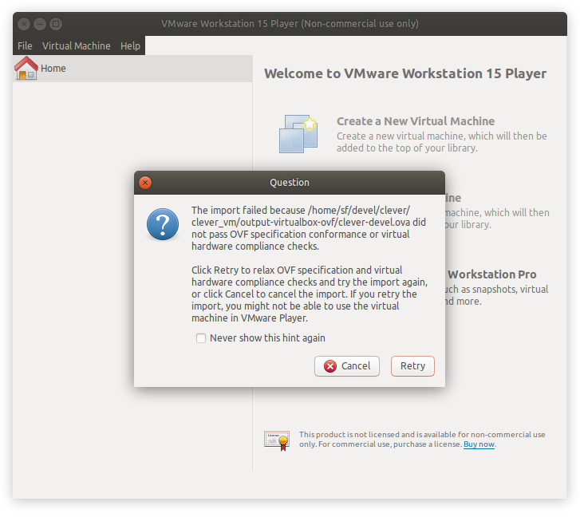
    Это предупреждение можно игнорировать и нажать кнопку **Retry**.

2. Откройте окно настроек виртуальной машины и измените параметры для наилучшего соответствия основной системе:

    * увеличьте объём оперативной памяти, отводимый для виртуальной машины:
    
    * увеличьте количество доступных процессорных ядер:
    
    * включите 3D-ускорение:
    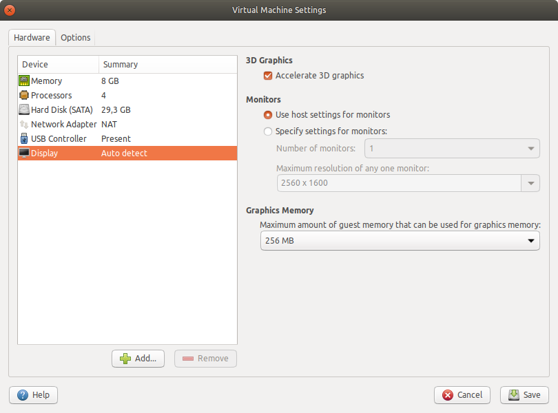
    * включите использование USB 2.0/3.0:
    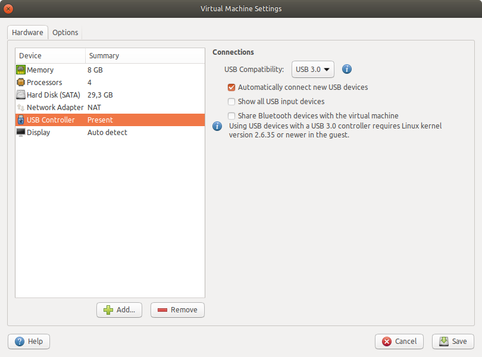
    * опционально включите режим "мост" для виртуального сетевого адаптера:
    

    > **Note** Режим "мост" может некорректно работать с некоторыми сетевыми адаптерами. Если в режиме "мост" вы не можете подключиться к дрону, используйте USB Wi-Fi-адаптеры, "проброшенные" в виртуальную машину.

3. Запустите виртуальную машину. Возможно, при первом запуске справа появятся сообщения об отсутствии поддержки 3D-ускорения со стороны основной системы:

    

    В этом случае убедитесь, что у вас установлены самые последние драйверы для видеокарты в основной системе. Если сообщения появляются при повторных запусках виртуальной машины, добавьте строку

    ```
    mks.gl.allowBlacklistedDrivers = "TRUE"
    ```

    в файл `clever-devel.vmx`, находящийся в папке, в которую был импортирован архив в п. 1.

4. Настройте режим моста через настройки виртуальной машины (если используется VMware Player для Windows) или с помощью утилиты `vmware-netcfg` (если используется версия для Linux-дистрибутивов):

    

    В списке сетей выберите `vmnet0`, ниже - режим *Bridged*, в выпадающем списке *Bridged to* - название беспроводного адаптера, с помощью которого будет производиться подключение к дрону.

### Настройка виртуальной машины в среде VirtualBox

Здесь и далее под *ноутбуком* будет пониматься *основная система* в которой создаётся виртуальная машина.

1. Импортируйте архив виртуальной машины в среду виртуализации.

    * используйте пункт меню **Открыть в VirtualBox** или дважды щёлкните по скачанному `clover-devel.ova` файлу:
    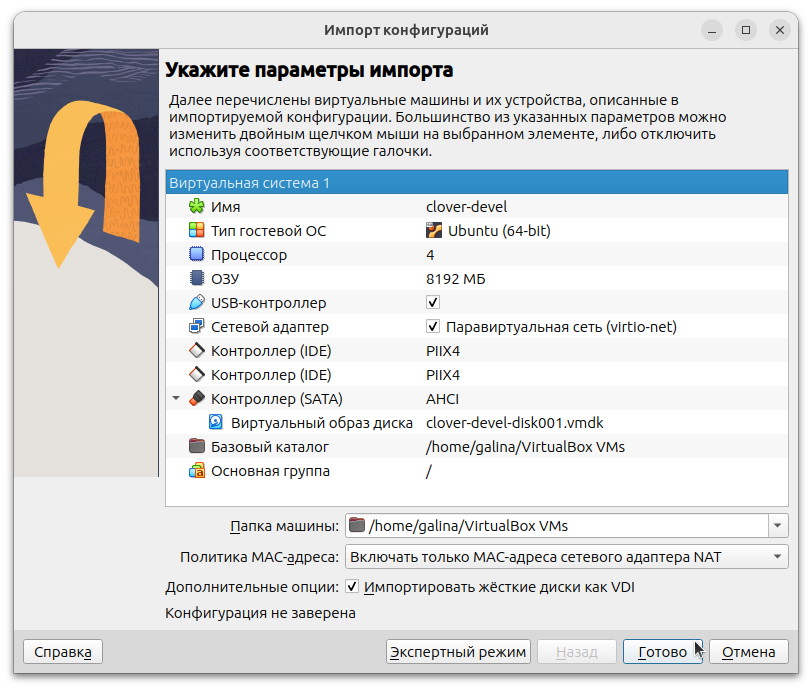
    * дождитесь завершения процедуры импорта виртуальной машины;
    * после завершения импорта скачанный `clover-devel.ova` файл можно удалить.

2. Откройте окно настроек виртуальной машины и измените параметры для наилучшего соответствия возможностям ноутбука:

    * увеличьте объём оперативной памяти, отводимый для виртуальной машины (рекомендуемый объём от 8Гб):
    
    * увеличьте количество доступных процессорных ядер (рекомендуется выделить половину процессорных ядер от имеющегося количества в ноутбуке):
    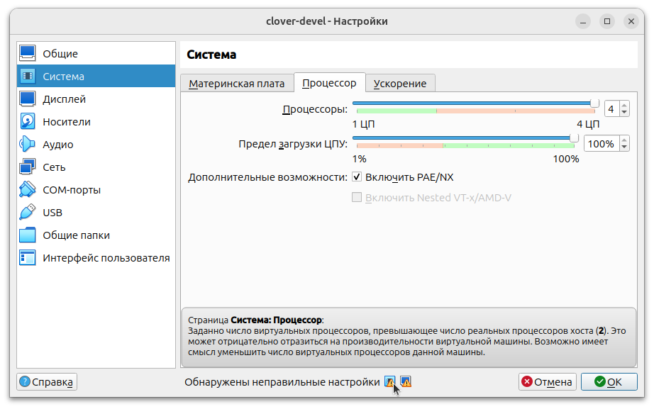
    * включите все доступные дополнительные возможности аппаратного ускорения, поддерживаемые вашим ноутбуком:
    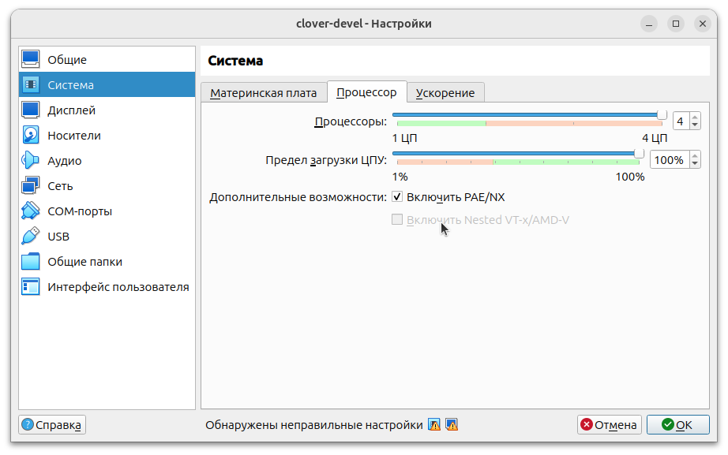
    * отключите удалённый доступ к виртуальной машине, если её использование планируется на ноутбуке, а не на сервере:
    
    * выберите тип графического контроллера `VMSVGA` (обратите внимание на подсказки с предупреждениями в нижней части окна, на вашем ноутбуке может быть рекомендован к использованию иной тип графического контроллера):
    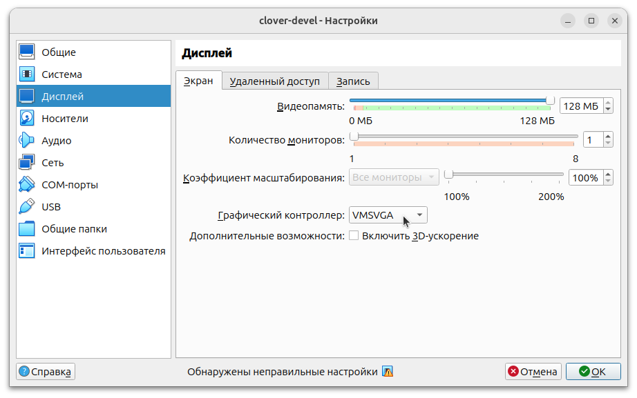
    * отключите "3D-ускорение" в той же вкладе окна настроек (облегчённая графическая оболочка XFCE в виртуальной машине не использует 3D-ускорение, и при включении 3D-ускорения у некоторых ноутбуков наблюдается "заторможенность" в работе);
    * добавьте привод оптических дисков, в появившемся окне укажите путь к `VBoxGuestAdditions.iso` файлу (в Windows этот файл вы можете найти в каталоге `C:\Program files\Oracle\VirtualBox`, а в Linux поищите его в директории `/usr/share/virtualbox`, если его там нет, то см. инструкцию ниже):
    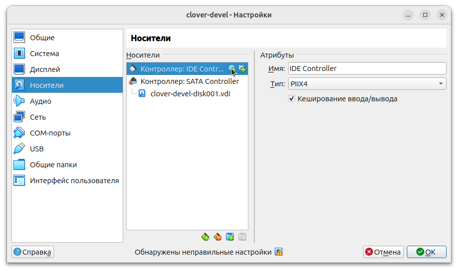

    ```bash
    # установка VBoxGuestAdditions.iso в Linux
    sudo apt install virtualbox-guest-additions-iso
    # поиск места расположения .iso файла
    # обычно это /usr/share/virtualbox/VBoxGuestAdditions.iso
    dpkg -L virtualbox-guest-additions-iso | grep VBoxGuestAdditions.iso
    ```

    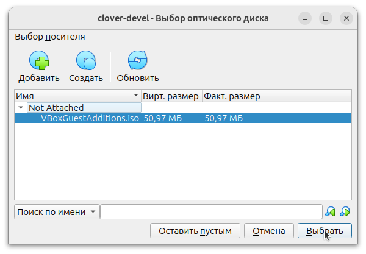
    * подтвердите выбор пути к файлу, убедитесь что в списке устройств появился новый привод компакт-дисков:
    
    * дополнительную информацию по содержимому диска с дополнениями см. по [этой ссылке](https://docs.oracle.com/en/virtualization/virtualbox/7.0/user/guestadditions.html);
    * закройте окно с настройками, сохранив изменения с помощью кнопки "ОК".

3. Запустите виртуальную машину. Установите расширения для VirtualBox для того, чтобы появилась возможность использовать буфер обмена (*clipboard*) и работать с файлами с использованием режима *общих папок*.

    * после запуска виртуальной машины убедитесь, что в меню "Устройства | Оптические диски" галочка напротив `VBoxGuestAdditions.iso` установлена;
    * откройте файловый менеджер в виртальной машине и сверху справа отыщите группу "Devices", щёлкните по `VBox_GA_7.0.12`:
    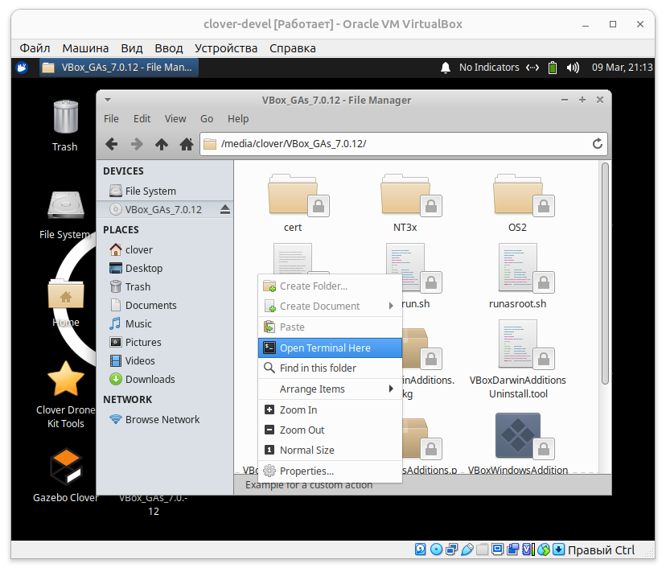
    * в появившемся списке файлов щёлкните по пустому месту (не по иконке), выберите пункт "Open terminal here", введите команду `sudo ./autorun.sh`:
    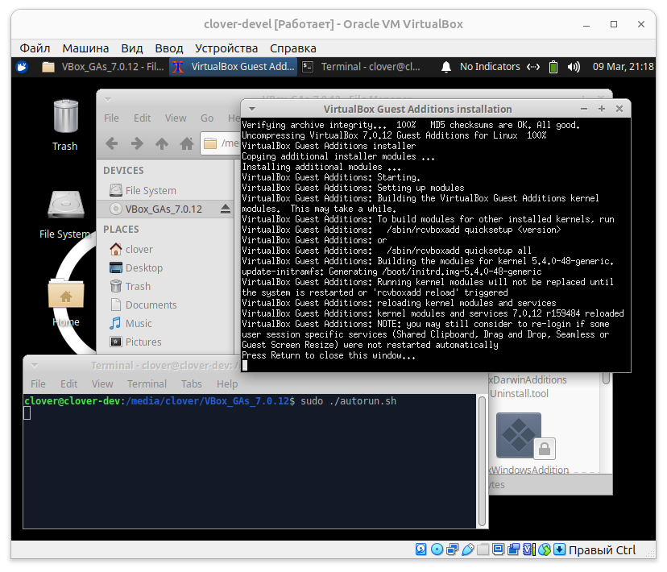
    * откроется новое окно, в котором выполнится сборка необходимых драйверов и программ для работы с буфером обмена и общими папками;
    * дождитесь завершения сборки программ, когда появится надпись "Press Return to close this window..." нажмите Enter, окно закроется;
    * добавьте Linux-пользователя виртуальной машины в группу, которой разрешён обмен общими файлами, для этого введите команду `sudo adduser $USER vboxsf`:
    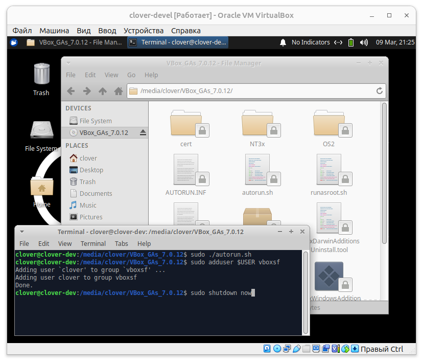
    * внесённые изменения потребуют перезапуск виртуальной машины, выключите её с помощью команды `sudo shutdown now`;
    * после выключения виртуальной машины в окне программы VirtualBox вернитесь в её настройки и включите общий буфер обмена и функцию Drag'n'Drop (по желанию):
    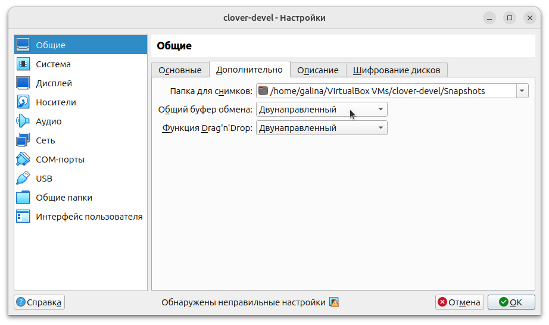
    * закройте окно с настройками, сохранив изменения с помощью кнопки "ОК".

4. Запустите виртуальную машину. Убедитесь, что функции дополнений VirtualBox работают.

    * в меню "Вид" вам станет доступен "Режим интеграции экрана", при изменении размера окна виртуальной машины её разрешение будет подстраиваться под размер окна, так что вы сможете работать в Gazebo с крупными разрешениями дисплея;
    * проверьте работоспособность функции обмена содержимым буфера обмена (*clipboard*) как при копировании текста из виртуальной машины, так и из ноутбука в виртуальную машину;
    * проверьте работоспособность функции Drag'n'Drop, перетащив из ноутбука какой-нибудь файл на рабочий стол виртуальной машины (*внимание! если вы используете Windows на ноутбуке, то перетаскивание файлов может приводить к сбоям в виртуальной машине, если вы столкнулись с этой проблемой, тогда рекомендуется отключить эту функцию*);
    * в меню виртуальной машины "Устройства | Общие папки | Настроить общие папки" добавьте новую папку, выбрав путь на ноутбуке (*внимание! рекомендуется использовать папки лишь только с латинскими символами, например `/home/galina/Workspace` или `c:\Users\galina\Documents`*):
    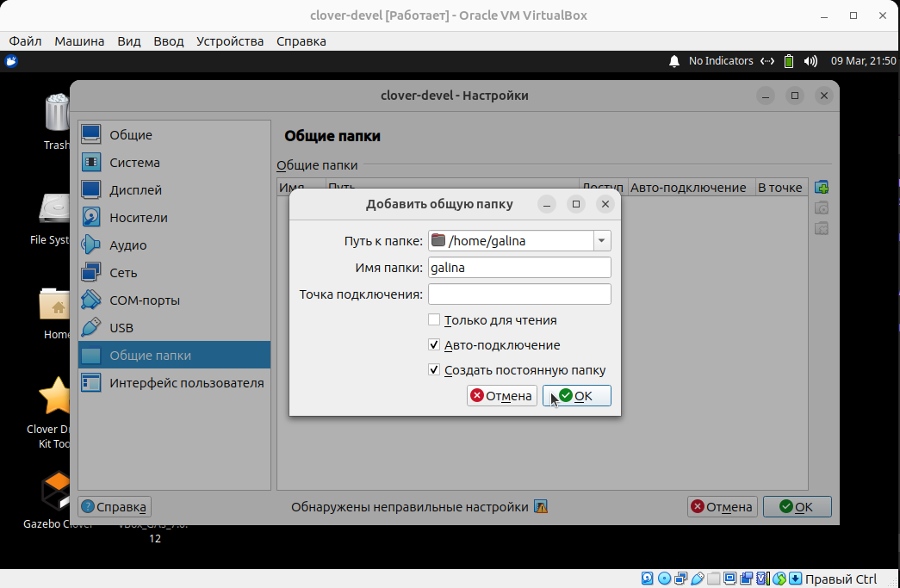
    * в настройках папки укажите "Автоподключение" и "Создайте постоянную папку";
    * закройте окно с настройками, сохранив изменения с помощью кнопки "ОК";
    * откройте файловый менеджер, отыщите новую папку в верхней группе Devices, у которой будет приписка `sf_`, например `sf_galina`, создайте пустой файл, убедитесь что файл появился в файловой системе ноутбука:
    
    * если какой-то из перечисленных пунктов не работает, повторите действия перечисленные в разделе №3, повторно установив и настроив расширения VirtualBox.

5. Настройте работу с сетью в виртуальной машине. Смена режима работы сети в VirtualBox возможна в реальном масштабе времени, вы можете выбрать любой подходящий вариант. См. ниже список вариантов из которых вы можете выбрать тот, который будет наиболее удобен для вас в работе:

    * **Тип подключения: NAT** - режим по умолчанию. В этом режиме ваш ноутбук создаёт отдельную локальную сеть для виртуальной машины, из которой она сможет подключиться к сети (например что-либо скачать из интернета), но узлы сети в обратном направлении не смогут подключиться к серверу на виртуальной машине (например, Raspberry Pi **не сможет** подключиться к [clever-show](clever-show.md) серверу). Сетевой IP-адрес, который получит виртуальная машина, будет из диапазона сгенерированного вашим ноутбуком, например `10.0.2.15`. Этот режим идентичен тем условиям, которые создают домашние роутеры, когда ваш домашний компьютер может выйти в интернет, но компьютеры из интернета не смогут по своей инициативе попасть на ваш компьютер (эту возможность необходимо настроить и разрешить).
    * **Тип подключения: Сетевой мост**. В этом режиме виртуальная машина подключается к сети через ваш ноутбук *прозрачно*. Вместе с выбором типа подключения вам предлагается выбрать ещё и название сетевого интерфейса, относящегося к той сети, частью которой станет виртуальная машина. В этом режиме виртуальная машина получит сетевой IP-адрес относящийся к выбранной вами сети, например, если бы ваш домашний роутер раздавал адреса в диапазоне `192.168.0.xxx`, то подключив виртуальную машину к сети роутера она получила бы адрес например `192.168.0.100`. В этом режиме внутри выбранной сети вам разрешено подключиться к любому сетевому узлу, так и у других узлов имеется возможность подключаться к вашей виртуальной машине (например, Raspberry Pi **сможет** подключиться к [clever-show](clever-show.md) серверу).

Для того, чтобы сменить тип сети, перейдите к пункту меню "Устройства | Сеть | Настроить сеть". Выберите подходящий вам вариант подключения, при необходимости выберите имя сетевого подключения, подтвердите изменение с помощью кнопки "ОК". Для того, чтобы изменения в сети произошли, выберите пункт меню "Устройства | Сеть | Подключить сетевой кабель", дождитесь появления в виртуальной машине уведомления "Disconnected". После чего снова выберите пункт меню "Устройства | Сеть | Подключить сетевой кабель", дождитесь появления в виртуальной машине уведомления "Connection Established".

Например, переведите сеть в режим "Сетевой мост" выбрав сетевой интерфейс соответствующий вашему WiFi адаптеру (выполнив рекомендованные выше манипуляцию по переподключению "сетевого кабеля"). Подключите ноутбук к WiFi-сети с выходом в интернет.

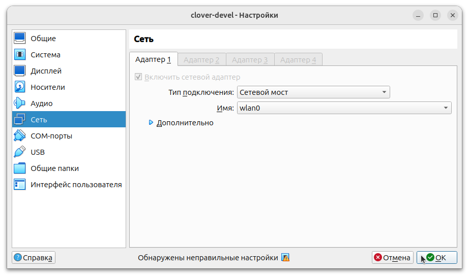

Убедитесь, что адрес виртуальной машины действительно получен внутри WiFi-сети с выходом в интернет, и интернет в виртуальной машине доступен.

```bash
ip a
ping ya.ru
```

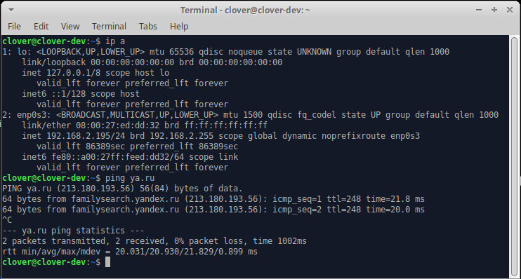

На приведённом выше скриншоте IP-адресом виртуальной машины является адрес `192.168.2.195` и она имеет выход в интернет, т.к. пингует сервер `ya.ru`.

После чего [подключитесь к Raspberry Pi по Wi-Fi](wifi.md), повторите рекомендованные выше манипуляцию по переключению "сетевого кабеля".

```bash
ip a
ping 192.168.11.1
ssh pi@192.168.11.1
```

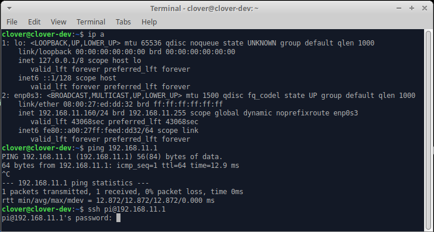

На приведённом выше скриншоте IP-адресом виртуальной машины является адрес `192.168.11.160`, она пигнует Raspberry Pi с адресом `192.168.11.1`, и может зайти на микрокомпьютер [по SSH](ssh.md). *Доступа к интернету на этой виртуальной машине не будет, т.к. как она и ноутбук отключились от WiFi сети с выходом в интернет*. Не отключаясь от WiFi-сети Клевера выполните сканирование сетевых узлов, поключенных к сети:

```bash
sudo nmap -sP -PR -T3 192.168.11.0/24
ip a
```

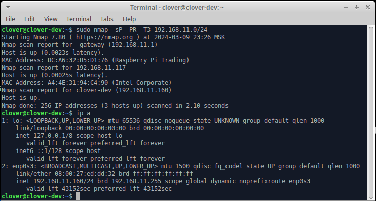

На приведённом выше скриншоте в сети найдены узлы:

* `192.168.11.1` - микрокомпьютер Raspberry Pi;
* `192.168.11.117` - ноутбук с сетевым адаптером Intel;
* `192.168.11.160` - виртуальная машина `clover-dev` с которой выполнялось сканирование.

Если все проверки перечисленные выше пройдены, то ваша виртуальная машина запущенная в среде VirtualBox готова к работе.
