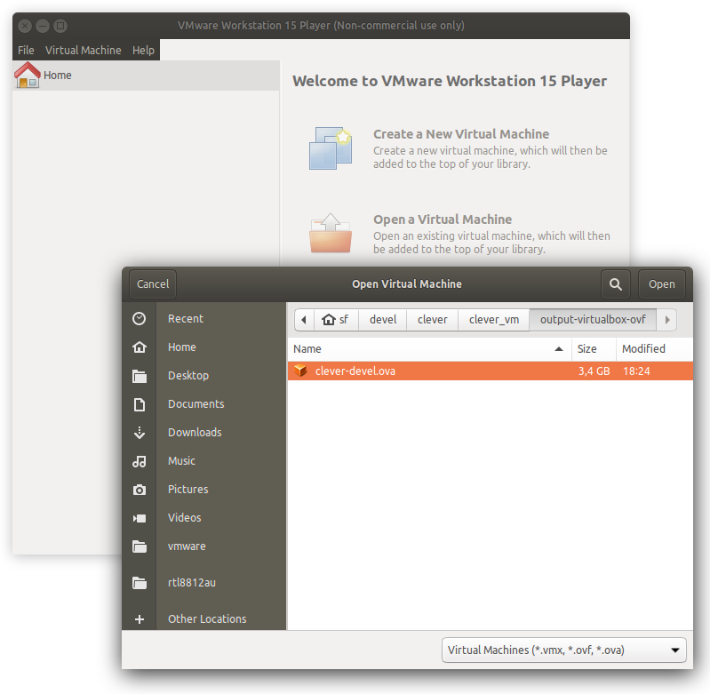
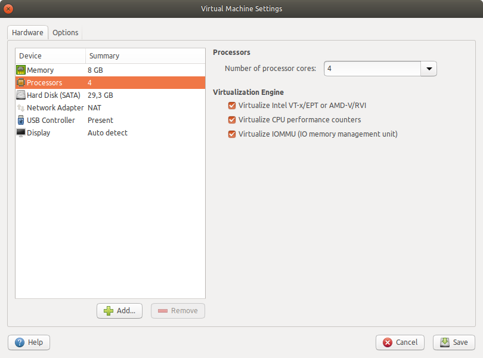

# Настройка симулятора в виртуальной машине

В дополнение к [сборке на собственной машине](simulation_native.md), мы предоставляем [предварительно настроенный образ виртуальной машины](https://github.com/CopterExpress/clover_vm/releases). Образ содержит:

* Ubuntu 18.04 с легковесной средой XFCE;
* пакеты ROS необходимые для разработки на платформе Клевер;
* QGroundControl;
* предварительно настроенный симулятор Gazebo;
* Visual Studio Code с плагинами для C++ и Python.

Виртуальная машина - простой способ создать среду для симуляции, но ее можно использовать и в качестве среды разработки для реального дрона.

Вы можете скачать образ [в релизах репозитория](https://github.com/CopterExpress/clover_vm/releases).

> **Примечание** Виртуальная машина должна использоваться, когда установка симулятора на собственной машине невозможна. В виртуальной машине вы можете испытывать снижение производительности в таких программах как rviz и Gazebo. 

## Настройка вирутальной машины

Вы должны использовать средства визуализации виртуальных машин, поддерживающих файлы формата OVF, например, [Virtualbox](https://www.virtualbox.org/wiki/Downloads), [VMware Player](https://www.vmware.com/products/workstation-player.html) или [VMware Workstation](https://www.vmware.com/products/workstation-pro.html).

> **Примечание** На время написания этой статьи, виртуальные машины, использующие GPU для 3D-ускорения имеют проблемы с работой на Virtualbox. Мы рекомендуем использовать VMware Player или VMware Workstation, если это возможно. Следующие шаги предполагают, что вы используете VMware Player.

Убедитесь, что вы включили аппаратную виртуализацию в вашем BIOS/UEFI (она может быть выключена по умолчанию, не смотря на то что она поддерживается железом). Шаги по включению виртуализации отличаются от производителя к производителю. Воспользуйтесь руководством пользователя для вашего устройства или обратитесь к производителю, если у вас возникли проблемы с включением виртуализации.

1. Импортируйте OVA-файл в программу. Для этого используйте **File -> Open a Virtual Machine**:

    

    > **Примечание** Вы можете увидеть диалоговое окно с предупреждением о формате виртуальной машины:  
      
    Вы можете спокойно проигнорировать это предупреждение и нажать **Retry**.

2. Нажмите правой кнопкой мыши на названии виртуальной машины и выберите **Virtual Machine Settings**. В новом окне укажите следуюшие параметры:

    * увеличьте объем памяти (2048 MB на каждое ядро процессора, но не меньше чем 4 GB):
      
    * увеличьте количество ядер процессора:  
      
    * включите 3D-ускорение:  
      
    * включите контроллер USB 2.0/3.0 (если вы планируете подключать внешние устройства к виртуальной машине):  
      
    * дополнительно можете включить "мостовое" сетевое соединение (если вы планируете подключаться к настоящему дрону):  
      

    > **Примечание** Некоторые сетевые адаптеры могут плохо работать с мостовой соединением. Рассмотрите возможность использования внешних WiFi-адаптеров для подключения к настоящему дрону.

3. Включите виртуальную машину, нажав "Power on". Вы можете увидеть предупреждения о том, что ваш хост не предоставил 3D-ускорение:

    

    Убедитесь, что у вас установлены последние версии драйверов для видеокарты (на хосте). Если эти предупреждения не исчезают, то добавьте следующию строку в файл `clover-devel.vmx` (название файла может изменяться в зависимости от назавние виртуальной машины):

    ```
    mks.gl.allowBlacklistedDrivers = "TRUE"
    ```

    Вы можете найти этот файл в папке, куда вы импортировали вирутальную машину.

4. (Только для мостовых сетей) Конфигурация сетевого моста в настройках виртуальной машины или с помощью утилиты `vmware-netcfg` (в Linux):

    

    Выберите `vmnet0` в списке сетей, установите его в *Bridged*, и выберите адаптер, который вы планируете использовать для подключения к дрону в раскрывающемся меню.