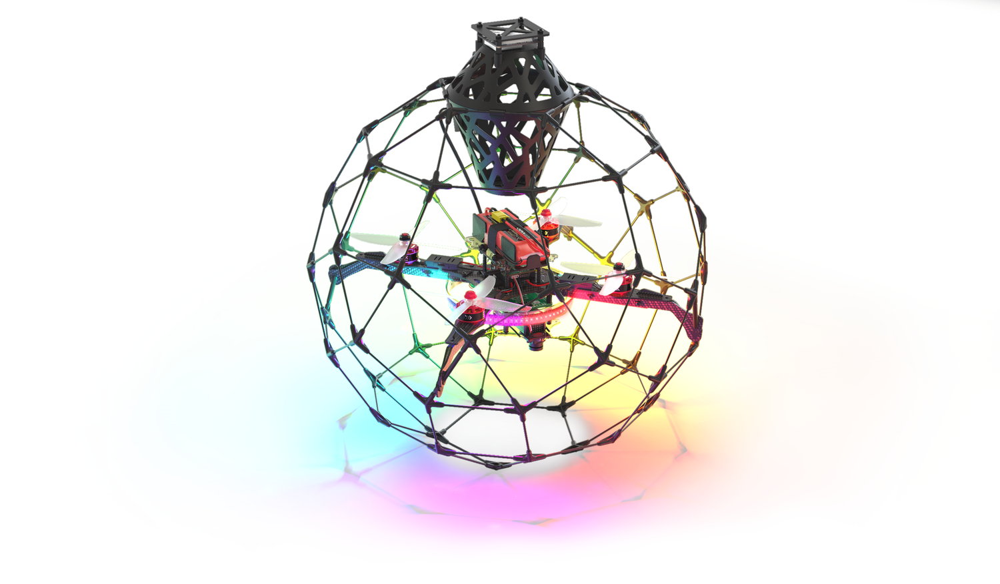

# Сборка сферической защиты

## Сборка пояса сферы

1. Соберите передние крепления коптера.

    

2. Соберите задние крепления коптера.

    

3. Соберите переднюю часть пояса.

    

4. Соберите заднюю часть пояса.

    

5. Соберите правую и левую части пояса.

    

        
        
    

6. Соберите пояс сферы (виды сверху и сбоку).

    

        
        
    

7. Пояс сферы в сборе.

    

        
        
    

8. Закрепите коптер внутри пояса.

    

        
        
    

## Сборка верхней части сферы

1. Соберите верхнюю часть сферы.

    

### Установка GPS модуля

1. Соберите крепление GPS.

    

2. Установите крепление GPS на верхнюю часть сферы.

    

        
        
    

### Установка корзинки

1. Проденьте прутки в специальные пазы в корзинке и соедините их коннекторами.

    

2. Установите корзинку в середину верхней части сферы.

    

## Сборка нижней части сферы

1. Соберите нижнюю часть сферы.

    

2. Соберите шаровую защиту из 3-х частей.

    
