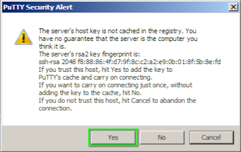

# Подключение к Raspberry Pi с использованием SSH-ключей

*Эта инструкция позволит вам быстро подключаться к Raspberry Pi. Всего за одну секунду. Без ввода пароля.*

Базовые сведения по работе с SSH вы можете найти в разделе [Доступ по SSH к Raspberry Pi](ssh.md). А в этом разделе вы найдёте расширенную информацию по использованию SSH, а также ряд рекомендаций по использованию SSH при работе с Клевером.

## Общая информация

SSH (англ. *secure shell* — "безопасная оболочка") - сетевой протокол, позволяющий удалённо управлять операционной системой на компьютере, к которому вы подключились. Аналогичен такому протоколу, как *telnet*, но позволяет выполнять шифрование сетевого трафика по время взаимодействия. Таким образом передача паролей и другой секретной информации оказываются скрыты. Операционная система Raspberry Pi поддерживает взаимодействие по SSH, как и многие другие распространённые системы на базе Linux.

SSH позволяет не только организовывать работу в командной оболочке, но и передавать файлы, а также туннелировать передаваемые данные других протоколов, например информацию с видеокамеры или телеметрию. Кроме того, SSH поддерживает несколько режимов аутентификации (то есть проверки подключающегося пользователя), с его помощью возможно подключение к Клеверу не только с использованием пароля, но и беспарольный доступ (аутентификация по ключевой паре, т.е. SSH-ключи).

## Аутентификация по паролю

Аутентификация [по паролю](ssh.md) на образе RPi для Клевера включена и пароль может быть использован для входа в командную оболочку мини-компьютера. На ЭВМ с операционными системами Linux (и в первую очередь на серверах, подключенных к интернету) возможность входа по паролю обычно отключают, поскольку есть более безопасный способ аутентификации.

> **Hint** Вход в Клевер по паролю отключать не рекомендуется, поскольку можно совсем утратить доступ к командной оболочке по сети.

При первом подключении к RPi пользователю показывается уведомление с предложением сохранить уникальный отпечаток *fingerprint*. Сохранённая информация накапливается на компьютерах с которых выполняется вход по SSH на RPi, и проверяется на внезапную подмену.

В ОС Linux и Unix (Mac OS) в текстовом SSH-клиенте первое подключение к RPi выглядит таким образом:

```bash
ssh pi@192.168.11.1
# The authenticity of host '192.168.11.1 (192.168.11.1)' can't be established.
# ED25519 key fingerprint is SHA256:4w/7MqTgrtsqPwKnVAMISpouaOJNqzUew2NkJjldMWI.
# This key is not known by any other names
# Are you sure you want to continue connecting (yes/no/[fingerprint])? yes
# Warning: Permanently added '192.168.11.1' (ED25519) to the list of known hosts.
# pi@192.168.11.1's password: *********
# Linux clover-3270 5.10.17-v7l+ #1414 SMP Fri Apr 30 13:20:47 BST 2021 armv7l

whoami
# pi

exit
```

В графических программах в Windows у вас будут периодически возникать окошки с похожими предупреждениями.



> **Hint** В Windows 10 появился встроенный SSH-клиент, который можно запускать из командной строки, см. руководство по использованию от Microsoft [по этой ссылке](https://learn.microsoft.com/ru-ru/windows-server/administration/openssh/openssh_install_firstuse).

## Аутентификация с использованием SSH-ключей

SSH-ключи - это удобный, быстрый альтернативный способ подключения к Raspberry Pi, для которого не требуется ввод пароля. В частности, при эксплуатации Клевера такой способ удобен потому, что экономит время, а значит и заряд аккумулятора, и лимит времени отведённого на мероприятия в полётных зонах. Кроме того, использование SSH-ключей открывает возможности по удобному использованию других программ, которыми бы вы вряд-ли воспользовались бы при необходимости всякий раз набирать пароль.

SSH-ключ делится на две части: пара состоит из т.н. *закрытого* и *открытого* ключа. Ключ однократно генерируется. Одна часть ключа (открытая) однократно передаётся на удалённый компьютер к которому будет выполняться подключение, вторая часть ключа (закрытая) хранится на компьютере, который будет подключаться, закрытая часть ключа никуда не передаётся.

> **Hint** Открытый ключ однократно копируется на Raspberry Pi, а закрытый ключ сохраняется в ноутбуке в виде файла.

### Подготовка

Для того, чтобы пара ключей появилась, её необходимо сгенерировать. В ОС Linux и Unix (Mac OS) есть программа `ssh-keygen` с помощью которой мы и получим нужную нам пару ключей (**внимание!** команды выполняются не в Raspberry Pi, и не в виртуальной машине симулятора Gazebo, а в командной оболочке ноутбука с которого вы будете подключаться к Клеверу):

Прежде чем пользоваться ключами, необходимо выполнить ряд действий для настройки прав доступа *на ноутбуке*:

```bash
# однократная настойка прав доступа к пользовательским директориям
chmod o-rwx $HOME
mkdir ~/.ssh
chmod g-rwx,o-rwx ~/.ssh
touch ~/.ssh/config ~/.ssh/known_hosts
chmod 600 ~/.ssh/config ~/.ssh/known_hosts
```

> **Hint** Директория `.ssh` в домашней папке пользователя - это стандартное место хранения и ключевых пар, и настроек подключения с использованием SSH, поэтому доступ к ней запрещаем группе Others (*посторонние*). Современные дистрибутивы Linux проверяют права доступа к файлам в директории `.ssh` и могут отказать в аутентификации по ключевым парам.

### Генерация пары SSH-ключей

Генерируем пару SSH-ключей в директории `~/.ssh` на ноутбуке:

<!-- TODO: в Windows начиная с версии 10 все команды перечисленные статье должны работать, - Проверить! -->

```bash
ssh-keygen -f ~/.ssh/id_clover -C "SSH key for Clover" -N ""
# Your identification has been saved in /home/galina/.ssh/id_clover
# Your public key has been saved in /home/galina/.ssh/id_clover.pub

chmod 400 ~/.ssh/id_clover*
```

### Копирование SSH-ключа на Raspberry Pi

После чего [подключаемся к Raspberry Pi по Wi-Fi](wifi.md) и продолжаем вводить команды *на ноутбуке* для копирования ключа на мини-компьютер:

```bash
ssh-copy-id -i ~/.ssh/id_clover.pub pi@192.168.11.1
# pi@192.168.11.1's password: *********
```

В результате с ноутбука на микрокомпьютер RPi будет скопирована т.н. *открытая* часть ключа, а *закрытая* останется на ноутбуке. Для проверки подключения без ввода пароля используем команду с указанием пути где находится SSH-ключ:

```bash
ssh -i ~/.ssh/id_clover pi@192.168.11.1
```

Если терминал не потребует ввода пароля для подключения к RPi, то вы всё сделали правильно и пара SSH-ключей работает. Теперь можно набрать команду выхода из SSH-терминала, чтобы продолжить настройку ноутбука:

```bash
pi@clover-3270:~ $ exit
# logout
# Connection to 192.168.11.1 closed.

galina@Thinkpad-X1:~/.ssh$
```

## Настройка SSH-подключения к Клеверу

Теперь давайте настроим SSH-терминал таким образом, чтобы не приходилось всякий раз вписывать путь к закрытому ключу. Это делается с помощью редактирования файла `~/.ssh/config` *на ноутбуке*. Откройте файл в текстовом редакторе и добавьте в файл следующие строки (если там уже есть какая-то информация, то поместите их в конец файла):

```txt
Host 192.168.11.1
    User pi
    IdentityFile ~/.ssh/id_clover
    PreferredAuthentications publickey,password
    PubkeyAuthentication yes
    PasswordAuthentication yes
    ConnectTimeout 1
    TCPKeepAlive yes
    ServerAliveInterval 2
    ServerAliveCountMax 3
    StrictHostKeyChecking no
```

Эта настройка:

* влияет на работу SSH-терминала при подключении к компьютеру с ip-адресом `192.168.11.1`;
* если имя пользователя не указано, то автоматически будет использоваться имя `pi`;
* будет автоматически использоваться приватный ключ `~/.ssh/id_clover`;
* если ключ по каким-то причинам не подойдёт (был заменён на одном ноутбуке, но забыт заменить на другом), то SSH-терминал перейдёт к аутентификации по паролю (настройки `PreferredAuthentications`, `PubkeyAuthentication`, `PasswordAuthentication`);
* если связь с RPi не может установиться (WiFi ещё не включился), то SSH-подключение не зависнет, а быстро завершится (настройка `ConnectTimeout`);
* если связь с RPi будет внезапно разорвана, то SSH-подключение не зависнет, а быстро завершится (настройки `TCPKeepAlive`, `ServerAliveInterval`, `ServerAliveCountMax`);
* уникальные SSH-отпечатки RPi-микрокомпьютеров (*fingerprints*) о которых упоминалось выше, проверяться больше не будут (настройка `StrictHostKeyChecking`).

Таким образом будет решено множество неудобств, связанных с использованием SSH-подключений.

> **Hint** Если у вас в лаборатории несколько дронов на базе Raspberry Pi, и несколько ноутбуков, то можно **однократно** сгенерировать SSH-ключи, скопировать их на все дроны и разложить по всем ноутбукам, тогда с любого ноутбука можно будет быстро зайти на любой из дронов.

Теперь, чтобы подключиться к RPi из терминала Linux вам достаточно набрать `ssh 1[TAB][TAB][ENTER]` и ip-адрес `192.168.11.1` автоматически дополнится в командной строке, т.к. командная оболочка использует адреса из файла `~/.ssh/config` и способна "угадать" ваши намерения для подключения к Клеверу. Нажав ввод вы мгновенно окажетесь в терминале RPi.

> **Hint** Графические программы для Windows, которые поддерживают работу с SSH-ключами, которыми вы можете воспользоваться: [PuTTY](https://www.chiark.greenend.org.uk/~sgtatham/putty/latest.html) и [MobaXterm](https://mobaxterm.mobatek.net/).

## Копирование файлов при помощи SSH

Чтобы скопировать файл `circle_flight.py` с ноутбука на RPi в домашнюю папку пользователя `pi` можно также воспользоваться SSH. Для этого наберите в командной оболочке команду:

```bash
# сначала указываем 'что' копируем, а потом 'куда'
scp circle_flight.py 192.168.11.1
```

Для того, чтобы скопировать файл `output.avi` c RPi из папки `examples` на ноутбук используем похожую команду:

```bash
# после символа ':' (двоеточие) можно указать путь на удалённом компьютере
# путь указанный как './' означает текущую папку, куда будет скопирован файл
scp 192.168.11.1:examples/output.avi ./
```

## Удалённый запуск команд по SSH

Чтобы запустить команду с ноутбука на RPi (то есть удалённо) можно также воспользоваться SSH.

Команда выключения Raspberry:

```bash
ssh 192.168.11.1 'sudo shutdown now'
```

Пример команды запуска Python-скрипта:

<!-- TODO: здесь слишком длинная команда получается, потому что-то запускать скрипты в .bashrc нехорошо (команды выполняются не только из bash) Должно быть так: ssh -t 192.168.11.1 'python3 examples/get_telemetry.py' -->

```bash
ssh -t 192.168.11.1 'ROS_HOSTNAME=`hostname`.local && . /opt/ros/noetic/setup.bash && . /home/pi/catkin_ws/devel/setup.bash && python3 examples/get_telemetry.py'
```

Для того, чтобы удалённо запустить запись видео можно выполнить команду:

```bash
ssh -t 192.168.11.1 'ROS_HOSTNAME=`hostname`.local && . /opt/ros/noetic/setup.bash && . /home/pi/catkin_ws/devel/setup.bash && rosrun image_view video_recorder image:=/main_camera/image_raw'
```
