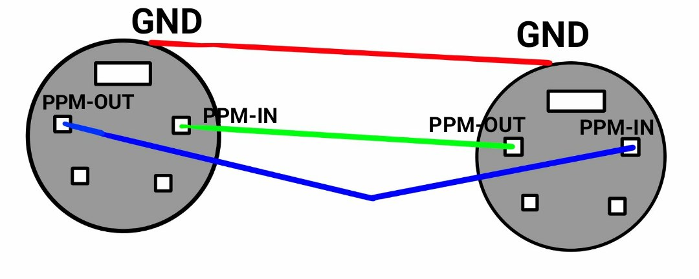

# Настройка режима тренера на пульте FlySky

Режим тренера используют для обучения пилотированию. Чтобы во время обучения ученик ничего не повредил, на перехвате стоит опытный пилот, чтобы при необходимости взять управление на себя.
Для этого при помощи провода соединяют два пульта: один из них - пульт тренера, а другой – ученика.

## Схема провода

Для создания моста общения между аппаратурами связи используется разъём сзади корпуса (S-Video).  Три контакта в разъёме отводятся для приёма, передачи информации и земли. Контакт PPM-OUT (передача) должен быть соединён с PPM-IN (приём) и наоборот.  Во избежание помех внешней среды контакты ground должны быть соединены между собой (PPM – аналоговый сигнал).
Таким образом нам нужно припаять провода к разъёму.

## Настройка пульта Учителя

Сначала нам нужно зайти в настройки (зажать кнопку OK). Далее заходим в системные настройки (System setup) и ищем (Up/Down) режим тренера (Trainer mode).

Чтобы активировать режим в строке Mode должен стоять параметр On. Чтобы изменить параметр используйте кнопки Up/Down. Чтобы сохранить параметр нажмите OK.

Теперь выбираем клавишу передачи управления.
Это можно сделать в меню режима (Trainer mode). В строке Switch выберите (менять можно с помощью Up/Down)  любую удобную клавишу (Sw A, Sw B, Sw C, Sw D). С помощью этой клавиши вы сможете перехватить управление.

Чтобы сохранить настройки зажмите Cancel.

> **Hint** На пульте учителя должен стоять тот же режим полёта, что и на пульте ученика.

## Настройка пульта Ученика

Зайдите в настройки и выберите режим ученика (Student mode). Далее нажмите OK и при помощи Up/Down выберите подтверждение (Yes).
Зажмите Cancel, чтобы сохранить настройки.
Если всё настроено правильно, на главном экране появится буква S.
