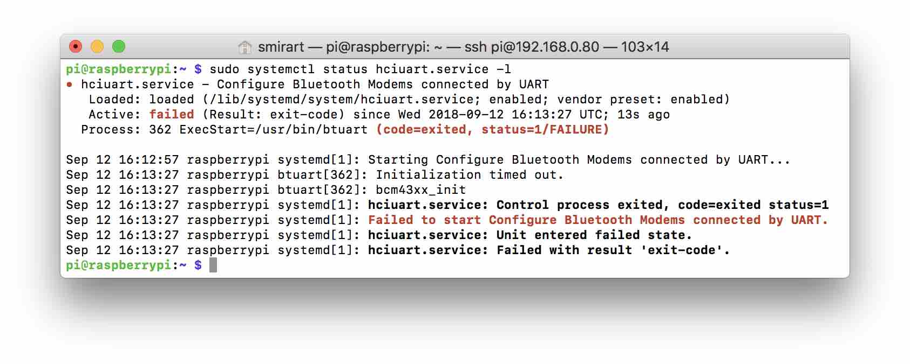

# Интерфейс UART

UART – последовательный асинхронный интерфейс для передачи данных, применяемый во многих устройствах. Например GPS-антенны, Wi-Fi роутеры или Pixhawk.

Интерфейс обычно содержит две линии: TX – линия для передачи данных, RX – линия для приёма данных. А также обычно использует 5-ти вольтовую логику.

Для соединения двух устройств необходимо линию TX первого устройства подать на RX второго. Аналогичную операцию нужно совершить с другой стороны, чтобы обеспечить двустороннюю передачу данных.

> **Note** Необходимо синхронизировать уровни напряжений – соединить землю на двух устройствах.

Почитать больше про интерфейс и протокол можно в [этой статье](https://habr.com/post/109395/).

## Linux TTY

В Linux есть понятие Posix Terminal Interface (подробнее [здесь](https://ru.wikipedia.org/wiki/TTY-абстракция)). Это некоторая абстракция над последовательным или виртуальным интерфейсом, позволяющая работать с устройством нескольким агентам одновременно.

В качестве примера такой абстракции в Raspbian можно привести `/dev/tty1` – устройство вывода текста на экран подключенный по HDMI.

## UART на Raspberry Pi 3

В Raspberry Pi 3 есть два аппаратных UART интерфейса:

1. `Mini UART` (/dev/ttyAMA0) – для своей работы использует тактирование видеоядра RPi, в связи с чем ограничивает его частоту.
2. `PL011` (/dev/ttyS0) – полноценный UART интерфейс выполненный на отдельном блоке кристалла микроконтроллера.

Подробнее про UART на Raspberry Pi в [официальной статье](https://www.raspberrypi.org/documentation/configuration/uart.md).

Данные интерфейсы с помощью вентилей микроконтроллера можно переключать между двумя физическими выходами:

1. разъём UART на GPIO;
2. Bluetooth модуль RPi.

По умолчанию в Raspberry Pi 3 `PL011` подключен к Bluetooth модулю. А `Mini UART` отключен с помощью значения директивы `enable_uart`, по дефолту равной `0`.

> **Note** Надо понимать, что директива `enable_uart` меняет свое дефолтное значение исходя из того, какой UART подключен к Bluetooth модулю RPi с помощью директивы `dtoverlay=pi3-miniuart-bt`.

Для удобства работы с этими выходами в Raspbian существуют алиасы:

* `/dev/serial0` – всегда указывает на то TTY устройство, что подключено к GPIO портам.
* `/dev/serial1` – всегда указывает на то TTY устройство, что подключено к Bluetooth модулю.

### Настройка UART на Raspberry Pi

Для настроек UART существуют директивы, которые находятся в `/boot/config.txt`.

Для включения UART интерфейса на GPIO:

```txt
enable_uart=1
```

Для отключения UART интерфейса от Bluetooth модуля:

```txt
dtoverlay=pi3-disable-bt
```

Для подключения `Mini UART` к Bluetooth модулю:

```txt
dtoverlay=pi3-miniuart-bt
```

В случае отключения Bluetooth модуля следует отключить `hciuart` сервис:

```bash
sudo systemctl disable hciuart.service
```

## Настройка образа по умолчанию

На [образе для RPi](image.md) изначально выключен `Mini UART` и Bluetooth модуль.

## Bugs

Если использовать подключение `Mini UART` к Bluetooth, `hciuart` падает с ошибкой:



В случае отключения Bluetooth

```txt
/dev/serial0 -> ttyAMA0
/dev/serial1 -> ttyS0
```
