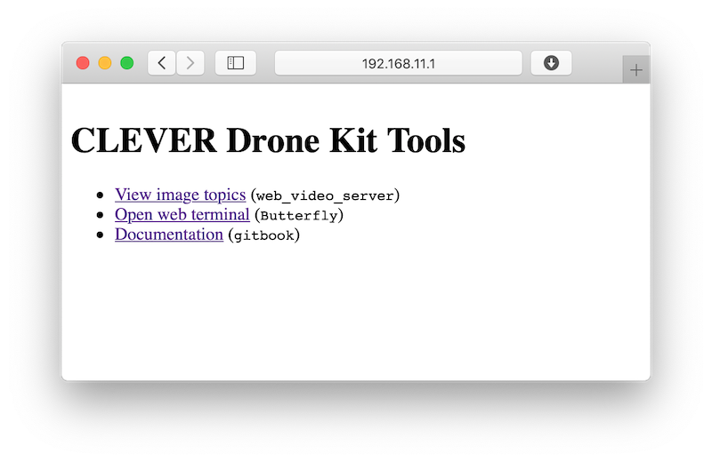

# Подключение к Клеверу по Wi-Fi

На [образе для RPi](image.md) преднастроена раздача Wi-Fi с SSID `CLEVER-xxxx`, где xxxx – 4 случайных цифры, назначаемых при первом включении Raspberry Pi.

Подключитесь в Wi-Fi, используя пароль `cleverwifi`.

Для изменения настроек Wi-Fi или получения более детальной информации о устройстве сети на Raspberry Pi прочитайте статью "Настройка Wi-Fi](network.md)".

## Веб-интерфейс

После подключения к Клеверу по адресу http://192.168.11.1 будет доступен веб-интерфейс. В нем доступны основные веб-инструменты Клевера: просмотр топиков с изображениями, веб-терминал (Butterfly) а также полная копия данной документации.

