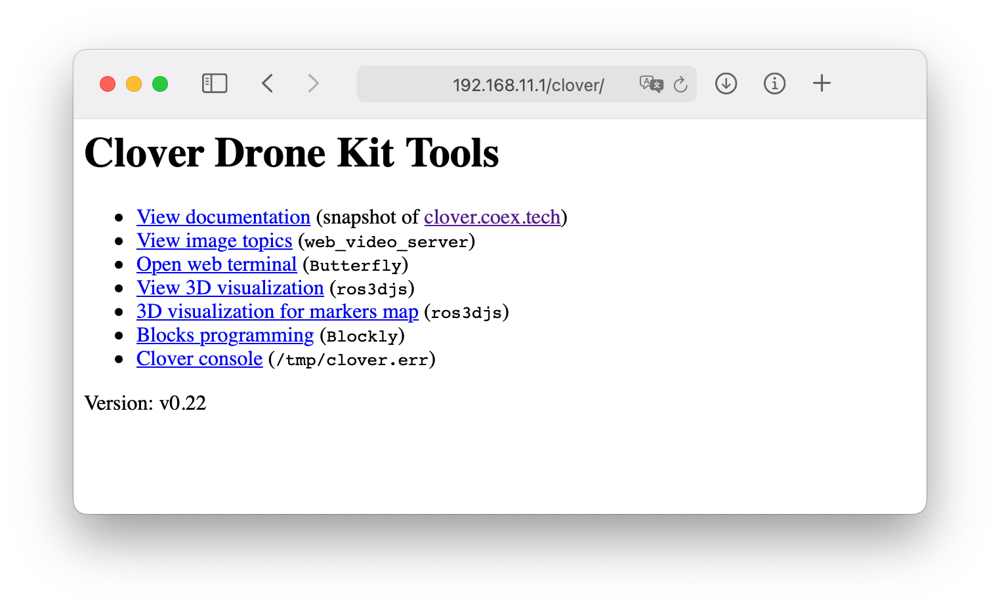

# Подключение к Клеверу по Wi-Fi

> **Note** Документация для версий [образа](image.md), начиная с **0.20**. Для более ранних версий см. [документацию для версии **0.19**](https://github.com/CopterExpress/clover/blob/v0.19/docs/ru/wifi.md).

На [образе для RPi](image.md) преднастроена раздача Wi-Fi с SSID `clover-xxxx`, где xxxx – 4 случайных цифры, назначаемых при первом включении Raspberry Pi.

Подключитесь к Wi-Fi, используя пароль `cloverwifi`.

    
    

Для изменения настроек Wi-Fi или получения более детальной информации о устройстве сети на Raspberry Pi прочитайте статью "[Настройка Wi-Fi](network.md)".

## Веб-интерфейс

После подключения к Клеверу по адресу http://192.168.11.1 будет доступен веб-интерфейс. В нем доступны основные веб-инструменты Клевера: просмотр топиков с изображениями, веб-терминал (Butterfly) а также полная копия данной документации.

**Далее**: [Подключение Raspberry Pi к полетному контроллеру](connection.md).
