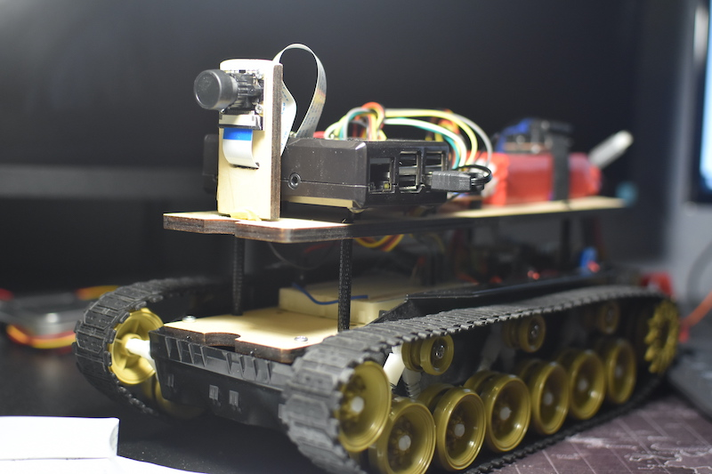
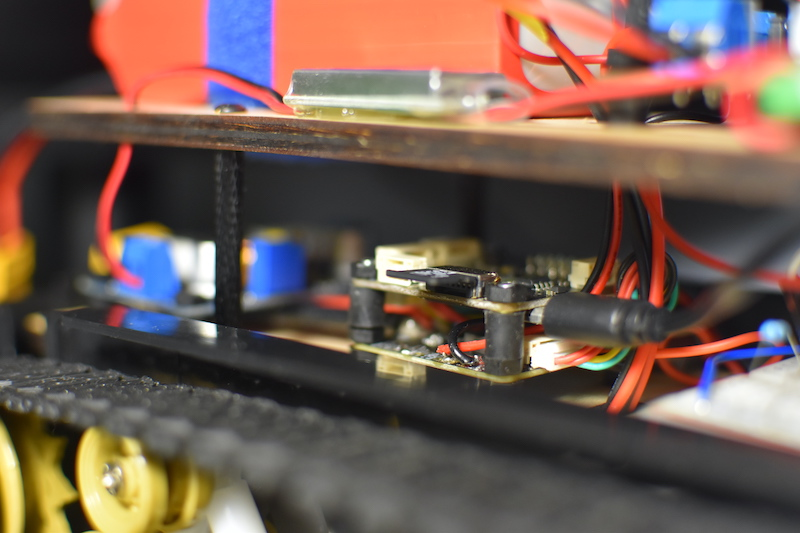
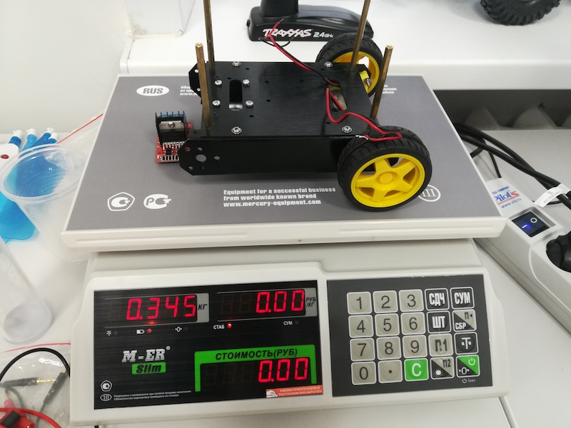
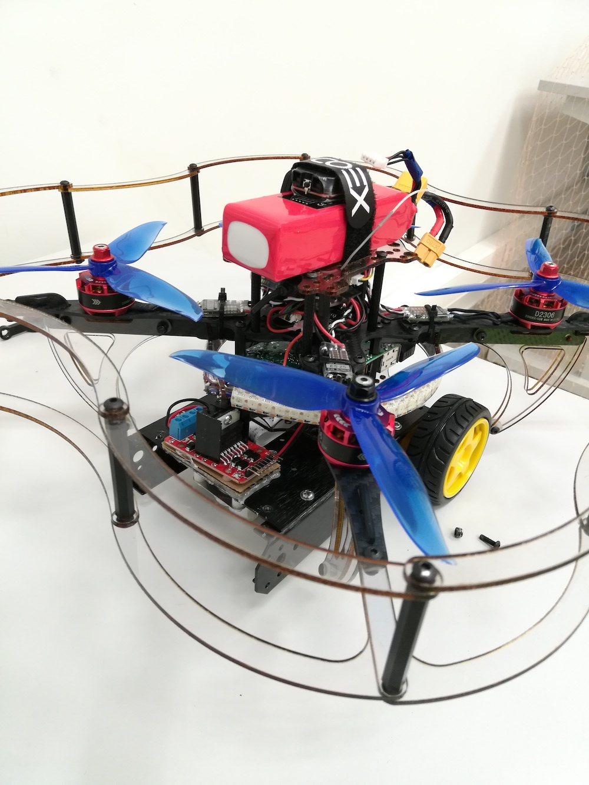
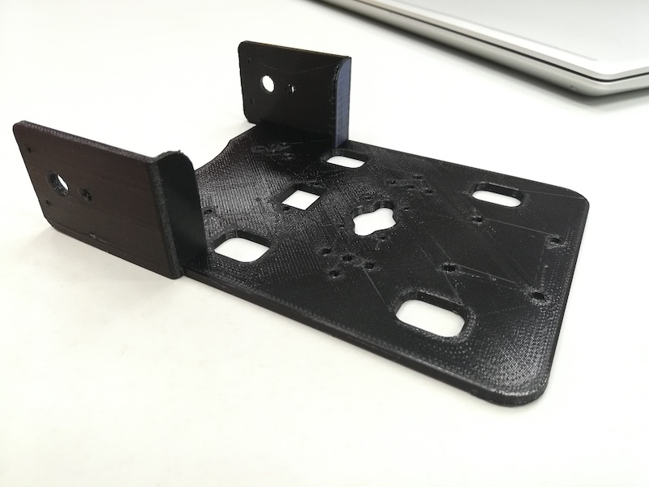
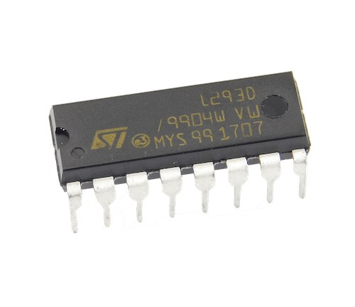
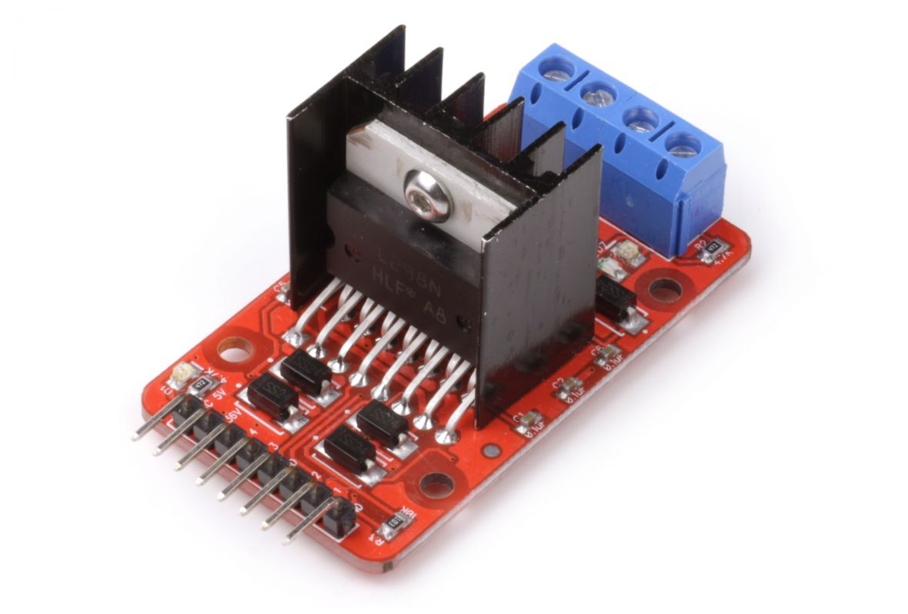
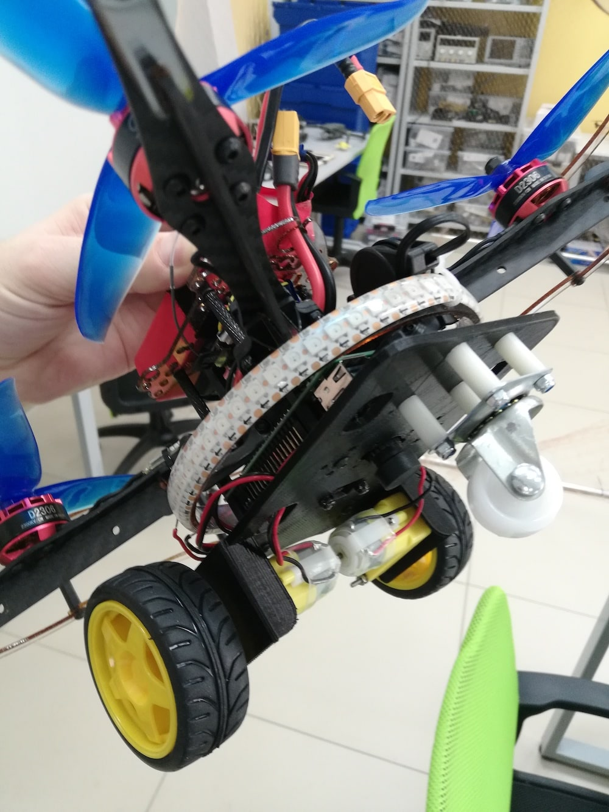

# Программируемый летающий автомобиль

Автор: [**Колмаков Станислав Витальевич**](https://t.me/stassauer).

[CopterHack-2021](copterhack2021.md), команда Зауральский викинг. Место работы: ГАНОУ КО «ЦРСК», г. Курган.

В мире широко разрабатываются и применяются новые модели мультироторных беспилотных летательных аппаратов (БПЛА). Самый распространенный и доступный способ знакомства с БПЛА – покупка квадрокоптера в магазине бытовой технике. В таком случае потребитель сможет лишь развить навыки пилотирования и производить аэрофотосъемку.
Для получения большего количества навыков и возможностью дополнить квадрокоптер лучше заплатить больше. Речь идет о конструкторах для сборки пилотируемого летательного аппарата.

В ногу со временем идет компания Copter Express (COEX), разрабатывая и модернизируя программируемые квадрокоптеры Clover.
Проект летающего автомобиля был разработан на основе программируемого квадрокоптера Clover 4 Code с возможностью двигаться по ровной горизонтальной поверхности, используя колесную базу. Данная возможность позволит расширить функционал использования программируемого квадрокоптера.

Задумка проекта началась с конструирования основы под электронные компоненты на гусеничной базе (рис. 1). В качестве основных компонентов выбрал полетный контроллер COEX Pix и микрокомпьютер Raspberry Pi 3 B+. Используя среду программирования [Blockly](blocks.md), получилось привести робота в движение.

    
    

*Рис. 1. Гусеничный робот с COEX Pix и Raspberry Pi 3 B+.*

Следующим этапом разработки колесной базы для квадрокоптера стало использование конструктора четырехколесной платформы Pirate. Вес платформы с драйвером моторов составил 345 грамм (рис. 2). С учетом увеличения взлетной массы и для увеличения мощности, принято использовать пропеллеры 3-лопастные 6040 (рис. 3).

    
    

*Рис. 2. Вес платформы. Рис. 3. Собранная конструкция.*

Для облегчения веса двухколесной платформы решено смоделировать и распечатать на 3D-принтере основу для колесной платформы (рис. 4), используя PETG пластик. Данный пластик обладает более высокими прочностными характеристиками, чем распространенные ABS и PLA пластики.

*Рис. 4. Основа из пластика.*

Ссылка на модель: https://drive.google.com/file/d/1_KPZfldSXNGiHbgnVBgMle-JvKtcDZHm/view?usp=sharing.

Платформа содержит: крепления под мотор-редукторы, отверстия для лазерного дальномера и Pi камеру. Также в основе предусмотрены монтажные отверстия для монтажа к квадрокоптеру и облегчения конструкции.

Следующим шагом для снижения веса, стало решение использовать микросхему драйвера двигателей L293D (рис. 5), вместо модуля драйвера двигателей L298N (рис. 6).

    
    

*Рис. 5. Драйвер двигателей L293D. Рис. 6. Драйвер двигателей L298N.*

С учетом всех облегчений, вес летающей машины составил 1 кг (рис. 7).

*Рис. 7. Общий вид программируемого летающего автомобиля.*

Испытания квадрокоптера, скрещенного с мобильной платформой, доказали работоспособность проекта с возможностью расширенного функционала программируемого квадрокоптера.

Следующим шагом развития проекта станет разработка алгоритмов распознавания линии, цветов и других образов.
