# Создание виртуальной сети ZeroTier и подключение к ней

## Создание и настройка сети ZeroTier

1. Зайдите на сайт [ZeroTier](https://www.zerotier.com/).

    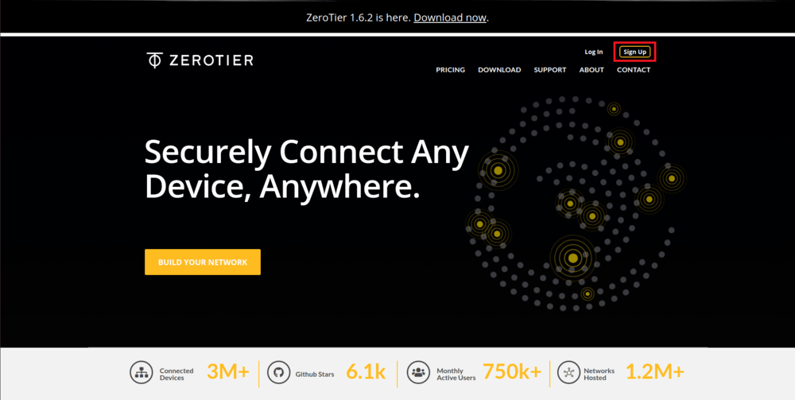

2. Зарегистрируйтесь в ZeroTier.

    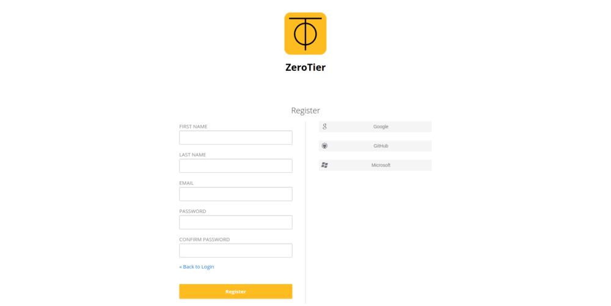

3. Зайдите в свой аккаунт.

4. Нажмите кнопку *Create A Network*.

    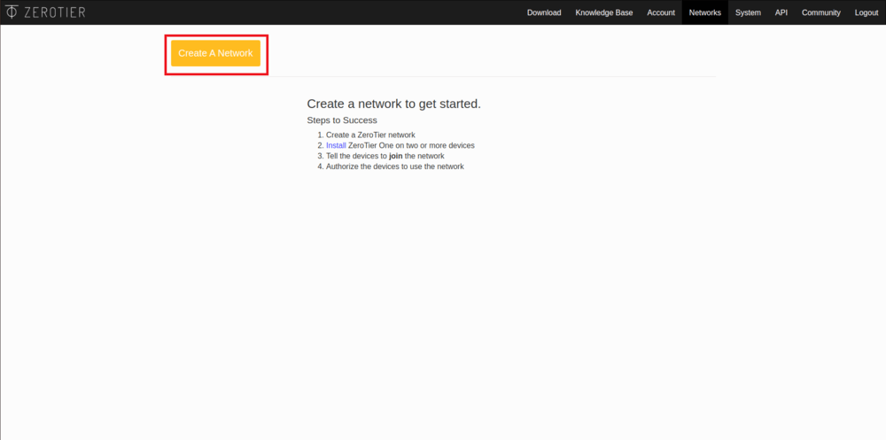

5. После этого вы увидите созданную вами сеть, ее ID и название. Для настройки сети нажмите на нее.

    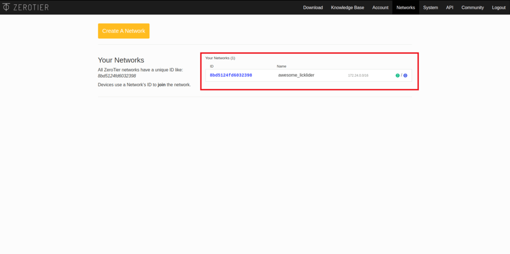

6. В открывшемся окне можно изменить имя сети и приватность подключения.

    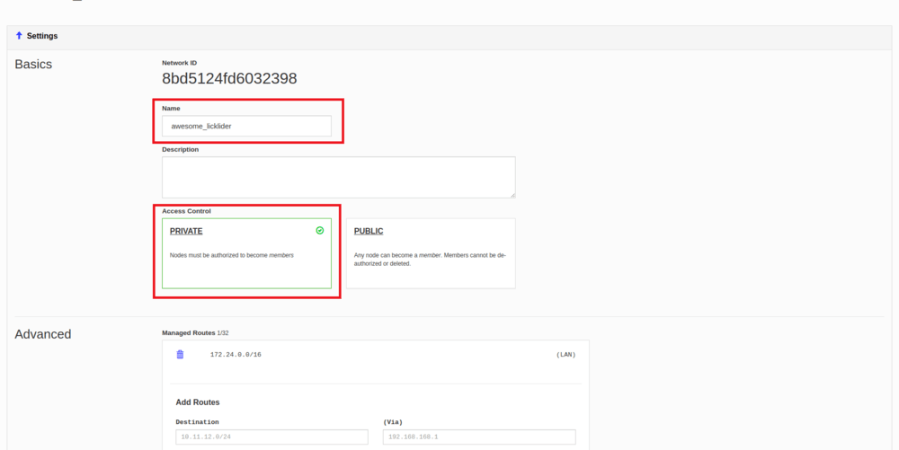

7. Пролистайте ниже, до графы *Members*. В ней будет написано о том, что в сети нету пользователей.

    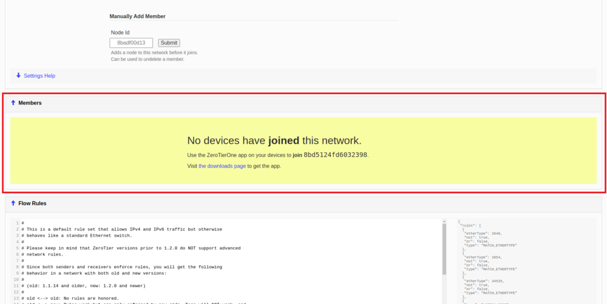

8. Устройства подключенные к сети будут отображаться в данной графе, для того, чтобы позволить им подключиться к сети, активируйте чекбокс *Auth?*. При этом, подключенному устройству автоматически выдастся внутренний IP адрес, в дальнейшем он будет использоваться для связи с данным устройством.

    <div class="image-group">
        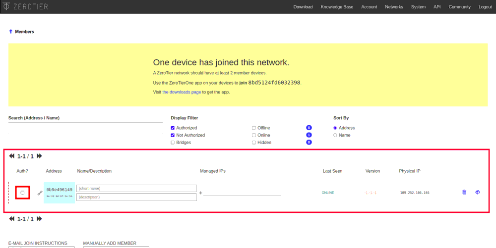
        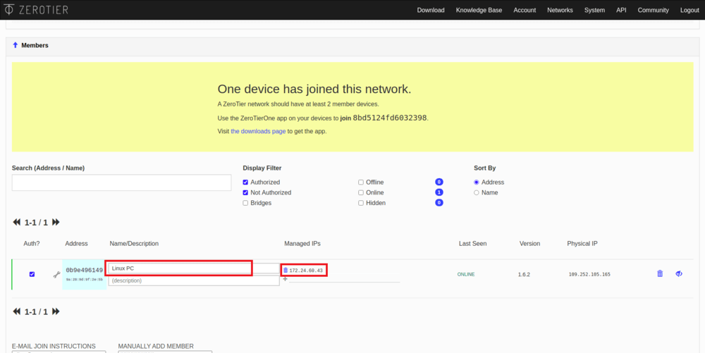
    </div>

    > **Hint** Указывайте имена для новых устройств, этом поможет вам в дальнейшем отличать их друг от друга.

9. Повторите последний шаг для всех подключаемых устройств.

    > **Info** Сеть ZeroTier в случае бесплатного использования поддерживает до 50 пользователей одновременно.

## Настройка на Windows

### Установка приложения

1. Перейдите на сайт ZeroTier.

    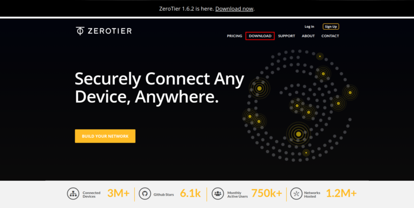

2. Нажмите на иконку Windows.

    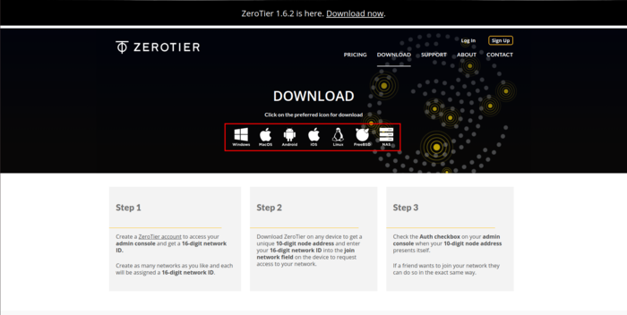

3. Скачайте и запустите файл `ZeroTier One.msi`.

    <div class="image-group">
        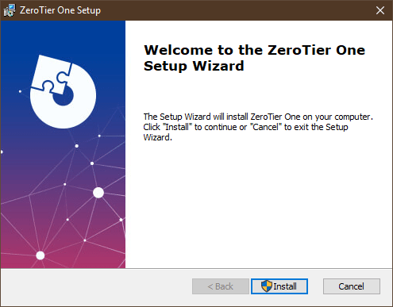
        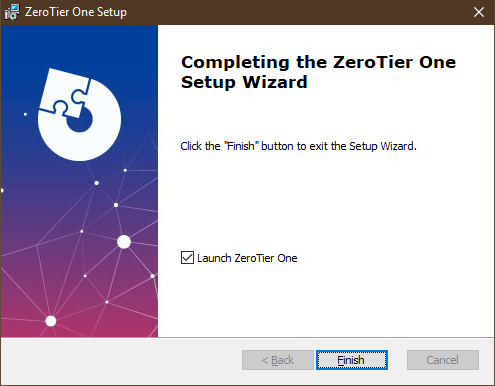
    </div>

### Подключение к сети

1. Запустите ZeroTier One.

2. Нажмите на иконку ZeroTier One в панели задач.

3. Нажмите на кнопку *Join Network...* для подключения к сети.

    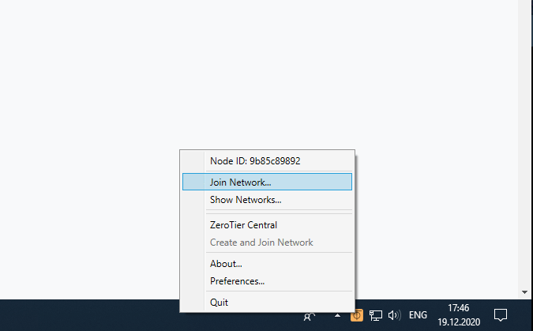

4. В появившемся окне введите ID вашей сети и нажмите кнопку *Join*.

    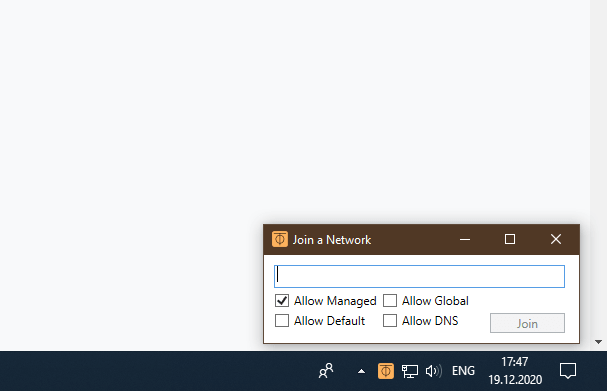

5. Разрешите использование новой сети.

    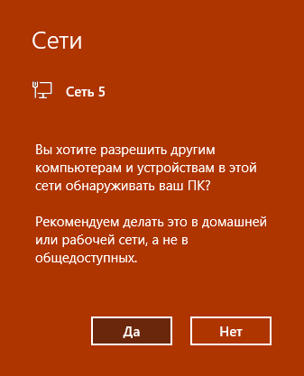

## Настройка на iOS

### Установка приложения

1. Перейдите на сайт ZeroTier.

    

2. Нажмите на иконку iOS.

    

3. Установите приложение *ZeroTier One*.

### Подключение к сети

1. Запустите приложение *ZeroTier One*.

2. Нажмите на *+* для добавления нового подключения.

    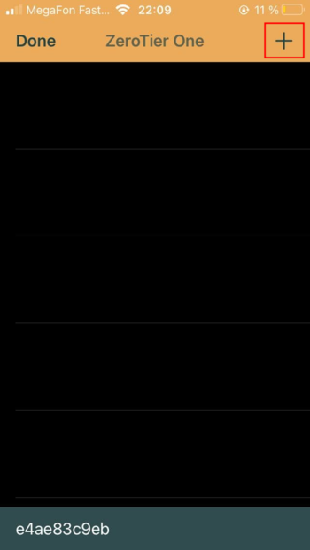

3. Подтвердите политику конфиденциальности.

    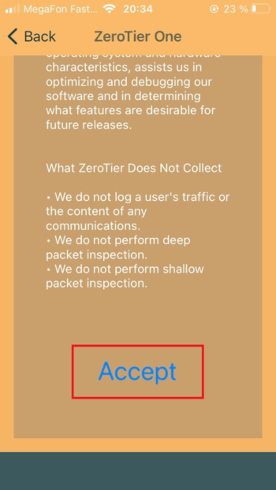

4. Введите ID вашей сети и нажмите кнопку *Add Network*.

    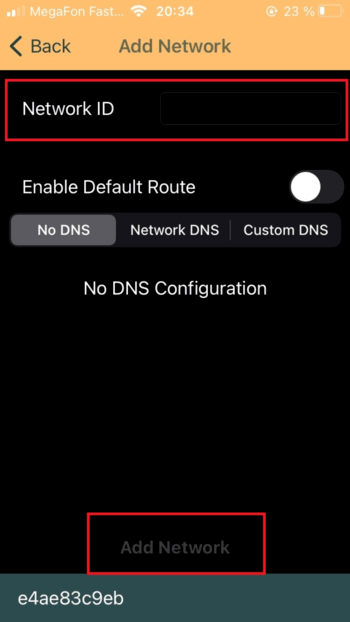

5. Подтвердите добавление новой конфигурации VPN.

6. Подключитесь к VPN сети, сдвинув ползунок активации сети.

    <div class="image-group">
        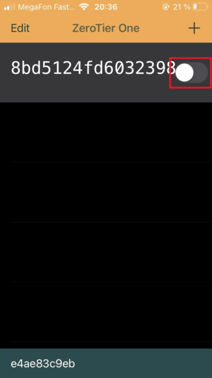
        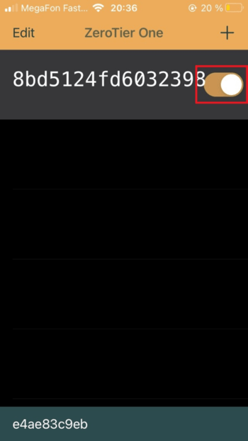
    </div>

## Настройка на Linux (PC, Raspberry Pi)

### Установка приложения

1. Откройте консоль, для этого нажмите сочетание клавиш *Ctrl* + *Alt* + *T* или в строке поиска программ введите *Terminal*

2. Введите команду установки ZeroTier.

    ```bash
    curl -s https://install.zerotier.com | sudo bash
    ```

### Подключение к сети

1. Откройте консоль.

2. Введите команду `sudo zerotier-cli join network-id`, где `network-id` это ID вашей сети.

    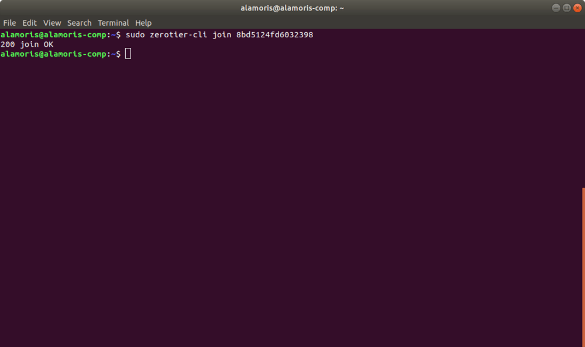

3. При успешном подключении, в консоль будет выведено соответствующее сообщение.

## Установка и настройка на macOS

### Установка приложения

1. Перейдите на сайт ZeroTier.

    

2. Нажмите на иконку macOS.

    

3. Скачайте и запустите файл `ZeroTier One.pkg`.

4. Установите приложение ZeroTier One.

### Подключение к сети

1. Запустите приложение ZeroTier One.

2. В панели задач нажмите на иконку ZeroTier One.

3. В открывшемся окне нажмите *Join Network...*.

    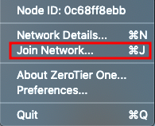

4. В поле *Enter Network ID* введите ID вашей сети.

    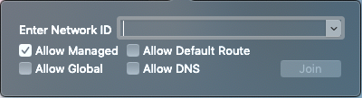

## Подключение к коптеру

1. Убедитесь, что ZeroTier работает и имеет соединение с сетью на дроне и управляющем устройстве. Для этого убедитесь, что интересующие вас устройства имеют статус *Online*.

    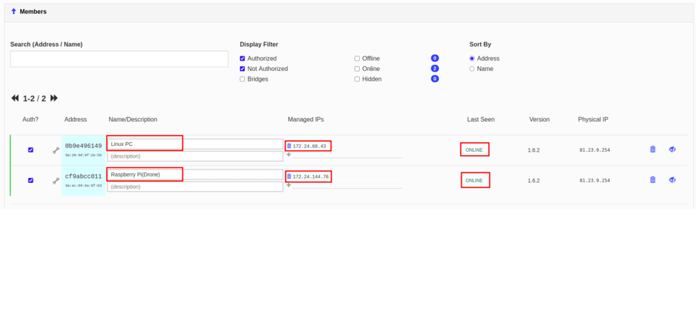

2. Убедитесь, что у всех устройств есть локальные IP адреса - *Managed IPs*.

3. Откройте GQC и во вкладке *Comm Links* добавьте TCP подключение, указав IP дрона. Подробнее про удаленное подключение читайте [тут](gcs_bridge.md).

    <div class="image-group">
        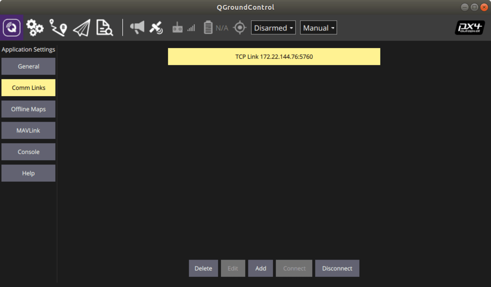
        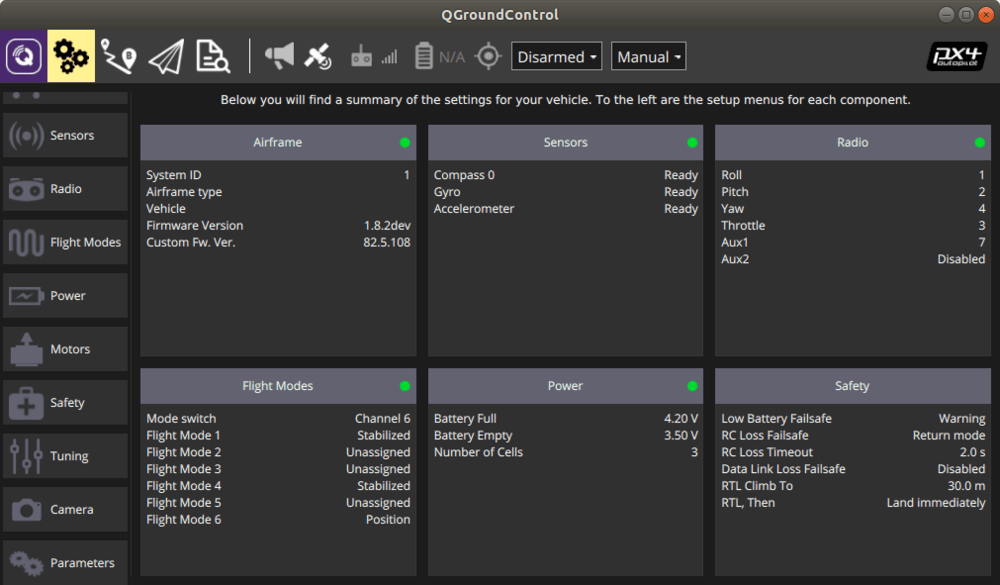
    </div>
