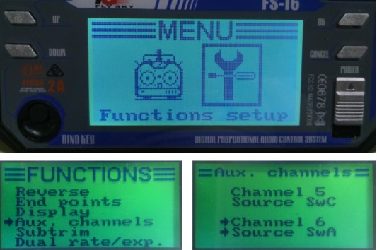
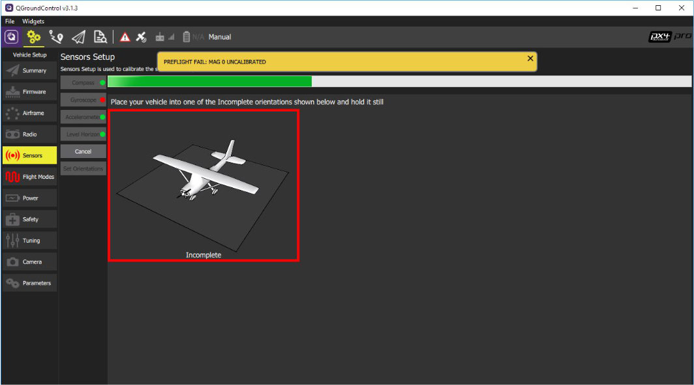
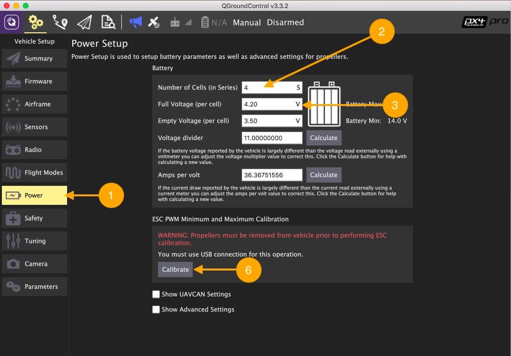

Предварительная настройка квадрокоптера
======

### 1. Состав пульта FLYSKY i6
---------------------

### 2. Установка QGroundCongtrol
* Скачиваем установочный файл для Windows/iOS по ссылке [QGroundCongtrol](http://qgroundcontrol.com/downloads/).
* Соглашаемся с установкой драйверов при инсталяции

### 3. Форматирование карты памяти

* Устанавливаем карту памяти microSD в адаптер
* Форматируем карту в файловую систему FAT32
  правый клие на диске > Форматирование
* Выполняем "Безопасное извлечение" карты напанели инструментов, далее извлекаем карту
* Устанавливаем micrSD карту в полетный контроллер Pixhawk.

### 4. Обновление прошивки Pixhawk

1. Заходим в Vehicle Setup.
2. Выбираем Firmware.
3. Отключаем Pixhawk от USB. Подключаем Pixhawk к USB снова.
4. Ждем подключения Pixhawk,  выбираем прошивку PX4 Flight Stack и активируем Advanced settings.
5. Выбираем тип прошивки Standard Version (stable). Если загружать собственную прошивку/ прошивку внешним файлом (например, скачанную из интернета), то выбираем Customize из выпадающего меню.
6. Кликаем OK. Ждем загрузку.
7. Ждем, пока Pixhawk выполнит перезагрузку

### 5. Настройка Pixhawk

1. Системы, нуждающиеся в настройке: Airframe, Radio, Sensors, Flight Mode
2. Текущая прошивка контроллера.
3. Текущий полетный режим.
4. Сообщения об ошибках.

### 6. Выбор рамы

1. Заходим в меню Airframe.
2. Выбираем тип рамы Quadrotor X.
3. Выбираем тип навесных элементов Generic Quadrotor X config
4. Перемещаемся в начало списка и сохраняем настройки Apply and Restart

5. Повторно подтверждаем Apply
6. Ждем, пока Pixhawk  выполнит сохранение и перезагрузится

### 7. Подключение пульта

#### Убедитесь, что перед калибровкой:
  * К коптеру не подключено внешнее питание АКБ
  * Пропеллеры не установлены на моторах

1. Заходим в меню Radio
2. Включаем пульт, переводя переключатель Power в верхнее положение
3. Далее необходимо убедиться, что связь с приемником установлена:
  * На ЖК Экране пульта высвечивается индикация

  

  * Светодиод на приемнике горит непрерывно красным

 При наличиии проблем с подключением щелкните [здесь](radioerrors1.md)

### 8. Настройка режимных каналов

Каналы CH5 и CH6 необходимы для настройки полета коптера.
На канал CH5 назначаем 3-х позиционный переключатель SwC - будем изменять полетные режимы
На канал CH6 назначаем 2-х позиционный переключатель SwA - аварийная остановка моторов

#### Чтобы переназначить переключатели, выполните следующие действия:

1. Зайдите в МЕНЮ (удерживаем нажатой кнопку “ОК”)
2. Выберите меню “Functions setup” (Кнопки Up/Down - для навигации, кнопка “ОК” - подтверждение выбора
3. Выберите “Aux. channels”
4. Выберите
 * Channel 5 - SwC
 * Channel 6 - SwA
5. Сохраните изменения (удерживаем нажатой кнопку “CANCEL”)

### 9. Калибровка пульта

Начинаем процедуру калибровки

1. Нажимаем кнопку Calibrate
2. Устанавливаем триммеры Throttle, Yaw, Pitch, Roll в 0.
 * Триммеры позволяют задавать смещение коптеру.
 * Чтобы установить один из триммеров в 0, необходимо на пульте переместить указатель в центр до длительного звукового сигнала (писка)
3. Жмем ОК

4. Переводим Левый стик (газ) (throttle) в минимум и кликаем Next
5. Калибровка каналов управления (throttle, yaw, pitch, roll).
 Повторяем движения стиками вслед за анимацией и читаем подсказки.
6. Калибровка переключателей.
 При появлении надписи Move all transmitter switches and/or dials back and forth to their extreme positions переключаем SwA..SwD, VrA,   VrB в их конечные положения.
 Кликаем Next
7. Сохранение параметров.
 При появлении надписи "All settings have been captured. Click Next to write the new parameters to your board"
  Кликаем Next

8. Калибровка пульта завершена!

### 10. Калибровка акселерометра

1. Заходим в меню Sensors > Accelerometer
2. Поскольку направление Pixhawk совпадает с носом БПЛА, то выбираем Autopilot Orientation: ROTATION_NONE
   Кликаем OK

   

3. Начинаем калибровку:
   Последовательно располагаем БПЛА как на картинках, когда Pixhawk захватит положение, вокруг картинки появится желтая рамка - удерживаем в этом положении БПЛА до переключения в зеленую рамку

 

### 11. Калибровка компаса

1. Заходим в меню Sensors > Compass
2. Поскольку направление Pixhawk совпадает с носом БПЛА, то выбираем Autopilot Orientation: ROTATION_NONE
   Кликаем OK
3. Начало калибровки.
* Выбираем ориентацию БПЛА как на картинке и ждем, когда Pixhawk определит положение БПЛА, появится желтая рамка и надпись "Rotate"
* Вращаем БПЛА как на картинке до появления зеленой рамки - Pixhawk откалибровал компас по данной оси.

 ### 12. Калибровка гироскопа

1. Заходим в меню Sensors > Gyroscope
2. Устанавливаем БПЛА на ровную поверхность и кликаем OK
Ждем окончания калибровки.

 ##### Во время калибровки БПЛА не должен менять своего положения, шататься и т.д.

### 13. Полетные режимы

1. Заходим в меню Flight Modes
2. Устанавливаем переключатель каналов на переключатель SwC (Channel 5)
   Mode channel - Channel 5
3. Переключая SwC, текущий режим подсвечивается желтым цветом.
4. Назначаем полетные режимы:
 * Flight Mode 1: Stabilized
 * Flight Mode 4: Altitude
 * Flight Mode 6: Hold
5. Отображение текущего полетного режима
6. Аварийное отключение моторов ставим на переключатель SwA (Channel 6).
   Kill switch - Channel 6

 ### 14. Отключение Safety Switch

В полетном контроллере PIXHAWK стоит защита моторов от случайного использования.
Чтобы разблокировать коптер, необходимо отключить кнопку безопасности

1. Заходим в меню Parameters > Circuit Breaker
2. Выбираем параметр CBRK_AIRSPD_CHK, устанавливаем максимальное значение параметра (оно указано в строке Maximum Value окна Parameter Editor)
3. Сохраняем значения, кликая по кнопке Save
4. Повторяем установку максимальных значений для всех параметров, кроме CBRK_RATE_CTRL и CBRK_VELPOSERR

  ### 15. Калибровка регуляторов

1. Заходим в меню Power
2. Устанавливаем количество банок Number of cells - 4S
3. Устанавливаем параметр Full Voltage (per cell) - 4.20V

Чтобы изменения сохранились, необходимо перезагрузить Pixhawk.
* Отключаем Pixhawk от USB
* Подключаем Pixhawk к USB снова

4. Проверяем, что АКБ не подключена и пропеллеры сняты
   Нажимаем Calibrate

 ### 16. Настройка PID - регулятора

 Если во время полета, квадрокоптер имеет осцилляции (колебания) и в связи с этим не может корректно летать, то необходимо провести [подстройку коэффициентов ПИД - регулятора](calibratePID.md)

 По умолчанию для квадрокоптера Клевер 2 используются следующие коэффициенты:
 1. Заходим в меню Parameters > Multicopter Attitude Control
 2. Устанавливаем выделенные значения параметров ПИД регулятора для углов Roll и Pitch:

 * MC_PITCHRATE_P: 0.145
 * MC_PITCHRATE_I: 0.050
 * MC_PITCHRATE_D: 0.0025

 * MC_ROLLRATE_P: 0.145
 * MC_ROLLRATE_I: 0.050
 * MC_ROLLRATE_D: 0.0025

 ## ИНСТРУКЦИЯ ПО БЕЗОПАСНОСТИ

#### Безопасность при подготовке к вылету

* Убедиться, что Li-ion аккумуляторы заряжены.
* Убедиться, что батарейки в аппаратуре управления заряжены.
* Устанавливать пропеллеры только перед вылетом.
* Проверить надёжность следующих узлов:
1. Затянутость гаек пропеллеров.
2. Крепление и целостность защит винтов.
3. Надежность крепления проводов, отсутствие болтающихся проводов.

#### Безопасность перед вылетом

* Располагать зрителей за спиной пилота или за линией, проходящей через оба плеча пилота за спиной пилота.
* Не допускать выхода зрителей в полусферу перед лицом пилота.
* Знать и помнить время полёта, на которое рассчитан данный коптер и его аккумулятор.

* ДО подключения Li-ion аккумулятора включить аппаратуру управления (пульт), перевести левый стик (газ) в нулевое положение.
* Подключать Li-ion аккумулятор только перед взлётом, отключать сразу после взлёта.
* Стоять на расстоянии не менее 3 м от коптера.
* Взлетать с земли с ровной площадки, на расстоянии не менее 3 метров от препятствий.

 #### Безопасность в полете

* Выполнять все указания преподавателя или лётного инструктора.
* Заранее обозначить зону пилотажа. Летать только в обозначенной зоне и не допускать вылета за её пределы. Не залетать за собственную спину.
* При обучении полётам летать на уровне ниже собственного роста.
* Летать рядом с собой на расстоянии, на котором вам видна ориентация коптера в пространстве. Не улетать далеко от себя. В случае сомнений в ориентации коптера немедленно выполнить посадку на месте. Не пытаться взлететь. Подойти ближе к коптеру и выполнить взлёт.
* При управлении все движения стиками выполнять аккуратно и плавно. Не допускать резких движений. При необходимости изменить направление полёта двигать стиками следует энергично, но не резко.

“РЕЗКИЕ движения стиками ЗАПРЕЩАЮТСЯ. Движения стиками В КРАЯ ЗАПРЕЩАЮТСЯ.”

* Летать следует осторожно и выполнять только те элементы, в которых нет сомнений. Запрещается выполнять фигуры пилотажа, в успехе которых возникают сомнения и фигуры, связанные с риском.
* Соблюдать скоростной режим. Скорость полёта коптера держать в пределах скорости идущего человека.
* Вернуть коптер к месту посадки к рассчитанному времени, не допускать полной разрядки аккумулятора в полёте.
* Посадку выполнять только на ровную открытую площадку вдали от препятствий

### АВАРИЙНАЯ ПОСАДКА

В случае удара об землю или жесткой посадки выполнить следующие действия:

1. Прекратить полёт. Посадить коптер на землю. Левый стик (газ) в минимум
2. Disarm (Левый стик влево-вниз на 3 секунды)
3. Отключить Li-ion аккумулятор на коптере.
4. Выключить пульт.
5. Осмотреть коптер и при необходимости отремонтировать.

### ЗАПЛАНИРОВАННАЯ  ПОСАДКА

После запланированной посадки выполнить следующие действия:

1. Disarm (Левый стик влево-вниз на 3 секунды)
2. Отключить  Li-ion аккумулятор на коптере.
3. Выключить пульт.

Далее: [Настройка-полетного-контролера](aruco.md#Настройка-полетного-контролера)

Далее: [Подключение Raspberry Pi к PixHawk](connection.md).
