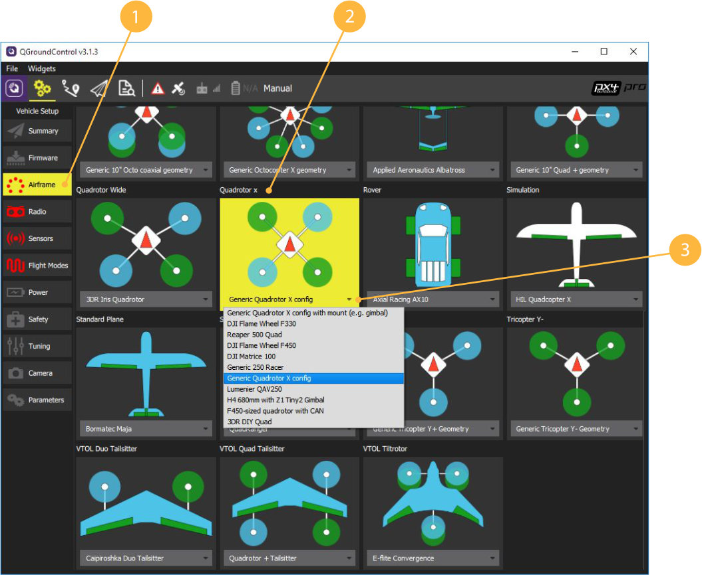

Предварительная настройка квадрокоптера
======

### 1. Состав пульта FLYSKY i6
---------------------


### 2. Установка QGroundCongtrol
* Скачиваем установочный файл для Windows/iOS по ссылке [QGroundCongtrol](http://qgroundcontrol.com/downloads/).
* Соглашаемся с установкой драйверов при инсталяции

### 3. Форматирование карты памяти

* Устанавливаем карту памяти microSD в адаптер
* Форматируем карту в файловую систему FAT32
  правый клие на диске > Форматирование
* Выполняем "Безопасное извлечение" карты напанели инструментов, далее извлекаем карту
* Устанавливаем micrSD карту в полетный контроллер Pixhawk.

### 4. Обновление прошивки Pixhawk


1. Заходим в Vehicle Setup.
2. Выбираем Firmware.
3. Отключаем Pixhawk от USB. Подключаем Pixhawk к USB снова.
4. Ждем подключения Pixhawk,  выбираем прошивку PX4 Flight Stack и активируем Advanced settings.
5. Выбираем тип прошивки Standard Version (stable). Если загружать собственную прошивку/ прошивку внешним файлом (например, скачанную из интернета), то выбираем Customize из выпадающего меню.
6. Кликаем OK.
7. Отключаем Pixhawk от USB.
8. Подключаем Pixhawk к USB снова.

### 5. Настройка Pixhawk


1. Системы, нуждающиеся в настройке: Airframe, Radio, Sensors, Flight Mode
2. Текущая прошивка контроллера.
3. Текущий полетный режим.
4. Сообщения об ошибках.

### 6. Выбор рамы



1. Заходим в меню Airframe.
2. Выбираем тип рамы Quadrotor X.
3. Выбираем тип навесных элементов Generic Quadrotor X config
4. Перемещаемся в начало списка и сохраняем настройки Apply and Restart


5. Повторно подтверждаем Apply
6. Ждем, пока Pixhawk  выполнит сохранение и перезагрузится

### 7. Калибровка радиоаппаратуры

#### Убедитесь, что перед калибровкой:
  * К коптеру не подключено внешнее питание АКБ
  * Пропеллеры не установлены на моторах
  
1. Заходим в меню Radio
2. Включаем пульт, переводя переключатель Power в верхнее положение
3. Далее необходимо убедиться, что связь с приемником установлена:
  * На ЖК Экране пульта высвечивается индикация
  ![ Индикация пульта] (../img/unblockView.jpg)
  * Светодиод на приемнике горит непрерывно красным
  
 При наличиии проблем с подключением щелкните 


3. Начинаем калибровку Calibrate
Устанавливаем все триммеры в 0.Триммеры позволяют задавать смещение коптеру. Чтобы установить в 0, необходимо указатель переместить в центр до длительного звукового сигнала (писк)
Жмем ОК


3. Залить прошивку PX4 последней версии. Для полетов в помещении на клевере – вариант с эстимейтором LPE.

TODO

4. Выбрать в QGroundControl раму, соответствующую раме коптера, например Quadrotor X (3DR DIY Quad) для квадрокоптера

TODO

5. Провести калибровки IMU, компаса, радиопульта.

TODO

Настройка для автономных полетов с использованием companion-computer (Raspberry Pi 3)
===

Основная статья: https://dev.px4.io/en/ros/offboard_control.html

6. Убедиться в коррекном подключении Raspberry Pi и PixHawk по UART.

7. Установить значение SYS_COMPANION на 921600 в параметрах.

8. Убедиться в работоспособности подключения, выполнив с Raspberry Pi:

```bash
rostopic echo /mavros/state
```

9. Отключить Safety Switch, если он не установлен, поменяв параметр CBRK_IO_SAFETY на 22027.

10. Включить land detector (если необходим режим AUTO.LAND), изменив значения параметра COM_DISARM_LAND. Подробнее: https://dev.px4.io/en/tutorials/land_detector.html

Настройка PX4 для использования marker_navigator
===

Для полетов по полю маркеров убедиться, что:

* SYS_MC_EST_GROUP = local_position_estimator
* В LPE_FUSION установлены **только** vision position, vision yaw, land detector. При желании, можно включить Baro (барометр).
* Выключен компас: ATT_W_MAG = 0
* Включена ориентация по Yaw по зрению: ATT_EXT_HDG_M = Vision
