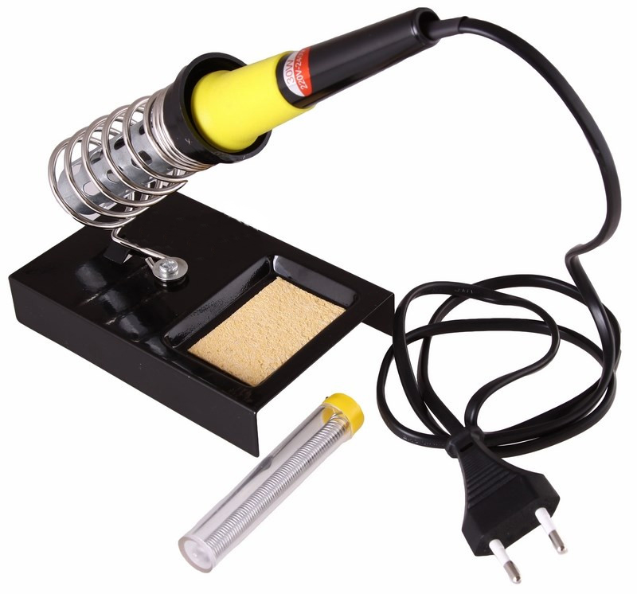
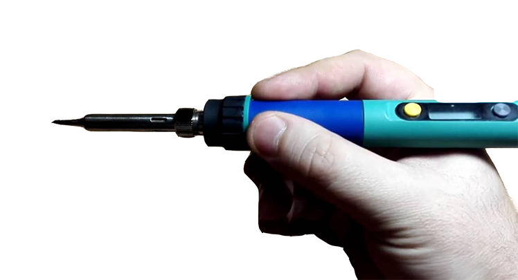
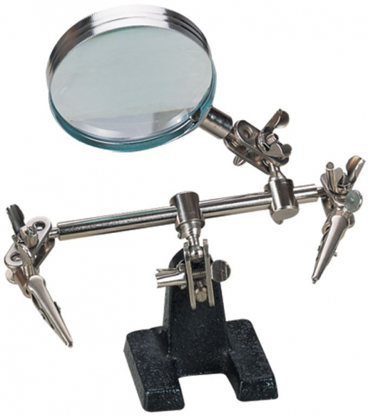

Техника безопасности при пайке
==============================
  Работы, связанные с пайкой и лужением, должны проводиться в специально оборудованных и предварительно подготовленных помещениях. Обязательно должна присутствовать система вентиляции. 

Перед началом работы необходимо: 
1. Привести в порядок рабочее место, ничего не должно мешать процессу. Рабочее место должно быть хорошо освещено.
2. Паяльник, находящийся в рабочем состоянии, установить в зоне действия местной вытяжной вентиляции, в специалюную подставку.

3. Жало паяльника имеет высокую температуру. Во избежание ожогов следует держать паяльник за ручку. 

4. Для перемещения изделий применять специальные инструменты (пинцеты, клещи или другие инструменты), обеспечивающие безопасность при пайке. 
5. Во избежание ожогов расплавленным припоем при распайке не выдергивать резко с большим усилием паяемые провода. 
6. При пайке мелких и подвижных изделий пользоваться специальным держателем. 

7. Паяльник переносить за корпус, а не за провод или рабочую часть. При перерывах в работе паяльник отключать от электросети. 
8. При обнаружении неисправной работы паяльника или возникновении возгорания отключить его от питающей электросети.
