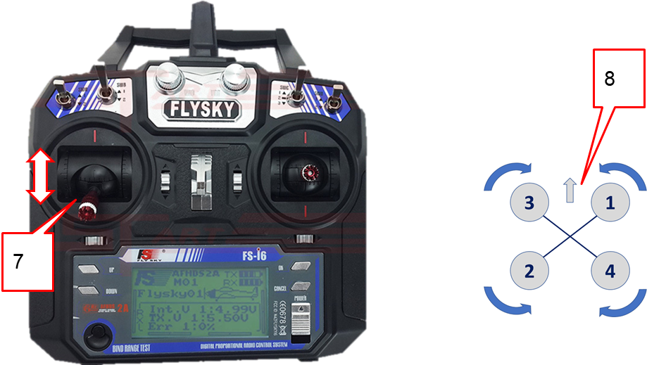

### Проверка направления вращения моторов

1. Наклеить наклейки на АКБ 18650.
2. Установить 18650 в отсек АКБ, соблюдая полярность.

3. Проверить, что разъем питания 5В подключен к приемнику по схеме.
4. Подключить регулятор мотора к 3 каналу приемника CH3 по схеме.

5. Подключить внешнее питание (АКБ).
6. Включить пульт.
7. Подать левым стиком газ (throttle) на 10%.
8. Проверить направления вращения мотора по схеме.

9. Если необходимо изменить направление вращения, то меняем любые два фазных провода мотора (нужно перепаять).

