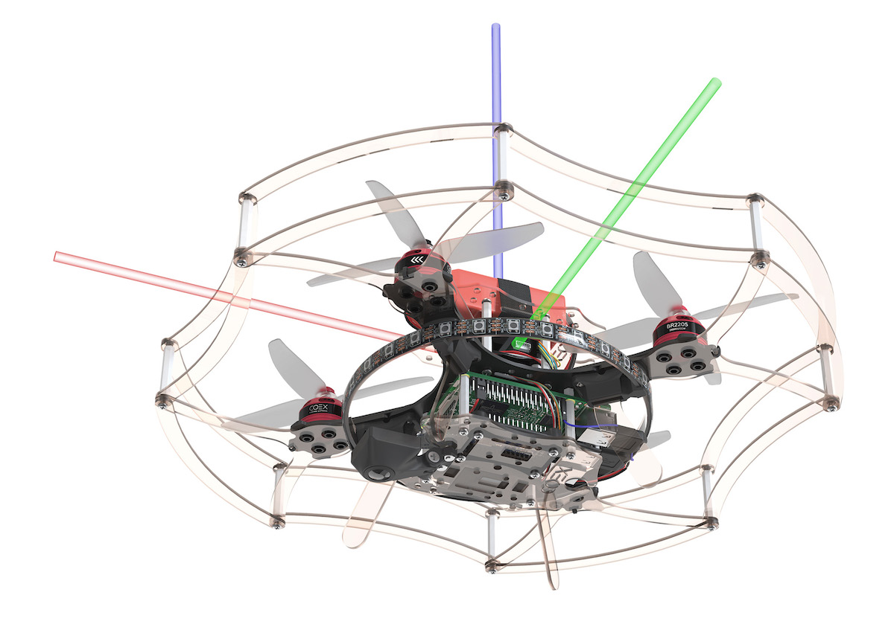
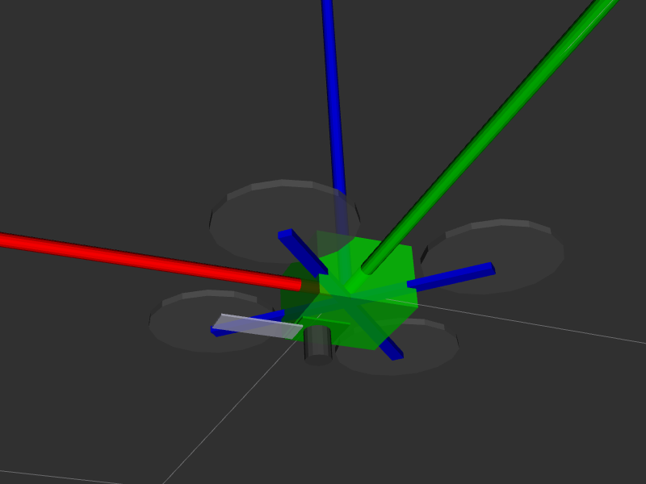
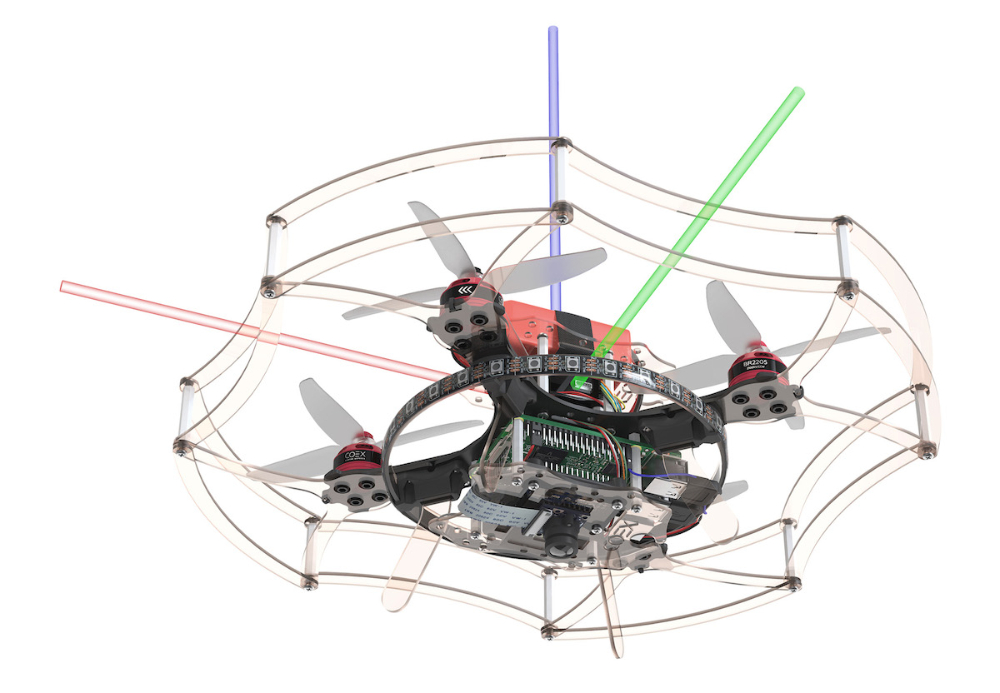
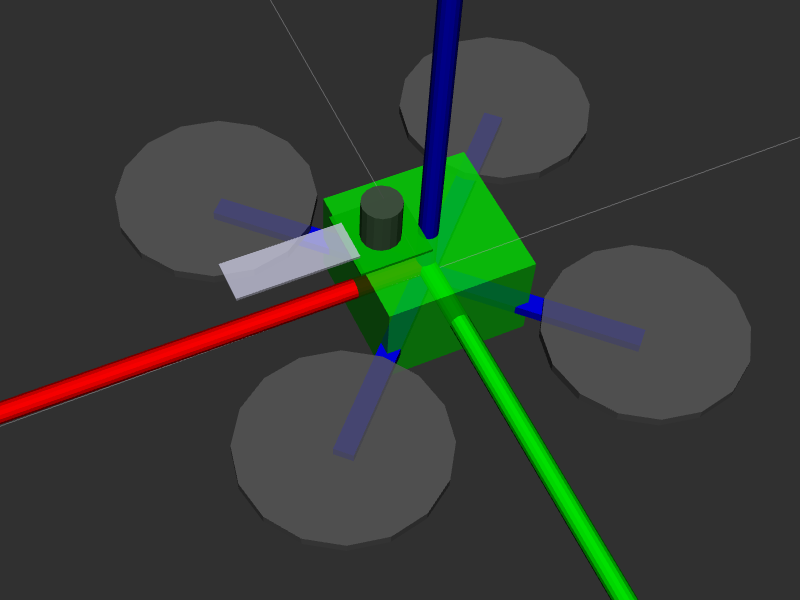
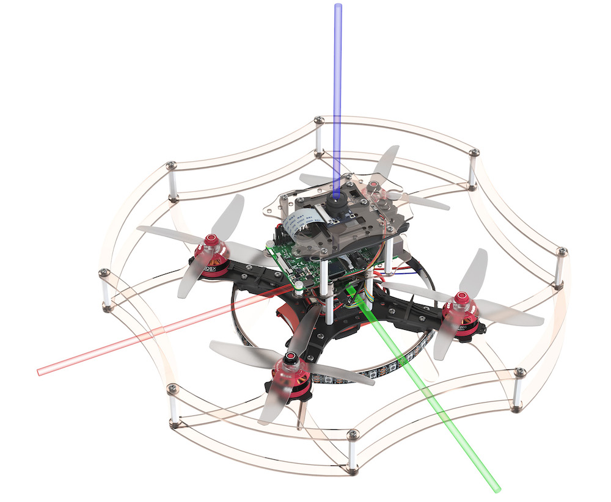

# Camera setup

> **Note** The following applies to [image version](image.md) **0.20** and up. See [previous version of the article](https://github.com/CopterExpress/clover/blob/v0.19/docs/en/camera_frame.md) for older images.

Computer vision modules (like [ArUco markers](aruco.md) and [Optical Flow](optical_flow.md)) require adjusting the camera focus and set up camera position and orientation relative to the drone body. Optional camera calibration can improve their quality of performance.

## Focusing the camera lens {#focus}

In order to focus the camera lens, do the following:


1. Open the live camera stream in your browser using [web_video_server](web_video_server.md).
2. Rotate the lens to adjust the image. Make sure the objects that are 2-3 m from the camera are in focus.

|Unfocused image|Focused image|
|-|-|
|||

## Setting the camera position {#frame}

Position and orientation of the main camera is [set in the](cli.md#editing) `~/catkin_ws/src/clover/clover/launch/main_camera.launch` file:

```xml
<arg name="direction_z" default="down"/> <!-- direction the camera points: down, up -->
<arg name="direction_y" default="backward"/> <!-- direction the camera cable points: backward, forward -->
```

To set the orientation, define:

* direction the camera lens points `direction_z`: `down` or `up`;
* direction the camera cable points `direction_y`: `backward` or `forward`.

### Examples

### Camera faces downward, cable goes backward

```xml
<arg name="direction_z" default="down"/>
<arg name="direction_y" default="backward"/>
```




### Camera faces downward, cable goes forward

```xml
<arg name="direction_z" default="down"/>
<arg name="direction_y" default="forward"/>
```




### Camera faces upward, cable goes backward

```xml
<arg name="direction_z" default="up"/>
<arg name="direction_y" default="backward"/>
```


### Camera faces upward, cable goes forward

```xml
<arg name="direction_z" default="up"/>
<arg name="direction_y" default="forward"/>
```




> **Hint** The [`selfcheck.py` utility](selfcheck.md) will describe your current camera setup in a human-readable fashion. Be sure to check whether this description corresponds to your actual camera position.

### Custom camera position

It's possible to set arbitrary camera position and orientation. In order to do that uncomment node, marked as `Template for custom camera orientation`:

```xml
<!-- Template for custom camera orientation -->
<!-- Camera position and orientation are represented by base_link -> main_camera_optical transform -->
<!-- static_transform_publisher arguments: x y z yaw pitch roll frame_id child_frame_id -->
<node pkg="tf2_ros" type="static_transform_publisher" name="main_camera_frame" args="0.05 0 -0.07 -1.5707963 0 3.1415926 base_link main_camera_optical"/>
```

This line describes how the camera is positioned relative to the drone body. Technically, it creates a static transform between the `base_link` frame ( which [corresponds to the flight controller housing](frames.md)) and the camera (`main_camera_optical`) in the following format:

```txt
shift_x shift_y shift_z yaw_angle pitch_angle roll_angle
```

Camera frame (that is, [frame of reference](frames.md)) is aligned as follows:

* **<font color=red>x</font>** points to the right side of the image;
* **<font color=green>y</font>** points to the bottom of the image;
* **<font color=blue>z</font>** points away from the camera matrix plane.

Shifts are set in meters, angles are in radians. You can check the transform for correctness using [rviz](rviz.md).

## Calibration {#calibration}

To improve the quality of computer vision related algorithms it's recommended to perform camera calibration, which is described in the [appropriate article](camera_calibration.md).
