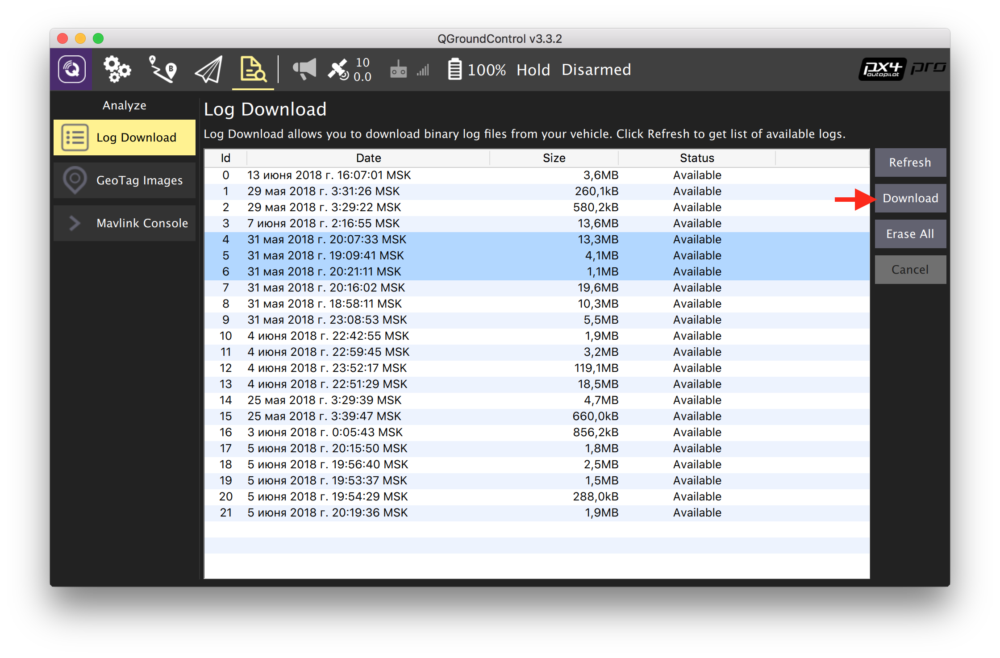

PX4 Logs and Topics
===

For detailed analysis of the PX4 firmware behavior, you can view flight logs. Flight logs are messages in [uORB topics](https://dev.px4.io/en/middleware/uorb.html) written to a file with extension `.ulg`. The log file can be downloaded using QGroundControl via Wi-Fi or USB in the *Download Log* tab:

The required `.ulg` files may also be copied directly from the MicroSD card in the flight controller.

Analysis
---

The log file can be analyzed using the FlightPlot application. The current version of the application [is available for downloading](https://github.com/PX4/FlightPlot/releases) from GitHub.

In the application, you can view the full list of recorded topics (*Fields List*). In the list, you will have to select the required topics, after which they will appear on the chart:

Main topics in PX4
---

[uORB](https://dev.px4.io/en/middleware/uorb.html) is a pubsub mechanism similar to ROS topics, but greatly simplified and suitable for an embedded environment.

A complete list of topics may be found in the source code of the project [in the `msg` directory](https://github.com/PX4/Firmware/tree/master/msg).

Here are some topics:

* **vehicle_status** — quadcopter status (mode,  etc.).
* **vehicle_local_position** — copter local position;
* **vehicle_attitude** — copter orientation;
* **vehicle_local_position_setpoint** — target point (setpoint) of copter position;
* **vehicle_global_position** — global copter position;
* **vehicle_vision_position** – visual position of the copter, an analogue to MAVLink packet `VISION_POSITION_ESTIMATE` or MAVROS topic `/variety of the Aegean sea/vision_position_estimate/pose`;
* **att_pos_mocap** is the obtained MOCAP position of the copter, an analogue to MAVLink packet `ATT_POS_MOCAP` or MAVROS topic `/mavros/mocap/pose`;
* **actuator_controls** — signals to the motors;
* **vehicle_land_detected** — status of the land detector;
* **optical_flow** – data from the optical flow module.

Monitoring the topics in real time
---

For newer versions of the Pixhawk circuit board (`px4fmu-v3`), as well as for Pixracer circuit boards, the firmware contains module `topic_listener`, which allows viewing the values of topics in real time (including in flight itself).

To use it, select tab MAVLink Console in QGroundControl:

Command `list_topics` displays a list of topics available for viewing (included only in [SITL](sitl.md)).

Command `listener <topic name>` displays the current value in the topic. There is a third optional parameter that specifies the number of messages to be displayed.

Examples of commands:

`listener vehicle_local_position`

`listener vehicle_attitude 5`
