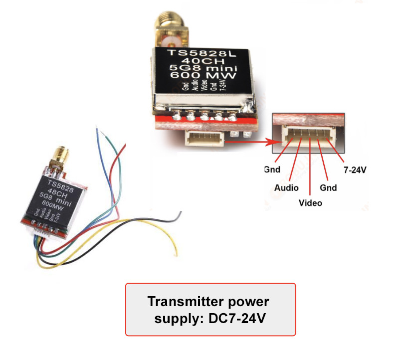
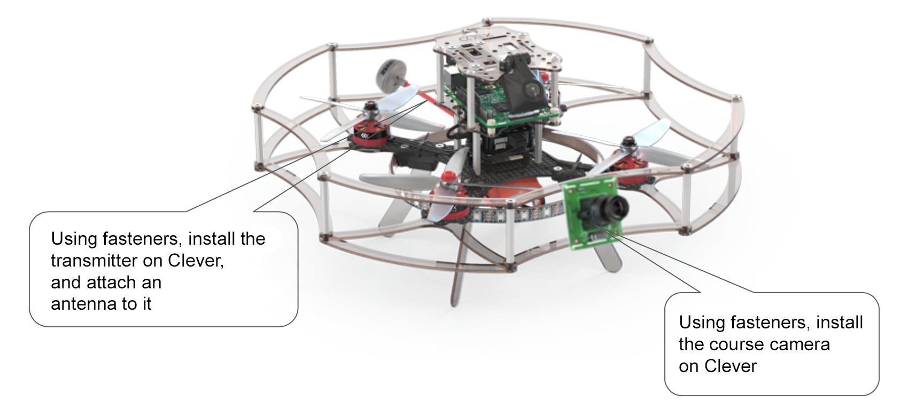

# Installation of FPV

## Preparation of the FPV camera

1. Take the connector wire from the camera and cut off the BLACK side of the 3-pin connector.
1. Prepare the wire leads to be connected:
   1. Shorten the wires to the desired length *.
   1. Strip (remove 2 mm of insulation from the end of the wire without damaging the strands).
   1. Twist the wires.
   1. Blanch using tweezers.

\* The distance between the power distribution board and the estimated location of the camera should be determined in advance!

## Preparation of the transmitter

The same procedure applies here:

1. Take the connector wire from the transmitter and cut off the BLACK side of the 5-pin connector.
2. Prepare the wire leads to be connected:
   1. Shorten the wires to the desired length *.
   2. Strip (remove 2 mm of insulation from the end of the wire without damaging the strands).
   3. Twist the wires.
   4. Blanch using tweezers.

\* The distance between the power distribution board and the estimated location of the transmitter should be determined in advance!

## Connection of FPV

Prepared connectors are to be inserted into appropriate sockets, and power wires are to be soldered to the power distribution board according to the circuit diagram:

> **Warning** In this circuit diagram, the camera is powered from 12 V (however, it is possible to use 5 V).
> The transmitter is powered from the ESC power (however, it is possible to use 12 V).

## Installing FPV components

The following may be used as fastening materials:

1. Hot-melt glue;
1. electrical tape;
1. zip-ties (clamps);
1. double-sided adhesive tape.
