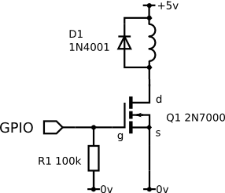

# Working with GPIO

A GPIO (General-Purpose Input/Output) pin is a programmable digital signal pin on a circuit board or a microcontroller that may act as an input or an output. Raspberry Pi has a set of easily accessible GPIO pins, some of which have hardware <abbr title="Pulse-width modulation">PWM</abbr>.

> **Info** Use the [pinout](https://pinout.xyz) for figuring out, which Raspberry Pi's pins support GPIO and PWM.

The [`pigpio`](http://abyz.me.uk/rpi/pigpio) library for interfacing with the GPIO pins is already preinstalled on [the RPi image](image.md). To interact with this library, run the appropriate daemon:

```bash
sudo systemctl start pigpiod.service
```

To enable automatic launch of the daemon, run:

```bash
sudo systemctl enable pigpiod.service
```

> **Warning** `pigpiod` may interfere with [LED strip](leds.md) if configured improperly. Make sure that the strip is connected to GPIO21. On [image versions](image.md) lower than 0.17 change the service start string in `/lib/systemd/system/pigpiod.service` to `ExecStart=/usr/bin/pigpiod -l -t 0 -x 0x0FFF3FF0`.

Example of working with the library:

```python
import time
import pigpio

# initializing connection to pigpiod
pi = pigpio.pi()

# set pin 11 mode for output
pi.set_mode(11, pigpio.OUTPUT)

# set signal of pin 11 to high
pi.write(11, 1)

time.sleep(2)

# set signal on pin 11 to low
pi.write(11, 0)

# ...

# setting pin 12 mode for input
pi.set_mode(12, pigpio.INPUT)

# read the state of pin 12
level = pi.read(12)
```

To find out the pins' numbers, consult the [Raspberry Pi pinout](https://pinout.xyz).

## Connecting servos

Servo motors are typically controlled with PWM signal. Extreme positions of servos are reached with signal widths approximately equal to 1000 and 2000 µs. Values for a specific servo can be determined experimentally.

Connect the signal wire of the servo to one of GPIO-pins of the Raspberry. To control a servo connected to the pin 13 use a code like this:

```python
import time
import pigpio

pi = pigpio.pi()

# set mode of pin 13 to output
pi.set_mode(13, pigpio.OUTPUT)

# set pin 13 to output PWM signal 1000 us
pi.set_servo_pulsewidth(13, 1000)

time.sleep(2)

# set pin 13 to output PWM signal 2000 us
pi.set_servo_pulsewidth(13, 2000)
```

## Connecting an electromagnet



To connect an electromagnet use a field-effect transistor (MOSFET). Connect the MOSFET to one of GPIO-pins of the Raspberry Pi. To control the magnet connected to the pin 15 use a code like this:

```python
import time
import pigpio

pi = pigpio.pi()

# set mode of pin 15 for output
pi.set_mode(15, pigpio.OUTPUT)

# enable the magnet
pi.write(15, 1)

time.sleep(2)

# disable the magnet
pi.write(15, 0)
```

> **Note** A more [comprehensive description](https://elinux.org/RPi_Low-level_peripherals) of the Raspberry Pi GPIO pins and [additional examples](https://elinux.org/RPi_GPIO_Interface_Circuits) of circuits are available at the [Embedded Linux wiki](https://elinux.org/RPi_Hub).
