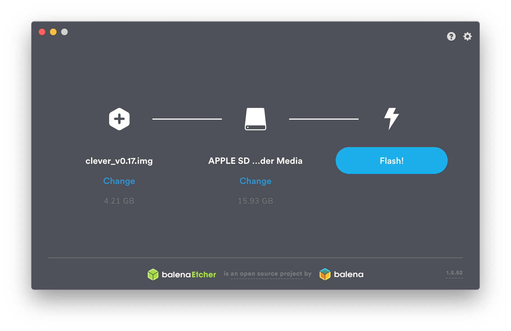

# Raspberry Pi image

The RPi image for Clover contains all the necessary software for working with Clover and [programming autonomous flights](simple_offboard.md). The Clover platform is based on [Raspbian OS](https://www.raspberrypi.org/downloads/raspbian/) and robotics framework [ROS](ros.md). The source code of the image builder and all the additional packages is [available on GitHub](https://github.com/CopterExpress/clover).

## Usage

> **Info** Starting from version v0.22, the image is based on ROS Noetic and using Python 3. If you want to use ROS Melodic and Python 2, use version [v0.21.2](https://github.com/CopterExpress/clover/releases/download/v0.21.2/clover_v0.21.2.img.zip).

1. Download the latest stable release of the image – **<a class="latest-image" href="https://github.com/CopterExpress/clover/releases">download</a>**.
2. Download and install [Etcher](https://www.balena.io/etcher/), the software for flashing images (available for Windows/Linux/macOS).
3. Put the MicroSD-card into your computer (use an adapter if necessary).
4. Flash the downloaded image to the card using Etcher.
5. Put the card into the Raspberry Pi.

After flashing the image on the MicroSD-card, you can [connect to the Clover over Wi-Fi](wifi.md), use [wireless connection in QGroundControl](gcs_bridge.md), gain access to the Raspberry [over SSH](ssh.md) and use all the other features.

**Next:** [Connecting over Wi-Fi](wifi.md).
