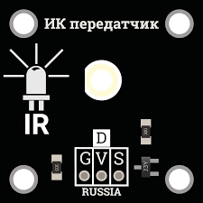

# Working with IR sensors on Raspberry Pi 3

> **Caution** This article is not relevant for the latest versions of the *clover* image and works only on the versions *clover_v0.16-clover_v0.17*.

Infrared sensors are a convenient tool for transmitting any commands to the copter. They are flexible in configuration, and interaction with them is possible in Python.

## Connecting the IR receiver

Most IR receivers operate and are connected the same way. Such receivers have 3 pins for connecting: G/GND — ground V/VCC — 5V power, S/OUT — signal.


> **Hint** The signal port doesn't have to be connected to port GPIO 17; this pin may be changed during the [in/out port settings](#in/out).

## Configuring the IR receiver to work with the LIRC module

LIRC (Linux Infrared Remote Control) is a stable and time-proven open source library, which allows sending and receiving commands via an infrared port. LIRC is supported by Raspbian.

To install LIRC and related modules, connect your Raspberry Pi to the Internet and run the console command:

```(bash)
sudo apt-get update
sudo apt-get install lirc
sudo apt-get install python-lirc
pip install py-irsend

```

> **Hint** To correctly edit the system files, superuser privileges are required; when calling a text editor, use `sudo`.

<a name="in/out"></a>
After installing the module, edit file `/etc/modules` and add line:

```
lirc_dev
lirc_rpi gpio_in_pin=18 gpio_out_pin=17
```

Where:

+ `gpio_in_pin` is the input pin from the receiver
+ `gpio_out_pin` is the transmitter output pin

Update the following line in file `/boot/config.txt`:

```
dtoverlay=lirc-rpi,gpio_in_pin=18,gpio_out_pin=17
```

Add the following lines to file `/etc/lirc/hardware.conf`. Is this file does not exist, create it yourself.

```
LIRCD_ARGS="--uinput --listen"
LOAD_MODULES=true
DRIVER="default"
DEVICE="/dev/lirc0"
MODULES="lirc_rpi"
```

Update the following lines in file `/etc/lirc/lirc_options.conf`

```
driver    = default
device    = /dev/lirc0
```

All required settings are made, you now have to restart your Raspberry Pi device to complete the installation. To do so, run:

```(bash)
sudo reboot
```

After rebooting, check its status by calling command:

```(bash)
sudo /etc/init.d/lircd status
```

If everything has been done correctly, the status should be `active`.
To check whether the installed module LIRC is running, disable daemon `lircd`, and call the appropriate command:

```(bash)
sudo /etc/init.d/lircd stop
mode2 -d /dev/lirc0
```

Now point the IR transmitter on your device and tap a few keys. You should see something like this:

```
space 402351
pulse 135
space 7085
pulse 85
space 2903
pulse 560
space 1706
pulse 535
```

> **Hint** If you are using an IR transmitter (a TV remote, an air conditioner remote, etc. and you are not getting the signal when checking, your remote is evidently using another signal frequency. When using receivers such as TSOP 22XX, the operating frequency of the signal reception will be in the range between 30 and 50 kHz.

## Write your configuration of the IR transmitter

<a name="remote_control"></a>

If you want to use your own IR transmitter, you will have to write its specific settings using the supplied module `irrecord`. For this purpose, disable daemon `lircd`, and call the appropriate command. During transmitter calibration, stick to all written instructions.

> **Hint** Please note that the last step of the calibration will be specifying the names of the keys that you will want to decode programmatically. To view the list of available names, call command `irrecord --list-namespace`.

```(bash)
irrecord -d /dev/lirc0 ~/lircd.conf
```

If you have managed to successfully write the configuration of your transmitter, file `your-name.lircd.conf` should appear in folder `/home/pi/`. Now you need to move the written configuration file to working folder `lirc`, and restart the daemon:

```
sudo cp ~/your-name.lircd.conf /etc/lirc/lircd.conf
sudo /etc/init.d/lircd restart
```

To check whether the written configuration is recognized, call the appropriate module. Now when you tap the keys that you have specified in the previously created configuration, the terminal will show debug information about which key has been pressed.

```
irw
```

> **Caution** when working with some transmitters, there are situations where the bit descriptions of keys are redundant; in this case, command `irw` may fail. To correct this error, open file `etc/lirc/lircd.conf` and check what the description of your keys looks like; if it looks like `KEY_1 0x00FF6897 0x7EE0CF2C` and in all lines the second digits match, you have to remove it, so that lines with keys assignment looks like `KEY_1 0x00FF6897` and all digits in them are unique. After completing these steps, close the file and restart the daemon.

If you did everything correctly, upon tapping a key, you will see the output similar to:

```
0000000000ff6897 00 KEY_1 pult
0000000000ff6897 01 KEY_1 pult
0000000000ff9867 00 KEY_2 pult
0000000000ff9867 01 KEY_2 pult
```

This means that your configuration is correctly detected by the program, and now you can program the desired action for tapping appropriate keys.

## Working with IR sensors in Python

To be able to use signals from the IR receiver in Python programs, you'll need package `python-lirc`. [Install it](#install), if necessary.

For correct obtaining information, create file `lircrc` in your own script, which will store settings of your keys and the program response upon calling.

This file is created in the folder from which your script will be called, `/home/pi/` by default.

To create the required file, use any text editor:

```(bash)
sudo nano .lircrc
```

The format of this file should be something like this:

```
begin
prog = myprogram
button = KEY_1
config = one
end

begin
prog = myprogram
button = KEY_2
config = two
end
```

Where:

+ `prog` is the name of the program that you will call from your script
+ `key` is the name of the key that you entered during transmitter setup
+ `config` is the information to be passed to your program upon tapping a specified key

All settings are now made, and you can proceed directly to programming IR signals.

For this purpose, create a Python script that will accept the values of the keys pressed and perform required action s accordingly.
An example of such a script:

```python
import lirc
import fly_module

# ...

sockid = lirc.init('myprogram')

inf = lirc.nextcode()
if inf[0] == 1:
    print('You pressed key 1')
elif inf[0] == 2:
    print('You pressed key 2')

lirc.deinit()
```

## Working with the IR transmitter

To work with the IR transmitter, connect it to the ports specified [during setup](#in/out).




> **Hint** if you are using a ready IR transmitter board, connect it to required pins of Raspberry in accordance with pins marking, in the same way as with the receiver.

If everything has been properly connected, you will be able to send signals specified in [transmitter settings](#remote_control) using the command:

```(bash)
irsend SEND_ONCE deviceName keyName
```

Where:

+ SEND_ONCE is the parameter responsible for sending a single signal, or sending a signal from a depressed and held down key
+ deviceName is the name of the transmitter specified during [setup](#remote_control)
+ keyName is the name of one of the keys specified during transmitter configuration

To work with `irsend` inside your script, you'll need module `python-irsend`; if necessary, [install it](#install).

To use `irsend`, import the library and call the appropriate command:

```python
from py_irsend import irsend


irsend.send_once('YourRemote', ['YourKey'])
```

Where:

+ YourRemote is the name of your transmitter specified during setup
+ YourKey is the name of one of the buttons specified during setup
