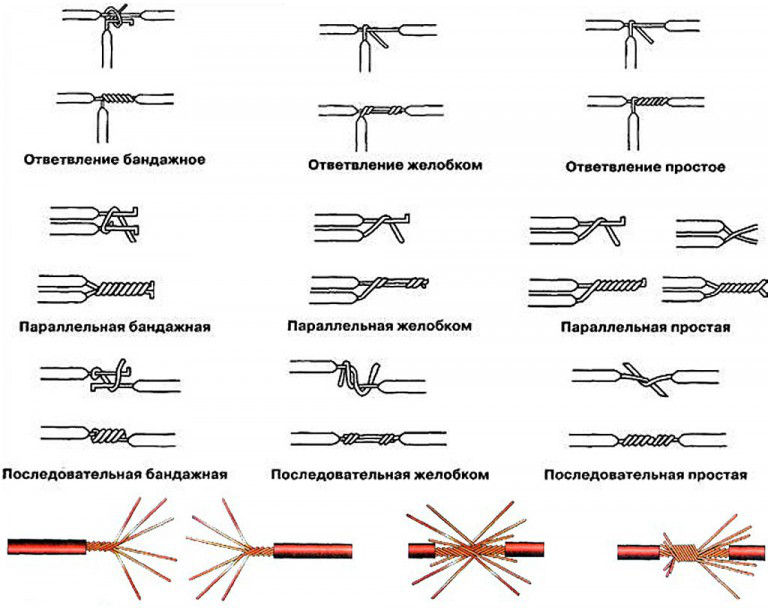
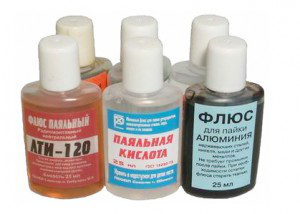
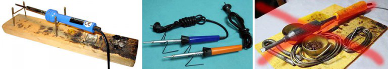

Lesson # 3 "Theory of soldering"
======================

Soldering metal is a rather complex physicochemical process; however, it boils down to fairly simple techniques and operations. To solder properly without wandering in the wilds of the theory, one should exactly follow the rules of soldering. This especially applies to the choice of the soldering method, the solder and the flux, depending on the kind of items connected and the requirements to the soldered joint.

What is soldering?
----------------

Soldering at home includes the following technological operations:

1. The surfaces to be soldered are to be cleaned from dirt, corrosion, etc. They are to be sanded until shine is seen, i.e., until no visible traces of oxides are to be visible;
2. Apply flux, i.e., a substance that removes oxide residues and does not allow oxidation of the surfaces during the further process. For applying to surfaces to be tinned, solid or liquid fluxes and flux pastes are recommended;
3. Then the surfaces are tinned — melted solder (an alloy specially intended for soldering) is applied to them, it spreads in a thin film and chemically combines with the base metal;
4. The items to be soldered are mechanically connected with a cable, or using forceps, pliers, vise, clamps, etc. More flux is applied to prevent oxidation of heated solder;
5. More heated solder (maybe another one) is applied, until a seam of desired quality is obtained;
6. If a soldering iron with a tinned tip was used for soldering, after work, it should be cleaned and coated with an inactive flux. To ensure high quality of soldering, a conventional soldering iron should be kept with its tip fluxed!

Cleanup
--------

Cleanup after cleaning is the first tricky soldering operation. Never use abrasives for this purpose! The smallest abrasive particles get embedded in the metal, and it is impossible to completely remove them. Subsequently, they become the foci of the processes that destroy the seam. The surface are cleaned up for soldering using files, grinders (various types of scrapers), or just with a knife. But best way, especially if current-carrying wires are being prepared for soldering, is covering them with activated flux, which should be carefully removed after soldering. It is easily done with a toothbrush moistened with alcohol.

How to tin/solder, and what to use?
-----------------------

For the following operations, you will need a special electric-heating tool: a soldering iron or a blowtorch. At home, an electric soldering iron with a tin-plated copper tip is most often used for soldering.

Tinning should be done as follows:

* Thin wires should be tinned easily, without pressure, by moving the tin on the bare ends of the wire at one and the opposite end until the solder melts. The wire is held with its end down. The excessive drop of the solder that collects at the end is removed with the soldering iron.
* Thick wires are tinned by moving the tip in a spiral back and forth.
* To flat slim long items, the solder is to be applied to the end of the tip, and the top is moved along. When un-tinned edges of the item are seen after the tip, more flux is applied to the untinned part, and another drop of tin is used for tinning.
* A long wider item — same as above, but the tip is moved in S-turns.
* A wide item — the tip moves in a spiral from the center to the edges.

Special aspects of soldering wires
--------------------------

Is the preliminary joint of soldered items, most problems occur with wires: one has to touch them with hands, which results in fouling of the surface of the metal; besides, seams between wires have to withstand mechanical loads more frequently than other soldered joints.

### Twisted wires

Before wires are soldered, they should be properly twisted. The main methods of twisting wires for soldering are shown in the Figure. Each of them has its own purpose:

* Band twisting is used for rigid (thick, one core) current carrying wires, i.e., the wires that transmit electric power, especially outside wires. Band twisting ensures sufficient electric contact even with insufficient soldering, or overheating of oxidized seam.
* Groove twists are used for wires with easily-melting insulation (common PVC, polyethylene) when complete spread of the solder with minimal heating is required. Groove twists are only heated along the groove.
* Simple twists may be used to connect both single core and multicore wires immediately after insulation stripping (shiny).
* Simple consecutive twisting, the so-called British twisting, is used for connecting current-carrying wires of flexible cables with the cross-section up to 1.4 sq. mm not subjected to regular high mechanical loads, e.g., electrical extension cords or temporary connections.

Electrical wires subjected to regular and/or constant mechanical loads are to be stranded. They are to be twisted as shown in the Figure below: the ends are spread apart, the "brooms" are slid into each other and twisted the British way. Soldering is performed with the use of a fusible solder with high tensile strength, e.g. POSK-50 (see below) with activated flux that does not require residue removal, also see below. Parallel (dead end) twists of wires with the cross section greater than 0.7 sq. mm should be soldered preferably by dipping into molten solder, see below. Otherwise, the wires re to be either heated for a long time, or with a too powerful soldering iron, which results in damaged insulation, and the flux boiling away prematurely.

What can be soldered, but should not be soldered

Flexible coaxial cables and cables for computer networks such as twisted pair, are not intended for soldering. An experienced cableman that has a good idea about electrodynamics of signal lines can in exceptional cases make a coupling with them. But when made by a layman, even if he is otherwise a qualified electronic engineer and installer, the throughput and noise immunity of the line will fall below the permissible level, down to total loss.

How to clean and preserve the soldering tip

The soldering tip is to be cleaned of excess solder by rubbing on soft porous or fibrous lining. Polyurethane foam is used most frequently, but it is not the best choice: it burns and sticks to the tip. The best material for cleaning is natural felt or basalt cardboard. But still better is two-stage cleaning, first with a sponge made of a metal strip, and with felt afterwards. After cleaning, the soldering iron is to be turned off, the tip is immersed into hard colophony, and some time is waited until it stops bubbling. After that, the tip is taken out, and the soldering iron is held tip down for the excess colophony to drain. Upon complete cooling, the soldering iron may be sent for storage.

Solders and fluxes
--------------

Solders from POS-90 to Avia-2 are soft solders for low temperature soldering. They guarantee only electrical contact. POS-30 and POS-40 are used for soldering copper, brass, bronze with inactive fluxes, and the same with steel and steel to steel with active fluxes. POSSR-15 may be used for soldering dipped galvanized steel with inactive fluxes; other solders in this corrode the zinc down to the steel and the soldering falls off soon. 34A, MF-1 and RSr-25 are solid solders for high temperature brazing. Solder 34A nay be used for soldering aluminum in the flame (see further about soldering aluminum) with special fluxes, see further, too. Solder MF1 is used for soldering copper to steel with activated flux. "Low strength requirements" in this case means that the strength of the joint will be closer to that of copper than of steel. When used with a dry soldering iron, PSr-25 is suitable for soldering jewelry, Tiffany stained glass, etc.

### Fluxes

Soldering fluxes are divided into neutral (inactive, acid-free) that do not interact chemically with the base metal, or interact to a negligible extent, activated fluxes that chemically interact with the base metal upon heating, and active (acid) that interact with cold base metal. As far as fluxes are concerned, our age has brought the largest number of advances which are mostly good, but let's start with the unpleasant ones. The first one is the fact that there is not technically pure acetone for washing soldering, since it is used it is used in the clandestine production of drugs, and has a narcotic action by itself. Substitutes for technical acetone are solvents 646 and 647.

The second one is that zinc chloride in activated flux pastes is often replaced with borax. Hydrochloric acid is a highly toxic volatile chemically aggressive substance; zinc chloride is also toxic and when heated, sublimates, i.e., it evaporates without melting. Borax is safe, but when heated, produces a large amount of crystallization water, which slightly affects soldering quality.

Soldering joints made with the spirit-colophony flux are to be washed: colophony contains succinic acid, which destroys metal upon prolonged contact. In addition, accidentally spilled spirit-colophony flux instantaneously spreads over a large area and turns into an extremely sticky stuff that takes very long to dry, and its stains cannot be removed from clothes, furniture, or floor and walls. In general, spirit-colophony is a good soldering flux, but not for rubbernecks and butterfingers. A full-fledged substitute for the spirit-colophony flux, but not so nasty if handled carelessly, is the flux named TAGS. If steel parts are more massive than allowed for soldering with soldering acid and the soldering should be stronger, flux F38 is used for soldering. It is a universal flux that can be used with virtually any metals in any combination, including aluminum, but the strength of the joint with it has not been standardized. We'll yet return to soldering aluminum.

### Other types of soldering

Tinkerers also often use a dry soldering iron with an untinned tip, the so-called soldering pencil, pos. 1 in the Figure. It is good where solder spreading outside the area of soldering is unacceptable: in jewelry, stained glass, soldered items of applied art. Dry soldering is sometimes used for soldering surface mounted chips, with the distance between pins of 1.25 or 0.625 mm, but it is risky even for experienced professionals: the poor thermal contact requires excessive power of the soldering iron and prolonged heating, while it is impossible to ensure heating stability during manual soldering. White resin POSK-40, 45, or 50, and flux pastes that do not require residue removal are used for dry soldering.

### Small-scale soldering

Soldering of printed circuit boards has its own peculiarities. Wires are not tinned, as pins of the components and chips are already tinned. In the amateur conditions, first, tinning current-carrying paths makes little sense, if the device operates at frequencies up to 40 – 50 MHz. In industrial production, circuit-board are tinned using low-temperature methods, e.g., by sputtering or electroplating. Heating with a soldering iron tracks along the entire length deteriorates their adhesion with the substrate and increases the probability of delamination. After installation of components, it is best to have the circuit-board covered with varnish Copper will immediately darken, but the efficiency of the device will not be affected, if only we are not talking about the microwave frequencies.

### Soldering electronic components on a printed circuit board

Then, take a look at something ugly on the left in the next Figure. Such poor quality could, even in the Ministry of electronics industry could be the reason for transferring fitters to movers or helpers. The reason was not even appearance or overuse of expensive solder, but, firstly, the fact that the mount pads and the components overheated while these drops of solder cooled down. Large and heavy drops of solder are pretty inert weights for the already weakened paths. Radio enthusiasts are well familiar with the effect: when one, two or more paths peel off from a circuit board that has fallen on the floor. Even without waiting for the first re-soldering

Soldering drops on circuit boards should have around shape, be smooth, and have the height not exceeding 0.7 of the mounting pad diameter, see right in the Figure. The ends of pins should slightly protrude from the drops. By the way, the circuit-board is completely self-made. There is a way to make a homemade circuit board as crisp and precise as a factory-made one, and place whatever inscriptions on it. White sports are glares from the varnish during under the flashlight. The drops are sagged in and shrunk - it is also a defect. A sagged in drop means that the soldier was not enough, and shrunk drop also means that air has penetrated the solder. If the device is not working or there are suspected dry joints, check these locations first.

### Chips, soldering

Chips in DIP-packages re soldered like other electronic components. Soldering iron power should be up to 25 watts. The solder should be POS-61; the flux should be TAGS or spirit colophony. Is remainders should be washed away with acetone or its substitute: alcohol poorly washes away colophony, and it cannot be removed between the pins even with a brush or cloth. As to chips and microchips, soldering them manually is highly not recommended by professionals of any level: it is a lottery that is very unlikely to win and very likely to lose. If it comes to repairing phones and tablets, you will have to buy a soldering station. Using it is not much harder than using a hand soldering iron, see video below, the price of a decent soldering station is quite affordable today

### What else?

Oh yeah, stands for soldering irons. A classic stand is shown in the figure in the left; it is suitable for any soldering irons with rod tips. It's up to you where to place trays for the solder and colophony - it is not regulated. For low-power soldering irons with a skirt, simplified stands with a bracket in the center are suitable.

Soldering stations are equipped with mainly spring or tubular socket cradles for soldering irons. The hot part of the tool is inaccessible in them, however it is easy to miss when soldering small components. But one should never, and it is expressly forbidden in the safety rules, make a stand of materials at hand, where the soldering iron rests on trays with consumables, as shown in the Figure on the right.

### Reference questions

1. What substance prevents oxidation?
2. List the main steps of soldering.
3. What is tinning?
4. In what cases soldering should not be used?
5. Which flux is better for soldering chips.
