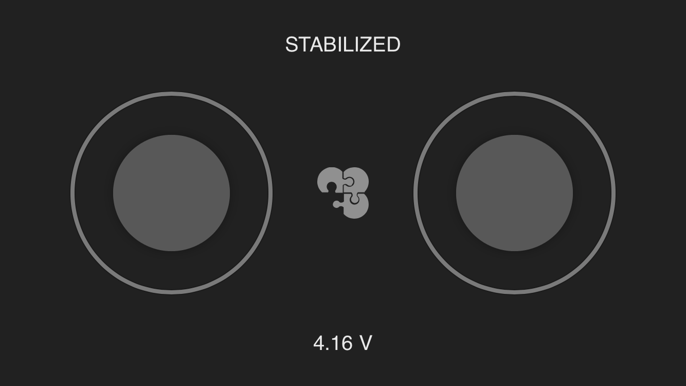

Controlling Clover from a smartphone
===

<a href="https://itunes.apple.com/ru/app/clever-rc/id1396166572?mt=8"></a><a href="https://play.google.com/store/apps/details?id=express.copter.cleverrc"></a>

To control Clover from a smartphone via Wi-Fi, you have to install the appropriate application – [iOS](https://itunes.apple.com/ru/app/clever-rc/id1396166572?mt=8), Android (https://play.google.com/store/apps/details?id=express.copter.cleverrc).



> **Warning** The mobile transmitter is mainly intended for indoor flights to the range not exceeding 10-15 m. Many Wi-Fi networks may also impair responsiveness and the range of the transmitter.

Control from a smartphone is also [available in the mobile version of the app](https://docs.qgroundcontrol.com/en/SettingsView/VirtualJoystick.html) QGroundControl.

Configuring
---

> **Warning** An open QGroundControl or rviz connection sends large amounts of data over Wi-Fi, which can adversely affect responsiveness of the mobile transmitter. It is recommended not to use these applications together with it.

Install [Clover image on RPi](image.md). For running the application, settings `rosbridge` and `rc` in the launch file (`~/catkin_ws/src/clover/clover/launch/clover.launch`) should be enabled:

```xml
<arg name="rosbridge" default="true"/>
```

```xml
<arg name="rc" default="true"/>
```

After the launch-file is edited, restart package `clover`:

```bash
sudo systemctl restart clover
```

Also make sure that PX4-parameter `COM_RC_IN_MODE` is set to `0` (RC Transmitter).

Additional PX4 parameters:

* `COM_RC_LOSS_T` – timeout for detecting signal loss by the transmitter (mobile or physical). It is recommended to increase the timeout to several seconds.
* `NAV_RCL_ACT` – action upon loss of transmitter signal.

> **Note** The mobile transmitter conflicts with the real radio control equipment. When the mobile transmitter is used, it should be powered off.

Connection
---

Connect the smartphone to Clover [Wi-Fi](wifi.md) network (`clover-xxxx`). The application should connect to the copter automatically. Upon successful connection, the current [mode](modes.md) and the battery charge level should be displayed.

The sticks on the screen of the application work just like real sticks. To arm the copter, hold the left stick in the bottom right corner for several seconds. To disarm — in the bottom left corner.

Malfunctions
---

* If the interface of the transmitter displays a surely incorrect voltage (e.g., > 5 V), check that the value of PX4 parameter `BAT_N_CELLS` matches the actual number of battery cells. If the displayed voltage is still incorrect, calibrate the battery (TODO: link).

* If instead of mode PX4, text "DISCONNECTED FROM FCU" is displayed, check [Raspberry Pi connection to Pixhawk](connection.md).
