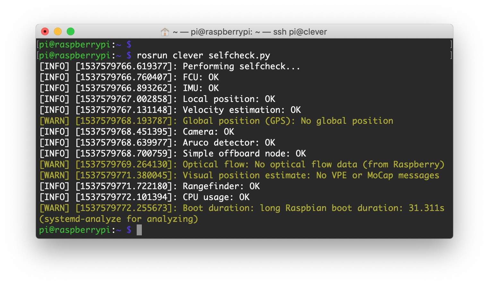

# Automatic check

The [RPi image](image.md) contains a tool for automatic checking the correctness of all the settings and subsystems of the drone – **selfcheck.py**.

It is generally a good idea to perform this check before flight, especially before an autonomous one.

In order to run it, enter the following command in [the Raspberry Pi console](ssh.md):

```(bash)
rosrun clover selfcheck.py
```



Description of some checks:

* FCU – checks for proper connection with the flight controller;
* IMU – checks whether the data from from IMU is sane;
* Local position – checks presence of local position data;
* Velocity estimation – checks whether drone velocity estimation is sane(**autonomous flight is not to be performed if this check fails!**);
* Global position (GPS) — checks for presence of global position data (GPS module is required for this check);
* Camera — checks for proper operation of the Raspberry camera.
* ArUco — checks whether [ArUco](aruco.md) detection is working
* VPE — checks whether VPE data is published.
* Rangefinder — checks whether [rangefinder](laser.md) data is published.
* RPi health – checks the [onboard computer](raspberry.md) status.
* CPU usage – checks the CPU load of the onboard computer.

> **Caution** Pay attention on the checks marked with *WARN* sign. If necessary, contact [Copter Express technical support](tg://resolve?domain=COEXHelpdesk).
