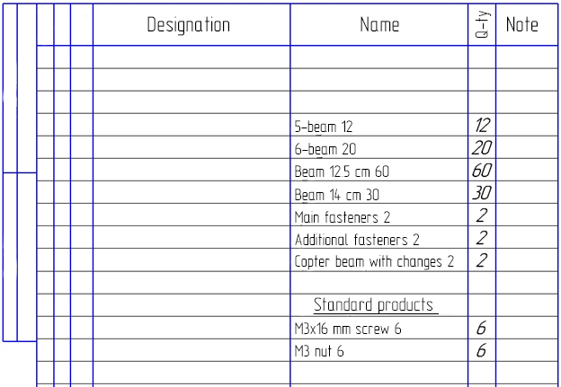
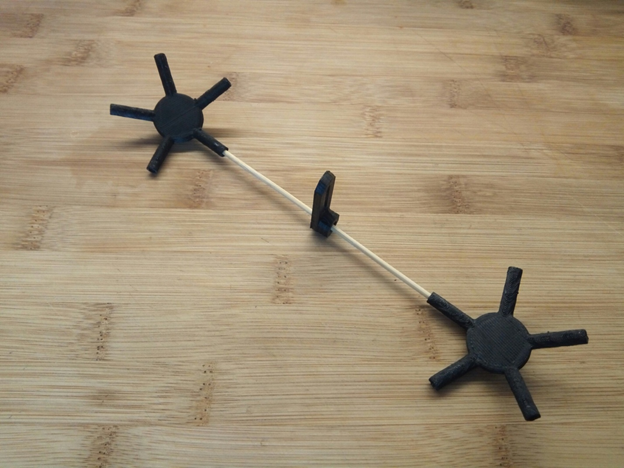

# Copter spheric guard

## Introduction

Probably, everyone who has held a copter has had to fly it indoors. Such flights are associated with considerable risk of damaging the copter upon hitting walls and various items. Flying even in a relatively large space is associated with the risk of hitting an obstacle: there might be a tree or a building in the path of the copter, to say nothing about flying in confined spaces. Such "crash tests" are not very pleasant, and in the best case may cause losing a considerable sum on repairs, and in the worst case — in losing the copter. Such situations are even more unpleasant for a beginner who cannot avoid an obstacle and is just learning to fly.

All this made us search for a solution. Unfortunately, searching the Internet did not provide a sufficiently simple and, more importantly, cheap solution for ordinary users. For example, propeller guard protects the propellers themselves quite well, but upon the slightest touch upon an obstacle the copter would flip over and fall down. In general, guard either did not protect the copter fully or looked awkward and was too scarcely available.

We made a difficult decision: we had to make it entirely ourselves and almost from scratch, and the goal was to make it lightweight and easy to manufacture.

## Development

As a result of searching for a solution that would fit all our requirements, we ended with several similar options. It was decided to make the guard in the shape of a semiregular polyhedron (examples include fullerene, carbon, or a pentakis dodecahedron) — it was chosen as the most pleasing to the eye. In addition, such a guard is easily scalable to the desired size.

In creating such a shape, two types of edges (beams) are used: short and long ones, their length is calculated based on the desired diameter of a polyhedron inscribed into a sphere. For better understanding, I will insert all necessary formulas from Wikipedia below.

The corner joints (fittings) were not very easy either. They are of two types as well: with five faces on the vertex (five beams protrude from the vertex) and with six faces (six rays protrude from the vertex).

## First models

A specification has been prepared for the ease of monitoring the manufacturing process, and we started modeling.

Making simple calculations for the required size, we built a model in Inventor CAD.

In the progress of designing, we faced problems in modeling corner joints, but they were solved by simplifying the design, and the differences of the angles were compensated for by flexible materials. Thus, all joints fit slightly tightly.

(Elements of guard fasteners to the body)

## Materials

During the design process, the question arose about a lightweight and strong material to be used for the guard. The answer, as always, was unexpected. We saw bamboo sticks: they were thin enough to not affect the aerodynamics, had sufficient flexibility and were quite strong. Then, the question was about how to make fittings, and of what material. Surely, it should be 3D printing! A 3D printer is a generally indispensable thing, especially for those who like doing something themselves. In addition, due to their moderate price, they are widespread enough. Such a printer may be used to make items of almost any complexity. That is what we need!

Convert ready models to .stl, put them into a slicer (Cura in our case), enter the setting for a particular printer and plastic, and start printing.

To reduce the weight we chose ABC plastic, which is lightweight and available.

The sticks were cut to the calculated length and prepared for subsequent work.

## Assembly and installation

After everything has been printed and cut, it is time to assemble the guard.

Assembly is the most crucial moment, as it requires a special algorithm.

From a five-beam fitting, only short beams protrude, while from a six-beam fitting — only every second long one.

Assembly:

1. First, assemble all five-beam vertices.
2. Put a six-beam vertice on every beam protruding from a five-beam vertice.
3. Interconnect the six-beam fittings with long sticks.
4. Connect assembled five-beam vertices to the six-beam vertices, bearing in mind that in a six-beam fitting, short and long beams alternate.
5. Repeat the process for each beam vertice, until the ball is assembled.

After assembly, divide the ball into 2 hemispheres and install the mounts on the copter making sure that everything fits.

(An example of fasteners installation)

Now, the hemispheres may be glued. The hemispheres are not to be glued to each other, as this is required for installing the copter inside. We used the Dichloroethane solvent for plastics as the glue, but you can use any quick-drying adhesive polymer with the same success.

After drying, the guard is ready for installation and for the first test flight!

(without fasteners yet)

## First flights

We have made a guard for the Clover 2 copter, which is a learning aid for quadcopters assembly and setup and is installed on it without modification. The guard weighs 70g more (139 grams) than the standard one, and almost does not affect controllability and flying time.

It should also be said that excessive vibrations, if any, may be removed by more rigid attachment to the copter.

Eventually, we've got an unusual guard for the copter that is lightweight and has an interesting design and opens new horizons for flying in the locations where flying copters was dangerous before.
