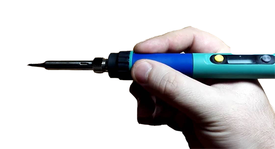
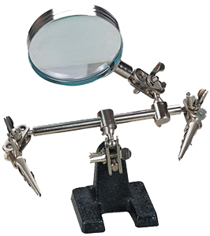

Soldering safety
=============================

All work involving soldering and blanching should be performed on specially equipped and prepared premises. There must be a ventilation system.

Before you start, do the following:

1. Tidy up your workplace, nothing should interfere with the process. The workplace should be well illuminated.
2. The working soldering iron is to be placed in the area of local exhaust ventilation, in a special holder.
3. Before work, put on a protective gown, goggles, and gloves, if necessary.

When soldering:

1. The soldering iron should be held only by the handle since the tip is hot.

    

2. Items are to only be moved using special tools (tweezers, pliers or other tools) that ensure safety when soldering.
3. To avoid burns by molten solder when soldering, do not pull the soldered wires out abruptly with great effort.
4. When soldering small and mobile items use a special holder.

   

5. Carry the soldering iron by the handle, rather than the cable or the working part. During breaks, the soldering iron is to be disconnected from the mains.

> **Caution** In case of the soldering iron malfunction or fire, disconnect it from the mains.
