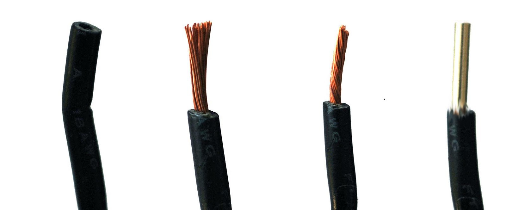

Blanching
============================

> **Caution** Before soldering and blanching, make sure that the wires and the circuit-boards are disconnected from the power supply (de-energized)!

## Blanching contact pads

Blanching a contact pad means doing the following:

1. Apply flux on the contact pad
2. Cover the contact pad with solder

## Blanching wires

Blanching a wire means doing the following:

1. Strip the wire to remove the insulation layer
2. Twist stripped wires
3. Apply flux to the twisted stripped wires
4. Apply a layer of solder.

