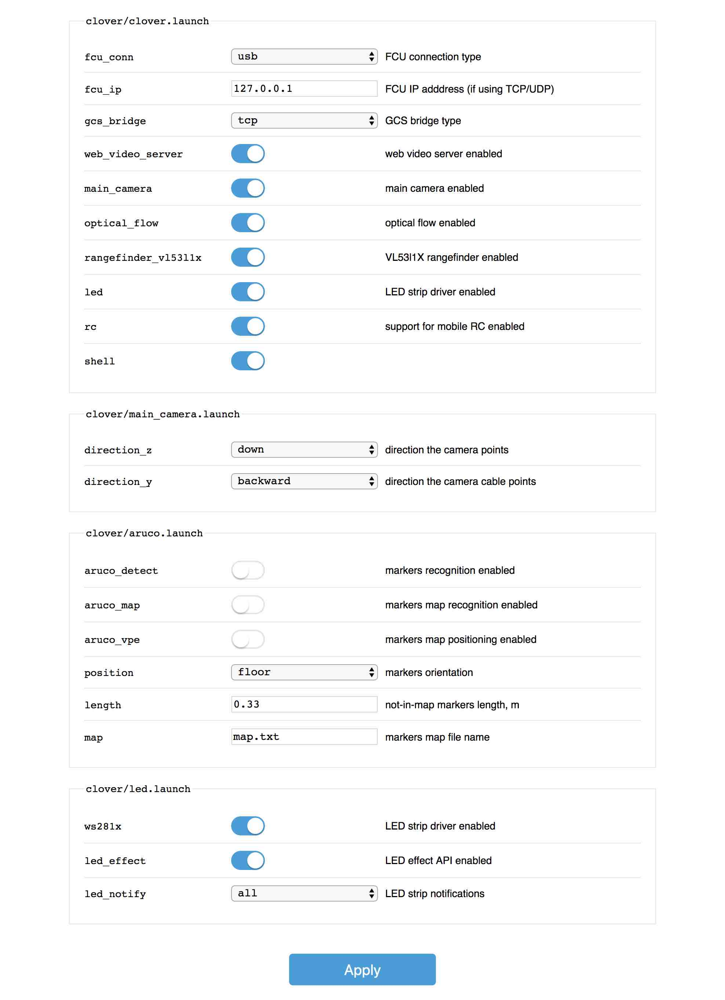

# roslaunch_editor

Web-based ROS launch-files editor, created for making configuration of your robot more user-friendly for novices.



## Quick launch

```bash
roslaunch roslaunch_editor example.launch
```

Then, open `http://localhost:8085/roslaunch_editor/` and edit the test launch file.

## Modes

`roslaunch_editor` works in two modes: standalone mode (where running `editor` node is required), and Clover mode (where `clover`'s `shell` node, `roswww_static` and `rosbridge_suite` are utilized). The editor will read and write launch-files and restart the nodes (if configured) using one of these nodes.

The mode is determined automatically, based on advertised ROS-services.

## Parameters

* `items` (`string` or `list`) – launch files to edit, format: `package_name/launch_file_name.launch`.
* `hide_uncommented` (`boolean`, default: `false`) – don't show arguments without comments.
* `apply_command` (`string`, default: `''`) – shell command to execute after writing launch-files (e. g. to restart the systemd service).
* `backup` (`boolean`, default: `false`) – backup overwritten launch-files (backup is written to `file_name.launch.bak`).

Some parameters (`items`, `hide_uncommented`) can be overwritten over GET-parameters, e. g. `?items=package/foo.launch,package/bar.launch&hide_uncommented=1`.
