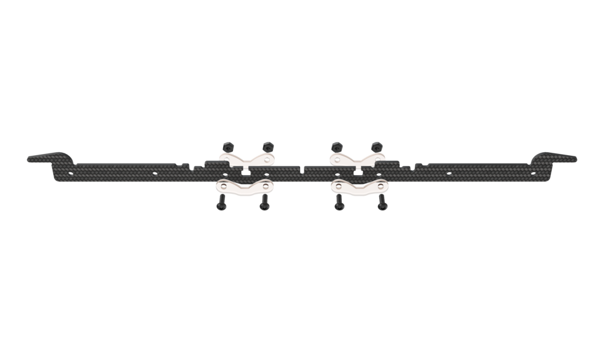
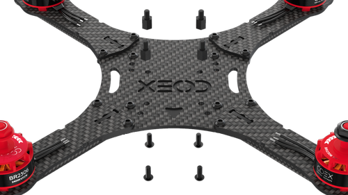
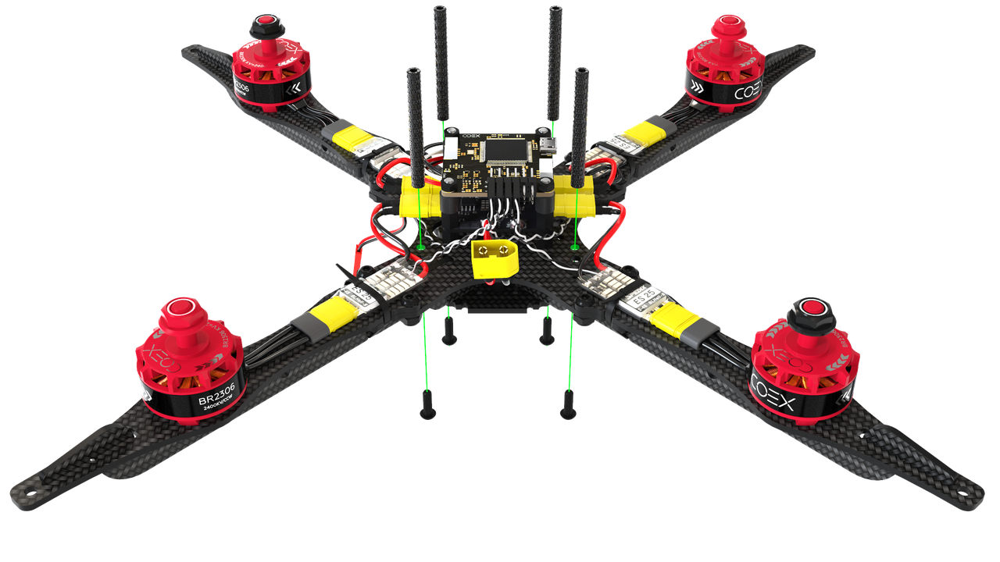
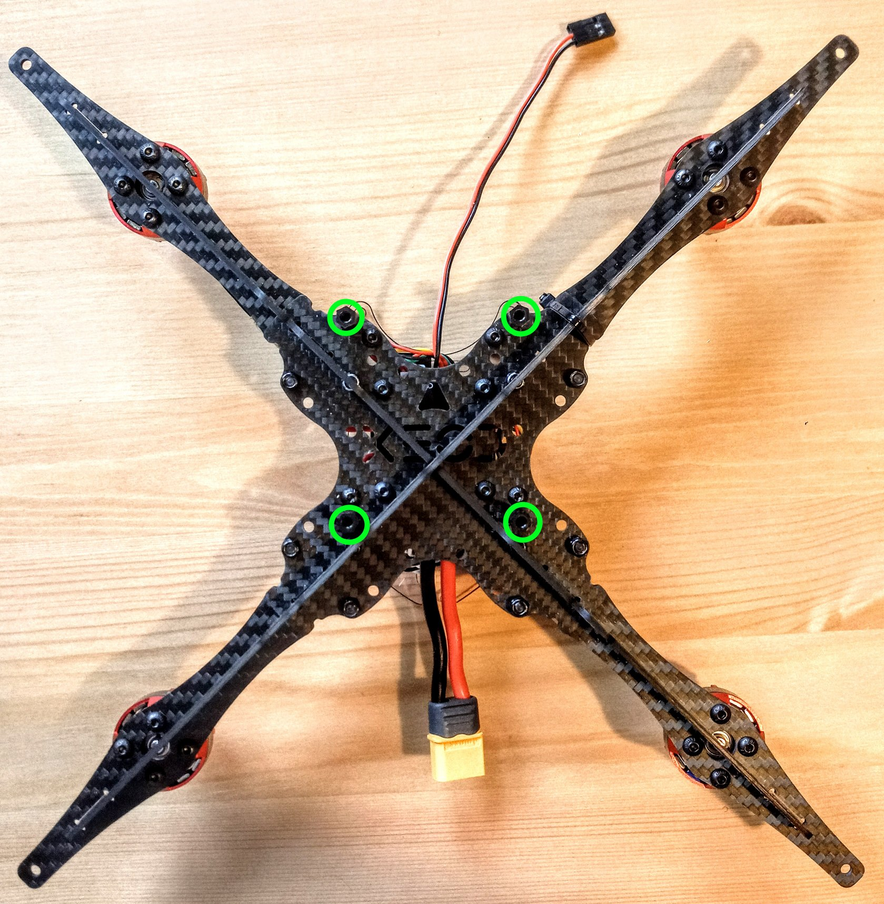
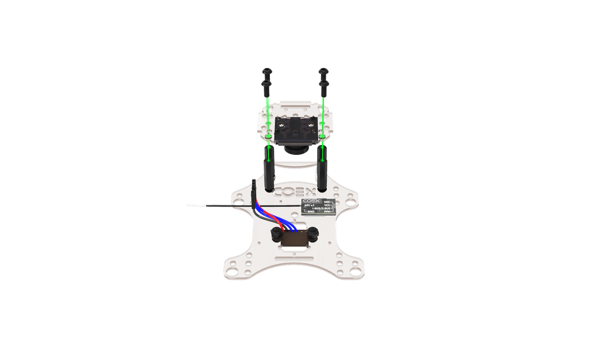
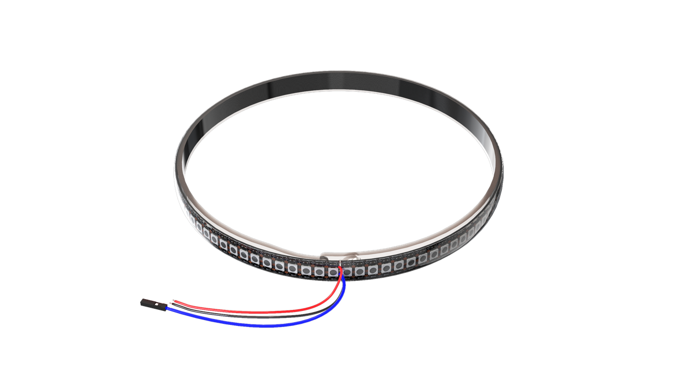
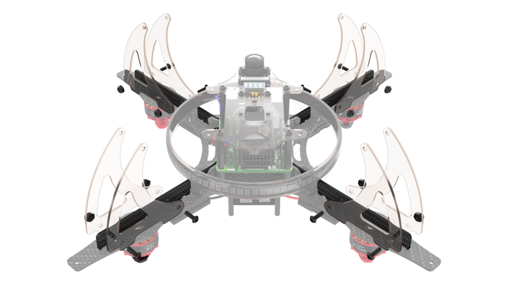
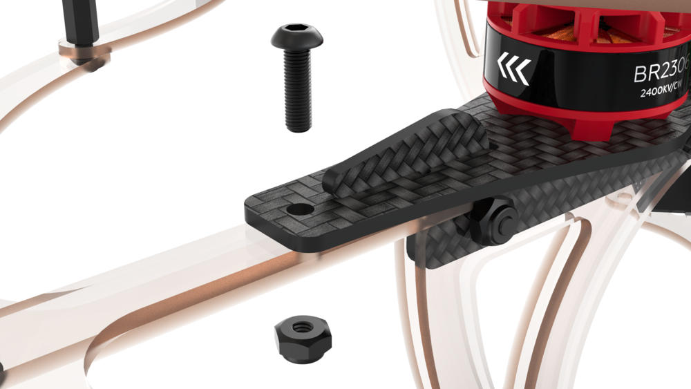
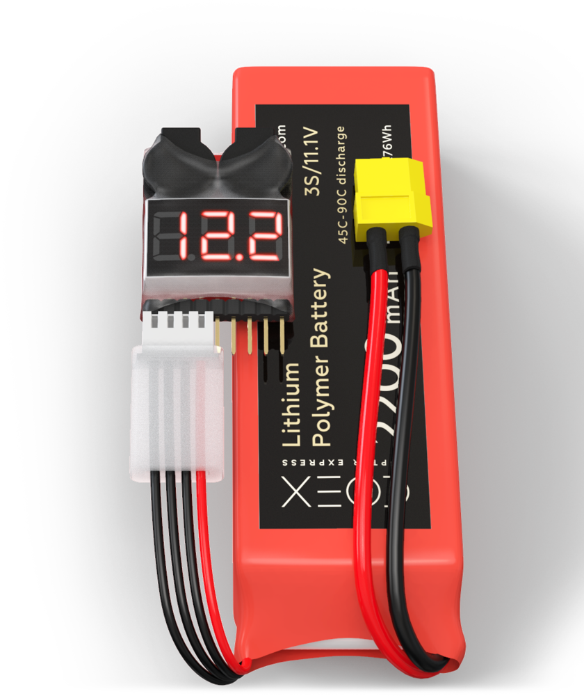

# Сборка Клевера 4.1

**Особенность набора.** Паечный набор с [версией рамы 4.0](assemble_4_1.md#сборка-основы-для-рамы), новыми регуляторами spedix e25 (они аналогичны старым dys 30a в плане работы и настройки), PDB и полётным контроллером производства COEX, радиоприёмником [FS-A8S](rc_flysky_a8s.md), новыми версиями пластин и деталей из поликарбоната. Использование новой COEX PDB избавляет от необходимости пользоваться дополнительными стабилизаторами на 5V, поэтому 2 платы BEC больше не включены в набор.

**Особенность сборки.** Сборка рамы, крепление моторов и PDB аналогичны сборке из старой версии. Отличается крепление Raspberry Pi к центральной деке. Направление вращения моторов во время сборки проверить нельзя из-за особенностей радиоприёмника, однако можно однозначно запаять провода моторов к регуляторам. Остальная сборка аналогична сборке нового беспаечного набора.

## Сборка основы для рамы

> **Info** Обратите внимание! Далее в инструкции некоторые изображения взяты из сборки старого паечного или нового беспаечного набора, если в текущей сборке требуются аналогичные действия.

1. В случае наличия, закрепите рем-накладки на пластинах жесткости, иначе продолжайте без них.

    

2. Совместите 2 карбоновые пластины жесткости, используя центральные пазы.

    

        
        
    

3. Используя пазы, установите сверху карбоновую центральную деку.

    

        
        
    

4. Стяните конструкцию с помощью винтов М3х8 и стальных гаек с нейлоновой вставкой, установленных в пазах пластин.

## Установка моторов

1. Распакуйте моторы.
2. Используя бокорезы, укоротите провода на моторах:

    * Обрежьте половину длины (оставив 30 мм).
    * Зачистите (снимите 5 мм изоляции с конца провода, не повредив медные жилы).

    

    * Скрутите медные жилы.
    * [Залудите провода](tinning.md), используя пинцет.

3. Установите мотор на луч.
4. Прикрепите мотор к лучу винтами М3х5, используя шестигранный ключ или отвёртку.

    

Повторите эти действия для остальных моторов.

## Сборка рамы

1. Установите 4 луча с моторами на базу рамы, используя пазы, согласно [схеме вращения моторов](#проверка-направления-вращения-моторов).

    

    > **Hint** Для правильной установки моторов обратите внимание на цвета гаек. Моторы с красными гайками следует установить на передний правый и задний левый лучи, с чёрными - на передний левый и задний правый.

2. Зафиксируйте лучи на раме, используя 8 винтов М3х8 и 8 стальных гаек.

    

## Монтаж PDB

1. Установите 4 стойки "папа-мама" 6 мм на центральную деку винтами М3х6.

    

2. Установите COEX PDB на стойки. Припаяйте к площадкам GND и 5V провод для питания Raspberry Pi. Его можно сделать из 3 pin провода для телеметрии, который есть в комплекте.

    

3. Разъём для подключения аккумулятора должен быть направлен к задней части рамы.

## Пайка регуляторов и ВЕС

1. Расположите регуляторы *логотипом вверх* около моторов, которые вращаются *по часовой стрелке*. Расположите регуляторы *логотипом вниз* около моторов, которые вращаются *против часовой* стрелки.
2. Припаяйте фазные провода моторов к регуляторам, чтобы провода не пересекались и проходили к контактам регулятора по кратчайшему расстоянию.
3. Припаяйте силовые провода регуляторов к контактным площадкам платы (**красный** к **«+»**, **черный** к **«-»**).

    

4. С помощью мультиметра проверьте, что в цепи нет короткого замыкания.

## Установка пластины для полётного контроллера COEX Pix

1. Установите 4 стойки "папа-мама" 6 мм на PDB, затем установите поликарбонатную пластину, затем закрутите её нейлоновыми гайками, затем установите резиновые стойки 6мм.

    

2. Закрепите *COEX Pix* на резиновых стойках с помощью нейлоновых гаек.

    

## Подключение полетного контроллера

1. Подключите регуляторы оборотов к полетному контроллеру в соответствии со схемой.

    

2. Подключите кабель питания к плате распределения питания и соответствующему разъему на полетном контроллере.

    

3. Установите алюминиевые стойки 40мм на болты М3х12.

    
    

## Установка Raspberry Pi, камеры, дальномера и радиоприёмника

1. На нижнюю грань основной деки установите 4 стойки 15мм, закрепите их с помощью болтов М3х8.

    

2. На монтажную деку установите 4 стойки 6мм и 4 стойки 30мм, закрепите их с помощью болтов М3х6 и М3х12.

    

3. Установите собранную монтажную деку на основную и закрепите с помощью болтов М3х8.

    

4. Установите плату *Raspberry Pi* и зафиксируйте с помощью нейлоновых гаек.

    

5. На деку захвата установите дальномер с помощью самоконтрящихся гаек и болтов М3х8, и приклейте радиоприемник `FS-A8S` с помощью двустороннего скотча. Подключение приёмника к полётному контроллеру и его сопряжение с пультом описано статье [Работа с приёмником Flysky FS-A8S](rc_flysky_a8s.md).

    

6. Установите 4 стойки 20мм и закрепите их с помощью болтов М3х8.

    

7. На малую монтажную деку установите камеру и зафиксируйте ее с помощью 2ух маленьких саморезов, в верхнем левом и нижнем правом углах.

    

8. Установите модуль камеры на деку захвата и закрепите с помощью болтов М3х8.

    

9. Установите собранную деку захвата и зафиксируйте с помощью болтов М3х8.

    

10. Подключите к *Raspberry Pi* дальномер и кабель питания.

    

11. Подключите шлейф камеры к *Raspberry Pi*.

    

## Установка LED ленты

1. Соберите обруч для светодиодной ленты, объединив замок на концах.

    

2. Наклейте светодиодную ленту на обруч, для большей прочности притяните ее с помощью 3-4 хомутов. Припаяйте к ленте 2 силовых провода и один сигнальный провод для подключения к Raspberry Pi.

    

3. Установите обруч на раму. Припаяйте питание светодиодной ленты (красный, черный кабели) к свободным площадкам 5V и GND соответственно на COEX PDB. Подключите сигнальный выход светодиодной ленты(белый кабель) в *Raspberry Ri*, к пину *GPIO 21*.

    

## Монтаж ножек

1. Установите 8 ножек с помощью винтов М3х10 и стальных гаек.

    

        
        
    

2. Установите демпфирующие прокладки на ножки с помощью винтов М3х10 и стальных гаек.

    

## Установка защиты

1. Соберите нижнюю часть защиты, используя 12 винтов М3х10 и 12 нейлоновых стоек 40 мм.

    

2. Установите верхнюю часть, используя 12 винтов М3х10.

    

3. Установите монтажную деку и закрепите ее болтами М3х8.

    

4. Установите защиту на коптер, с помощью 4 винтов М3х10 и стальных гаек.

    

## Установка пропеллеров и подготовка к полёту

1. Подключите полётный контроллер по micro USB проводу к Raspberry Pi. Закрепите улитку с проводом таким образом, чтобы она находилась ниже уровня установки пропеллеров, чтобы пропеллеры не повредили провод во время полёта. Для крепления улитки можно воспользоваться стяжкой.

    

2. Произведите настройку компонентов квадрокоптера, используя раздел ["Настройка"](setup.md).

    > **Warning** Установка пропеллеров должна производиться **только после окончательной настройки коптера**, непосредственно перед полетом.

3. Установите 4 пропеллера, согласно [схеме вращения](#проверка-направления-вращения-моторов). При установке пропеллеров АКБ должна быть отключена.

    При установке будьте внимательны, чтобы пропеллер не был перевернут. На лицевой стороне пропеллера имеется маркировка его характеристик, а также направление вращения, которое должно совпадать с направлением вращения моторов.

    

        
        
    

## Установка АКБ

> **Warning** Убедитесь, что все провода спрятаны и движению пропеллеров ничего не мешает.

Проверьте сборку квадрокоптера:

* Балансировочный разъем АКБ должен быть спрятан под утягивающим ремешком.
* Регуляторы должны быть зафиксированы хомутами.
* Все провода, идущие от PDB и полетного контроллера, должны быть зафиксированы липучкой или обмотаны вокруг алюминиевых стоек.
* Пропеллеры установлены правильной стороной и соответствуют направлению вращения моторов.

Обязательно установите и настройте индикатор напряжения перед полетом, чтобы не переразрядить аккумулятор. Для настройки индикатора используйте кнопку, расположенную в его основании. Отображаемые цифры во время настройки обозначают минимально возможное напряжение в каждой [ячейке](glossary.md#ячейка--банка-акб) аккумулятора, рекомендуемое значение **3.5**.

> **Info** Звуковая индикация означает, что ваш аккумулятор разряжен и его нужно зарядить.

> **Success** Дрон готов к полету!
