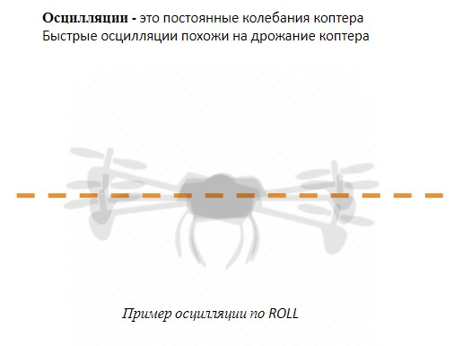

# Настройка коэффициентов PID

На практике самая распространенная проблема это быстрые осцилляции, возникающие из-за слишком большого значения параметра P. В данной ситуации следует уменьшить его значение (все параметры выставляются экспериментальным путем, исходя из поведения аппарата).

Также стоит проверить чтобы осцилляций не было при резком спуске (в противном случае уменьшить P).
Медленные раскачивания коптера из стороны в сторону при попытке удержания заданной точки связаны с перебором значения I.
В случае если при движении коптер раскачивается следует поднять это значение.
В случае если коптер плохо держит заданное положение следует увеличить параметр D при переборе или недостатке параметра D возникают осцилляции.

> **Note** Настройку D следует начинать с минимальных значений, в 3–4 раза меньше значений по умолчанию, если таковые присутствуют.

Параметры для Rate Pitch and  Rate Roll должны быть одинаковыми.

По YAW параметры следует менять отдельно, согласно вышеуказанной инструкции (как правило рысканье не требует серьезной настройки, можно оставить по умолчанию).

