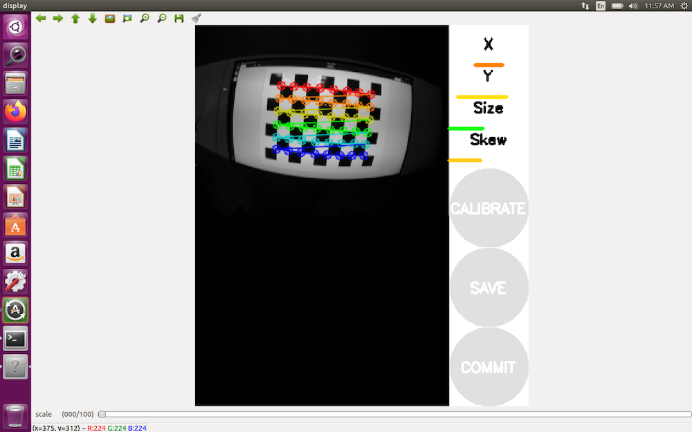

# Калибровка камеры

Калибровка камеры может значительно повысить качество работы модулей, связанным с компьютерным зрением: [распознавание ArUco-маркеров](aruco.md) и [Optical Flow](optical_flow.md).

При калибровке камеры подбираются параметры, наиболее хорошо описывающие конкретный установленный объектив. Данные параметры включают в себя фокусные расстояния, расположение точки principal point (которое зависит от того, насколько ровно по центру установлен объектив), коэффициенты дисторсии *D*. Подробнее про использующуюся модель искажений камеры можно прочитать в [документации OpenCV](https://docs.opencv.org/2.4/modules/calib3d/doc/camera_calibration_and_3d_reconstruction.html).

Существует несколько инструментов, которые позволяют откалибровать камеру и прописать вычисленные параметры в систему. Обычно, они используют калибровочные изображения: "шахматные доски" (*Chessboard*), а так же комбинации шахматной доски и сетки ArUco-маркеров ([*ChArUco*](https://docs.opencv.org/3.4/df/d4a/tutorial_charuco_detection.html)).

## ROS-пакет camera_calibration

Основной туториал: http://wiki.ros.org/camera_calibration/Tutorials/MonocularCalibration.

Для калибровки камеры с использованием ROS-пакета camera_calibration необходим компьютер с установленным ОС GNU/Linux и [ROS Melodic](ros-install.md).



1. Используя Терминал, установите на компьютер пакет `camera_calibration`:

    ```bash
    sudo apt-get install ros-melodic-camera-calibration
    ```

2. Скачайте калибровочную доску – [`chessboard.pdf`](../assets/chessboard.pdf). Распечатайте доску на принтере либо выведите ее на экран компьютера.

3. Подключитесь к [Wi-Fi Клевера](wifi.md).

4. Запустите калибровку (на компьютере):

   ```bash
   ROS_MASTER_URI=http://192.168.11.1:11311 rosrun camera_calibration cameracalibrator.py --size 6x8 --square 0.108 image:=/main_camera/image_raw camera:=/main_camera
   ```

   > **Note** Вместо значения *0.108* укажите реальный размер квадрата на распечатанной доске или на экране (в метрах). Например, значение *0.03* будет соответствовать 3 см.

5. Когда программа для калибровки запустится, начните перемещать дрон таким образом, чтобы калибровочная доска попадала в кадр под разными углами.

   * Перемещайте калибровочную доску в левый, правый, верхний и нижний торец кадра.
   * Вращайте калибровочную доску вокруг всех 3-х осей.
   * Отдаляйте и приближайте камеру к калибровочной доске.

6. Нажмите кнопку *CALIBRATE*, когда она станет активной. Процесс вычисления параметров калибровки займет несколько минут.

   Когда калибровка завершится, в терминале вы увидите полученные параметры. В окне отобразится изображение с выправленными искажениями. При успешной калибровке все реальные прямые линии должны остаться прямыми на полученном изображении.

7. Нажмите *COMMIT*, чтобы сохранить полученные параметры калибровки. Результат будет записан в файл калибровки основной камеры Клевера:
`/home/pi/catkin_ws/src/clover/clover/camera_info/fisheye_cam.yaml`.
