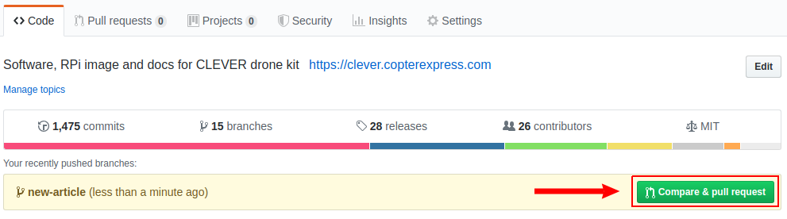

# Вклад в Клевер

Клевер – это, по большей части, [open source](https://ru.wikipedia.org/wiki/Открытое_программное_обеспечение) и [open hardware](https://ru.wikipedia.org/wiki/Открытое_аппаратное_обеспечение) проект, который ставит своей целью уменьшение порога входа в разработку проектов, связанных с летающей робототехникой. Вы можете внести свой вклад, предлагая исправления и улучшения в документацию и ПО Клевера.

> **Note** Для внесения предложений по изменению документации или ПО Клевера необходимо иметь аккаунт на [GitHub](https://github.com).

## Markdown

Вся документация Клевера написана в широко распространенном формате [Markdown](https://ru.wikipedia.org/wiki/Markdown). В Интернете существует множество руководств по нему.

На русском: https://guides.hexlet.io/markdown/.

На английском: https://www.markdownguide.org/getting-started, https://github.com/adam-p/markdown-here/wiki/Markdown-Cheatsheet.

Для удобного редактирования текста, вы можете использовать текстовые редакторы с поддержкой Markdown: [Typora](https://typora.io), [Dillinger](https://dillinger.io/) (веб), [VSCode](https://code.visualstudio.com) с плагином [Markdown Editor](https://marketplace.visualstudio.com/items?itemName=MadsKristensen.MarkdownEditor).

Для VSCode также рекомендуется использование плагина [Code Spell Checker](https://marketplace.visualstudio.com/items?itemName=streetsidesoftware.code-spell-checker) ([словарь для русского языка](https://marketplace.visualstudio.com/items?itemName=streetsidesoftware.code-spell-checker-russian)).

Для локальной сборки статического сайта документации необходимо использовать утилиту [`gitbook-cli`](https://github.com/GitbookIO/gitbook-cli).

## Исправление ошибок в документации

Если вы нашли ошибку в документации или хотите ее улучшить, используйте механизм **Pull Request**'ов.

1. Найдите файл с интересующей вас статьей в репозитории – https://github.com/CopterExpress/clover/tree/master/docs.
2. Нажмите кнопку "Редактировать".

    

3. Внесите необходимые изменения.
4. Нажмите кнопку "Propose file change".
5. Опишите ваше изменение и нажмите кнопку "Create Pull Request".
6. Ожидайте принятия ваших изменений :)

Более подробную информацию о Pull Request'ах смотрите [на GitHub](https://help.github.com/articles/about-pull-requests/) (англ.) или в [документации по git](https://git-scm.com/book/ru/v2/GitHub-Внесение-собственного-вклада-в-проекты) (русск.).

## Добавление статьи в GitBook

> **Note** Если вы реализовали собственный интересный проект на Клевере, вы можете добавить статью о нем в раздел "Проекты на базе Клевера".

Подготовьте вашу статью и пришлите Pull Request с ней в [репозиторий Клевера](https://github.com/CopterExpress/clover).

1. Сделайте форк репозитория Клевера:

    

2. Склонируйте форк на компьютер:

    ```bash
    git clone https://github.com/<USERNAME>/clover.git
    ```

3. Перейдите в директорию с форком и создайте новую ветку с названием вашей статьи (например `new-article`):

    ```bash
    git checkout -b new-article
    ```

4. Напишите новую статью в разделе `docs/ru` или `docs/en` в формате [Markdown](https://ru.wikipedia.org/wiki/Markdown) (например `docs/ru/new_article.md`). Не забудьте указать контактную информацию (e-mail / Telegram /...) для авторских статей.
5. Поместите дополнительные визуальные материалы в папку `docs/assets` и оформите на них ссылки в вашей статье.
6. Добавьте статью в файл оглавления `SUMMARY.md` в том разделе, где вы её написали (например в `docs/ru/SUMMARY.md`):

    ```bash
    ...
    * Дополнительные материалы
      * [Олимпиада НТИ 2019](nti2019.md)
      * [Вклад в Клевер](contributing.md)
      * [Новая статья](new_article.md)
      * [Сборка и модификация образа Клевера](image_building.md)
      * [Прошивка ESC контроллеров](esc_firmware.md)
    ...
    ```

7. Сохраните состояние ваших изменений локально:

    ```bash
    git add docs/
    git commit -m "Add new article for Clover"
    ```

8. Загрузите вашу новую ветку с изменениями на ваш GitHub репозиторий с форком Клевера:

    ```bash
    git push -u origin new-article
    ```

9. Перейдите на web страницу вашего форка и сделайте `pull request` вашей ветки в master Клевера:

    

    

10. Дождитесь комментариев на свою статью, сделайте правки, если потребуется.
11. Порадуйтесь своей новой полезной статье, опубликованной на https://clover.coex.tech !

## Простой способ

Если вышеприведенные инструкции для вас оказываются слишком сложными, отправляйте правки или новые статьи по e-mail (<a href="mailto:okalachev@gmail.com">okalachev@gmail.com</a>) или в Telegram (пользователь <a href="tg://resolve?domain=okalachev">@okalachev</a>).

## Публикация пакетов

Вы также можете опубликовать собственный пакет, расширяющий функциональность Клевера, в [Debian-репозитории COEX](packages.md).
