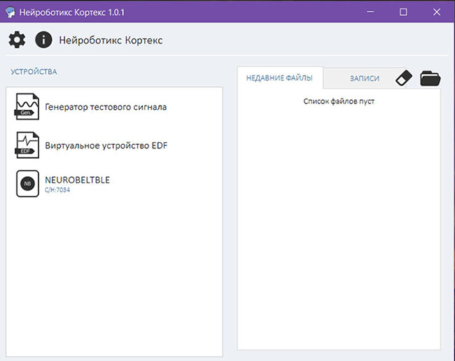
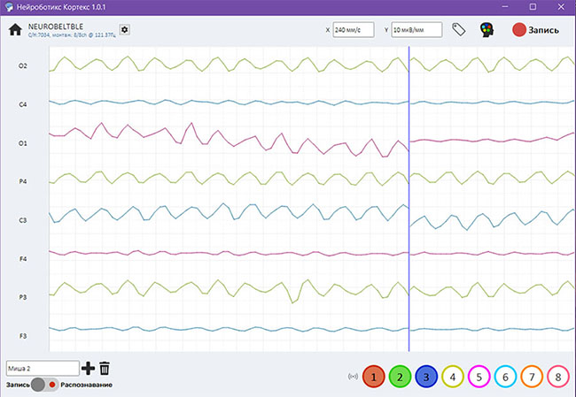
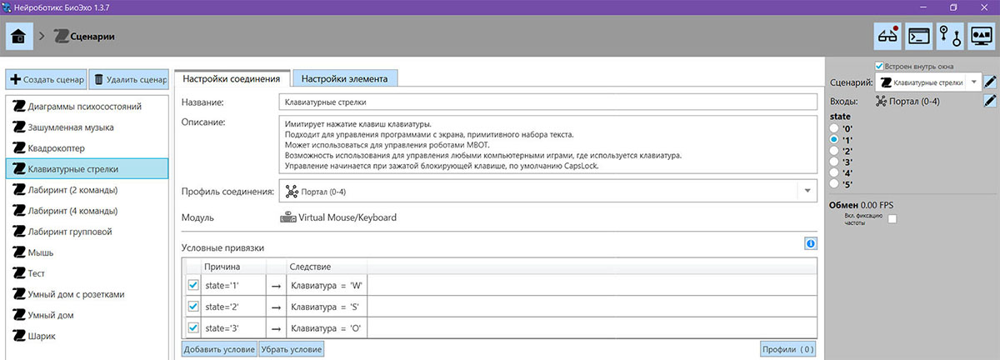

# Управление дроном силой мысли

## Введение

Нейронные сети и дроны достаточно быстро развиваются в мире технологий. В управлении квадрокоптером за основу была взята искусственная нейронная сеть, состоящая из искусственных нейронов (программируемая система, которая имитирует подобие биологических нейронов).

Нейронная сеть разделяется на несколько слоев:

1. входной слой;
2. скрытый слой;
3. выходной слой.

Целью данного проекта было создание управления Клевер 4 с помощью нейрошлема от компании «NEUROBOTICS». Мы использовали NeuroPlay-8M с 8-ми канальной системой беспроводной регистрации ЭЭГ данных человека на (гелевых) электродах. Программное обеспечение имеет поддержку устройств серии Нейробелт с интерфейсом Bluetooth 4.0 (BLE).

Видеодемонстрация:

<iframe width="560" height="315" src="https://www.youtube.com/embed/uLR5NNcekfA" frameborder="0" allow="accelerometer; autoplay; encrypted-media; gyroscope; picture-in-picture" allowfullscreen></iframe>

## Установка

Для начала нужно установить необходимые программы:

1. Cortex.
2. BioEcho.

## Использование

Программное обеспечение Cortex: классифицирует сигнал мозга в эмоцию.

Программное обеспечение BioEcho: эмуляция физической клавиатуры.

Далее данные поступают на клавиатуру с помощью BioEcho и предаются в ROS.

Основной код работает на Raspberry Pi и передает команды в ROS, имитируя нажатие соответствующих клавиш. Для управления дроном оператор использует устойчивые внутренние физиологические и психологические реакции, при которых произвольное внимание концентрируется на том или ином процессе и состоянии. В рамках реализации проекта были использованы следующие состояния:

1. Напряжение – вперед (клавиша «w»).
2. Радость – yaw на 90° (клавиша «s»).
3. Расслабление – удержание позиции (клавиша «o»).

Для корректного перехода между эмоциями мы использовали «нейтральное» состояние, в качестве которого может выступить любой эмоциональный процесс, который не был задействован в управлении дроном. Также нужно запомнить, что оператор не использует мышцы и движение глаз. Скорость переключения между эмоциями оператора составляет около секунды, а между командами движения более двух секунд.

## Код

Код для управления квадрокоптером, написанный на языке Python, [находится на сайте GitHub](https://github.com/hany606/COEX-Internship19/tree/master/projects/NeuroHelmet).
