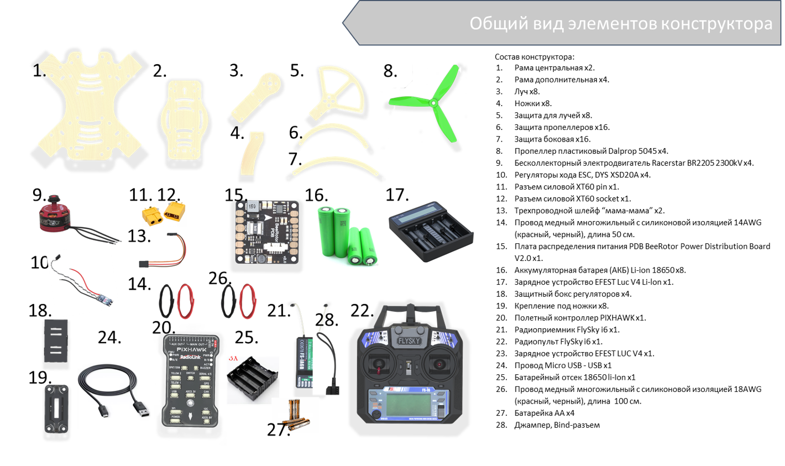

# Комплектация

В составе набора имеется 4 дополнительных рамы (поз. 2).
Они абсолютно одинаковые.
Поэтому для дальнейшего удобства понимания инструкции условно разделим их на верхнюю и нижнюю дополнительные рамы

