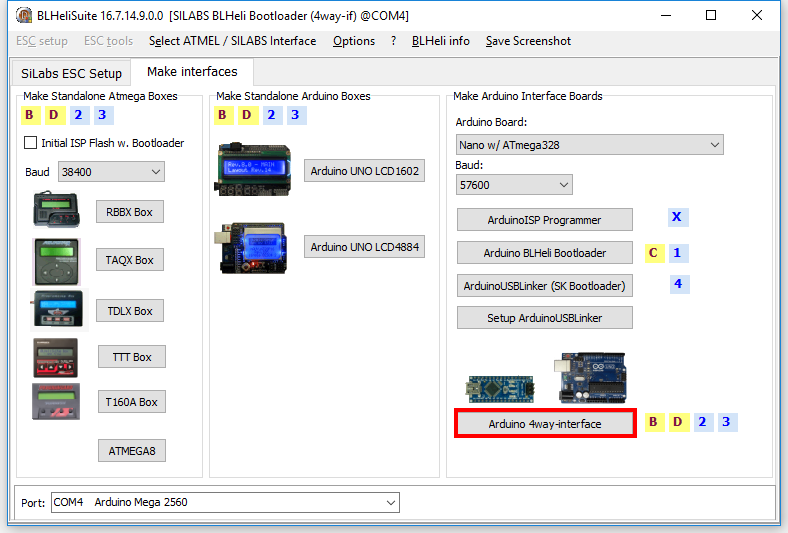
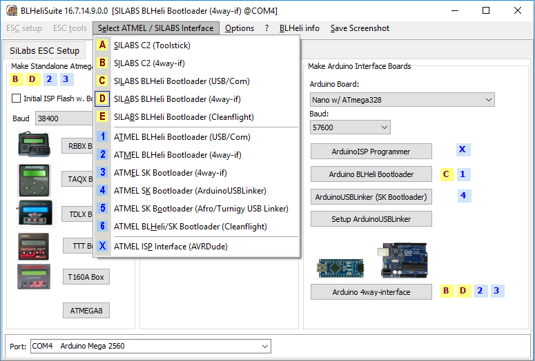
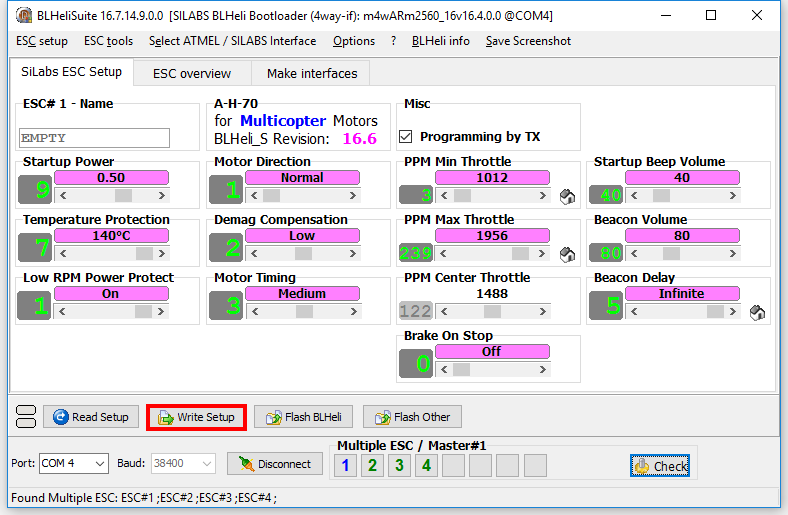

# Прошивка ESC регуляторов с помощью BLHeliSuite

Хорошая статья, которая объясняет принцип работы ESC \(Electric speed controller\) регуляторов: [http://www.avmodels.ru/engines/electric/esc.html](http://www.avmodels.ru/engines/electric/esc.html)

## Зачем перепрошивать?

Иногда требуется поменять один из параметров регулятора, например направление вращения мотора, минимальная и максимальная скважности PPM сигнала на входе контроллера, уровень громкости звуковых сигналов, издаваемых мотором или время, через которое регулятор начинает напоминать, что он включён.

## Программа для прошивки регуляторов

Для прошивки самых разнообразных ESC регуляторов существует программа [BLHeliSuite](https://github.com/4712/BLHeliSuite) \(для Windows\).

Для запуска программы \(BLHeliSuite.exe\) необходимо распаковать архивы BLHeliAtmelHEX.zip и BLHeliSilabsHEX.zip в папку с программой.

## Программатор для прошивки регуляторов

Чтобы прошить регулятор, необходим программатор, который умеет общаться с контроллером регулятора по 1-wire протоколу. Один из способов добыть программатор - взять подвернувшуюся под руку ардуинку и прошить её специальной прошивкой. В BLHeliSuite есть инструмент для создания интерфейсов программаторов.

Создание программатора на примере Arduino Mega.

1. Запустите программу BLHeliSuite и выберите вкладку Make interfaces.

   

2. Подключите Arduino к компьютеру, при необходимости посмотрите в диспетчере устройств номер COM порта, к которому подключена плата.

3. Нажмите Arduino 4way-interface в разделе Make Arduino Interface Boards и выберите файл прошивки. После выбора файла начнётся прошивка контроллера.

   
   
   

4. После прошивки Arduino вернитесь на вкладку Silabs ESC Setup и подключитесь к Arduino, предварительно выбрав интерфейс программатора 4way-if и COM порт Arduino.

   
   

## Подключение ESC регуляторов к Arduino

Для прошивки или изменения настроек регуляторов необходимо подключить сигнальные порты (обычно белого цвета) ESC регуляторов к портам Arduino, предварительно посмотрев в мануале (см. рисунок ниже), какие порты используются для соединения с регуляторами. Так же нужно соединить GND Arduino с землёй одного из регуляторов (обычно черного цвета). Регуляторы должны быть подключены к питанию, а если к регуляторам подключены моторы, **на них не должно быть винтов**.

В случае с Arduino Mega, сигнальные порты регуляторов подключаются к портам D43-D49 и D51.

## Изменение настроек ESC регуляторов

Для загрузки информации о версии прошивки и настроек регуляторов нужно нажать на кнопку Check.

Основные параметры, которые нас интересуют, это:

* Motor Direction \(Normal или Reversed\) - отвечает за направление вращения моторов. Удобно настраивать, если нет желания перепаивать неправильно припаянный мотор.
* PPM Min и Max Throttle - отвечает за минимальный и максимальный сигнал газа
* Startup Beep Volume - громкость стартового сигнала. В версии прошивки 16.65 добавлена возможность изменения стартовой мелодии. Подробнее об этом написано [здесь](https://github.com/cleanflight/blheli-multishot/releases). Например, можно в качестве мелодии запуска установить имперский марш из Звёздных Войн или главную тему Игры престолов.
* Beacon Volume - громкость обнаруживающего сигнала. Когда моторы не крутятся некоторое время и регулятор не используется, он начинает напоминать о себе писком моторов.
* Beacon Delay - время бездействия, после которого включается обнаруживающий сигнал. При разработке он может хорошенько надоедать, поэтому его можно выставлять в бесконечность.

Самый левый мотор в списке моторов \(Multiple ESC\) считается главным \(мастер\). Нажимая на номера моторов, можно включать/выключать возможность записи в них настроек. После изменения необходимых параметров можно записать в нужные моторы настройки, нажав на кнопку Write Setup.

Для отображения настроек со всех регуляторов одновременно можно воспользоваться вкладкой ESC Overview.

## Прошивка ESC регуляторов

Файлы с прошивками регуляторов находятся [здесь](https://github.com/cleanflight/blheli-multishot/tree/master/BLHeli_S%20SiLabs/Hex%20Files).

Для перепрошивки регуляторов нужно нажать на кнопку Flash BLHeli и выбрать файл прошивки с типом контроллера, название которого указано в рамке названия прошивки и находится сверху во вкладке Silabs ESC Setup (в случае контроллера, который используется в конструкторе Клевер 2, это A-H-70).

Для перепрошивки отдельного регулятора нужно сделать все остальные неактивными.

## Видеоинструкция по перепрошивке ESC регуляторов

Для лучшего понимания того, что описано в статье, рекомендуем посмотреть наглядное руководство по подключению электроники и прошивке регуляторов на английском языке на [youtube](https://www.youtube.com/watch?v=i6lhMcQLRSU&feature=youtu.be).
