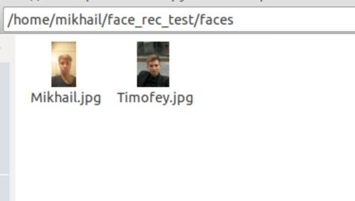
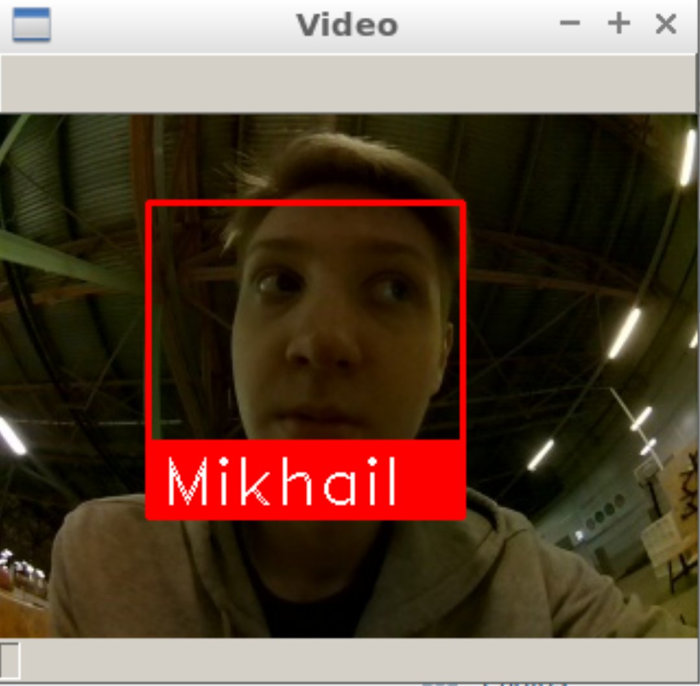
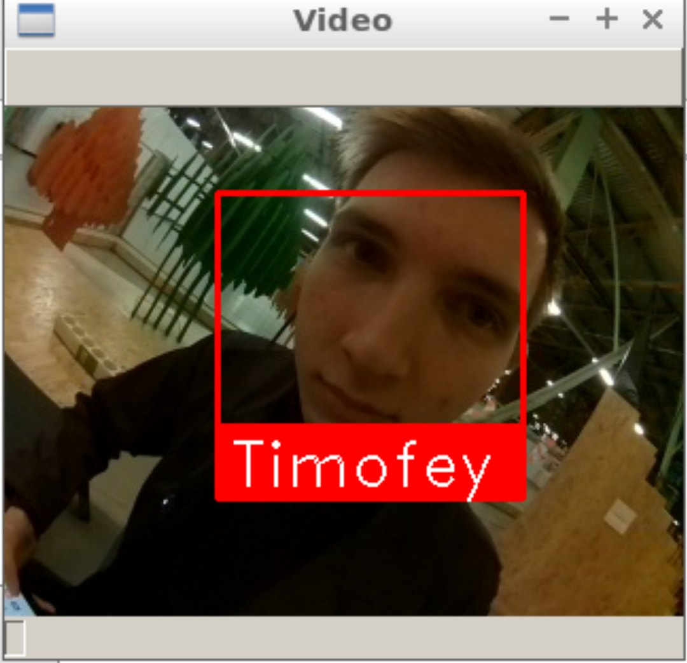
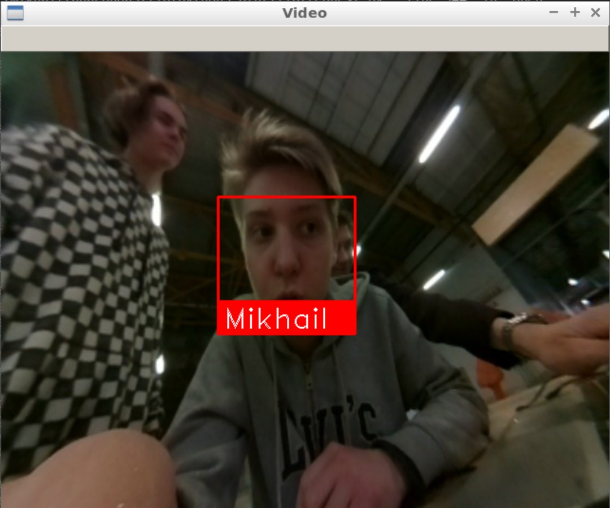
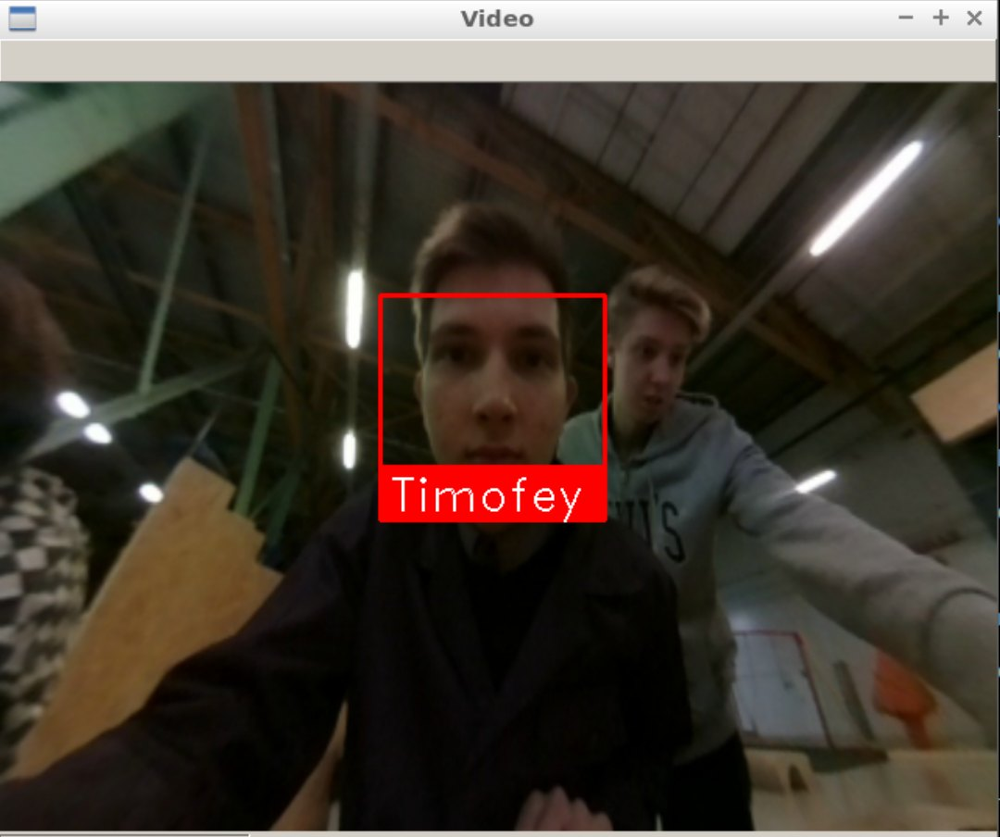

# Система распознавания лиц

## Введение

В последнее время системы распознавания лиц используются все шире, область применения этой технологии поистине огромна: от обычных селфи-дронов до дронов-полицейских. Ее интеграция в различные устройства проводится повсеместно. Сам процесс распознавания реально завораживает, и это сподвигло меня сделать проект связанный именно с этим.  Целью моего стажерского проекта является создание простой open source-ной системы распознавания лиц с квадрокоптера Клевер. Данная программа берет изображения с камеры квадрокоптера, а его обработка происходит уже на компьютере. Поэтому все оставшиеся инструкции выполняются на ПК.

## Разработка

Первой задачей было найти алгоритм самого распознавания. В качестве пути решения проблемы было выбрано использовать [готовое API для Python](https://github.com/ageitgey/face_recognition). Данное API сочетает в себе ряд преимуществ: скорость и точность распознавания, а также простота использования.

## Установка

Для начала нужно установить все необходимые библиотеки:

```bash
pip install face_recognition
pip install opencv-python
```

Затем скачать сам скрипт из репозитория:

```bash
git clone https://github.com/mmkuznecov/face_recognition_from_clever.git
```

## Объяснение кода

Подключаем библиотеки:

```python
import face_recognition
import cv2
import os
import urllib.request
import numpy as np
```

***Данный кусок кода предназначен для Python 3. В Python 2.7 подключаем urllib2 вместо urllib:***

```python
import urllib2
```

Создаем список кодировок изображений и список имен:

```python
faces_images=[]
for i in os.listdir('faces/'):
    faces_images.append(face_recognition.load_image_file('faces/'+i))
known_face_encodings=[]
for i in faces_images:
    known_face_encodings.append(face_recognition.face_encodings(i)[0])
known_face_names=[]url
for i in os.listdir('faces/'):
    i=i.split('.')[0]
    known_face_names.append(i)
```

***Дополнение: все изображения хранятся в папке faces в формате name.jpg***




Инициализируем некоторые переменные:

```python
face_locations = []
face_encodings = []
face_names = []
process_this_frame = True
```

Берем изображение с сервера и преобразуем его в cv2 формат:

```python
req = urllib.request.urlopen('http://192.168.11.1:8080/snapshot?topic=/main_camera/image_raw')
arr = np.asarray(bytearray(req.read()), dtype=np.uint8)
frame = cv2.imdecode(arr, -1)
```

***Для Python 2.7:***

```python
req = urllib2.urlopen('http://192.168.11.1:8080/snapshot?topic=/main_camera/image_raw')
arr = np.asarray(bytearray(req.read()), dtype=np.uint8)
frame = cv2.imdecode(arr, -1)
```

Объяснение дальнейшего кода можно найти на GitHub’е используемого API в комментариях к [следующему скрипту](https://github.com/ageitgey/face_recognition/blob/master/examples/facerec_from_webcam_faster.py)

## Использование

Достаточно подключиться к "Клеверу" через Wi-Fi и проверить, корректно ли работает видеострим с камеры.

Затем просто запускаем скрипт:

```bash
python recog.py
```

И на выходе:





## Возможные трудности

При запуске скрипта может выскочить следующая ошибка:

```python
    known_face_encodings.append(face_recognition.face_encodings(i)[0])
IndexError: list index out of range
```

В этом случае постарайтесь переделать изображения  в папке faces, возможно из-за плохого качества программа не распознает лиц на изображениях.

## Использование калибровки

Для повышения точности распознавания можно использовать калибровку камеры. Модуль для калибровки  можно установить, используя [специальный пакет](https://github.com/tinderad/clever_cam_calibration). Инструкцию по установке и использованию можно найти в файле calibration.md. Программа с использованием калибровочного пакета называется recog_undist.py

**Краткое пояснение кода:**

Подключаем установленный пакет:

```python
import clever_cam_calibration.clevercamcalib as ccc
```

Добавляем следующие строки:

```python
height_or, width_or, depth_or = frame.shape
```

Таким образом получаем информацию о размере изображения, где height_or-это высота оригинального изображения в пикселях, а width_or-ширина.
Затем исправляем искажения оригинального изображения и получаем уже его параметры:

```python
if height_or==240 and width_or==320:
    frame=ccc.get_undistorted_image(frame,ccc.CLEVER_FISHEYE_CAM_320)
elif height_or==480 and width_or==640:
    frame=ccc.get_undistorted_image(frame,ccc.CLEVER_FISHEYE_CAM_640)
else:
    frame=ccc.get_undistorted_image(frame,input("Input your path to the .yaml file: "))
height_unz, width_unz, depth_unz = frame.shape
```

***В данном случае мы передаем аргумент ссс.CLEVER_FISHEYE_CAM_640, т.к. разрешение изображения в приведенном примере составляет 640x480, также можно использовать ссс.CLEVER_FISHEYE_CAM_320 для разрешения 320x240, в противном случае необходимо в качестве второго аргумента передать путь до калибровочного .yaml файла.***

И, наконец, возвращаем изображение к изначальному размеру:

```python
frame=cv2.resize(frame,(0,0), fx=(width_or/width_unz),fy=(height_or/height_unz))
```

Благодаря этому можно значительно повысить точность распознавания, т.к. обрабатываемое изображение будет уже не так сильно искажено.



