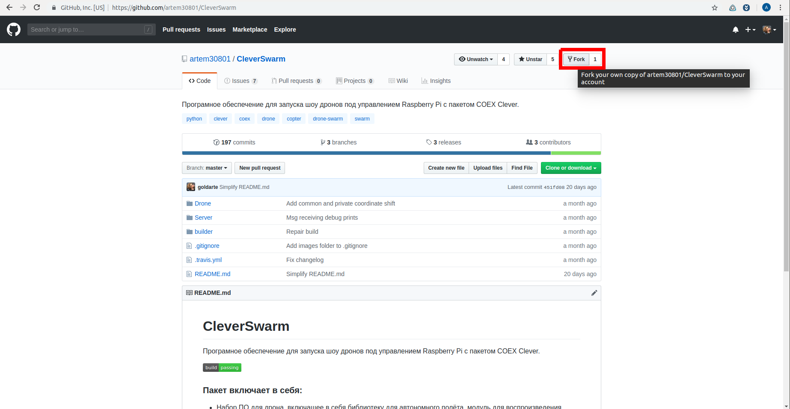
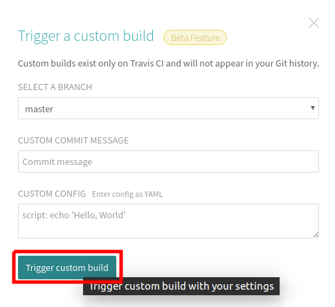
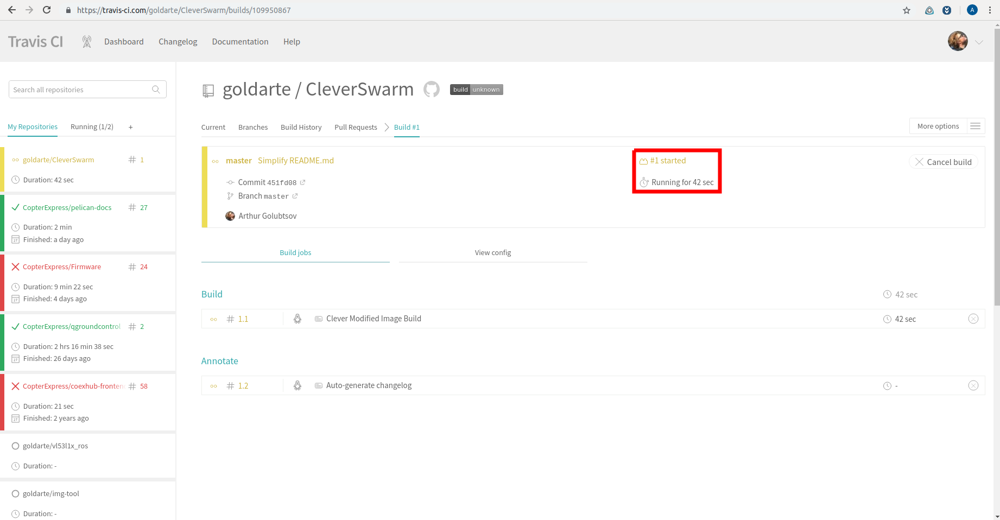
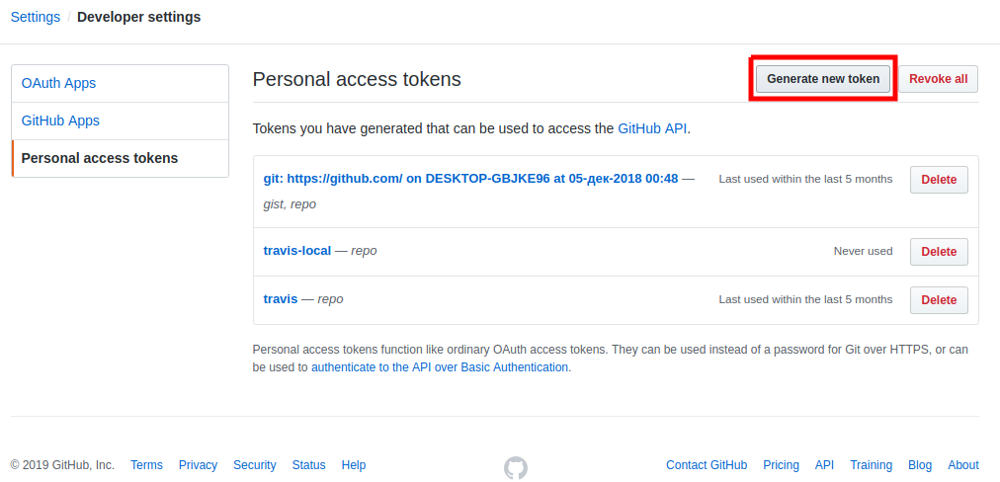
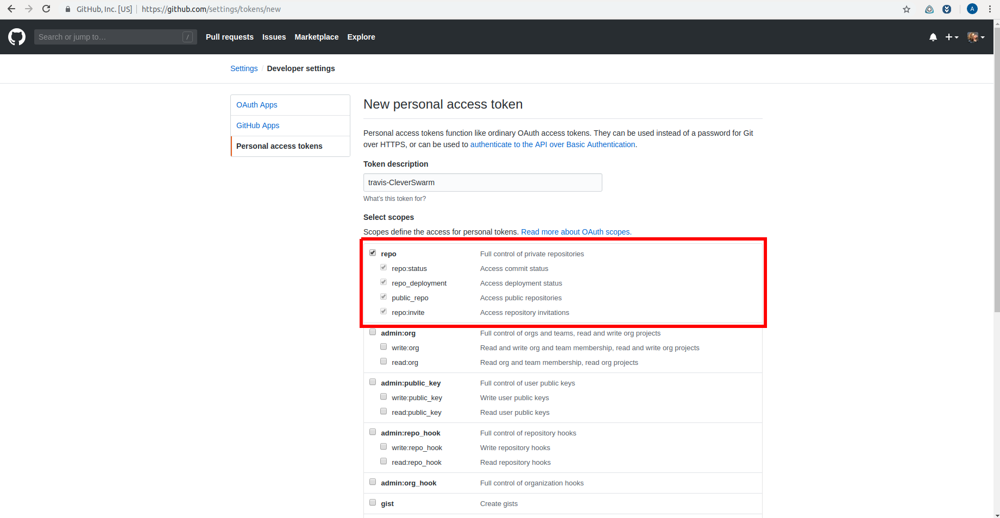
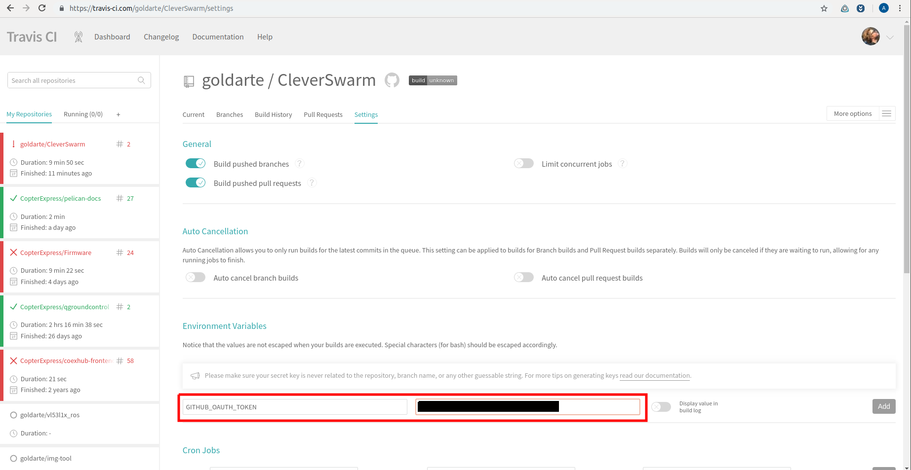

# Автоматическая сборка и модификация образа Клевера

Иногда возникает необходимость в сборке модифицированного образа системы, например для [своего проекта](https://github.com/artem30801/CleverSwarm) на базе [Клевера](https://github.com/copterexpress/clover). За основу можно взять, например, чистый образ Raspbian Stretch и модифицировать его с нуля, пройдя те же этапы, через который проходит сборка образа Клевера, добавив свои модификации. Однако на данный момент времени сборка образа Клевера занимает [чуть больше часа](https://travis-ci.org/CopterExpress/clover), что превышает ограничения бесплатной сборки в Travis \(50 минут\). Соответственно для проектов на базе Клевера имеет смысл брать за основу уже готовый образ и кастомизировать его. Концепция и основные этапы для автоматизированной сборки изложены ниже.

## Концепция

Имеется [Docker](https://www.docker.com/) образ, который содержит инструментарий для выполнения скриптов, копирования файлов и увеличения/сжатия размера образа системы на требуемой платформе для сборки \(например сборка для Raspberry Pi 3 осуществляется через qemu-arm-static, пример Docker образа для сборки находится [здесь](https://hub.docker.com/r/goldarte/img-tool)\). При запуске Docker образа выполняется скрипт `builder/image-build.sh`, в котором описан процесс сборки \(например скачивание опорного образа - увеличение свободного места на образе - установка необходимого софта - сжатие образа\), в результате которого создаётся файл образа системы. Триггер сборки, запуск Docker образа для сборки, выкладка образа осуществляется с помощью CI \(continuous integration\) системы [Travis](https://travis-ci.com/).

## Добавление скриптов сборки

1. Для осуществления сборки образа добавьте в свой проект build скрипты, модифицирующие исходный образ. За основу можно взять скрипты из репозитория Клевера \(папка [builder](https://github.com/CopterExpress/clover/tree/master/builder)\) или из репозитория шоу дронов на основе Клеверов \(тоже папка [builder](https://github.com/artem30801/CleverSwarm/tree/master/builder)\). Опорный скрипт, который исполняется безусловно Docker образом в этих проектах - `builder/image-build.sh`.
2. Для автоматического запуска сборки в облаке добавьте в свой проект `.travis.yml` файл, описывающий последовательность этапов выполнения сборки и правила для выкладки образов. [Пример](https://github.com/CopterExpress/clover/blob/master/.travis.yml) из репозитория Клевера, [пример](https://github.com/artem30801/CleverSwarm/blob/master/.travis.yml) из репозитория шоу дронов. Документация по составлению `.travis.yml` файла находится [здесь](https://docs.travis-ci.com/user/tutorial/).

## Настройка инструмента сборки travis-ci.com

1. Войдите в [Travis](http://travis-ci.com) через свой GitHub аккаунт.
2. Проверьте, что файл `.travis.yml` добавлен правильно: выберите свой проект, нажмите Trigger build из выпадающего меню справа сверху. Сборка должна начаться и успешно завершиться через некоторое время, если всё правильно.
3. Настройте проект. Основные настройки можно оставить по умолчанию. Если необходимы ключи авторизации \(токены\) для доступа к репозиторию \(например для того, чтобы выложить образ прикреплённым файлом в релиз\), нужно сгенерировать их в своём аккаунте и добавить под названием переменной, которая используется для передачи токена.

## Запуск сборки в облаке travis-ci.com

По умолчанию скрипт сборки из `.travis.yml` файла выполняется автоматически при любом изменении GitHub репозитория. Есть возможность добавить скрипты, которые будут выполняться только при создании релиза \(публикации тега\), пример [здесь](https://github.com/CopterExpress/clover/blob/master/.travis.yml#L35).

## Запуск сборки на локальной машине

Если есть необходимость собрать образ быстрее, чем в облаке, или поэкспериментировать со сборкой локально, можно запустить Docker образ на локальной машине. Для этого необходимо в консоли перейти в папку с репозиторием, где прописаны скрипты автоматической сборки, и запустить оттуда Docker, например \(подробнее [здесь](https://github.com/goldarte/img-tool/blob/master/README.md)\):

```bash
cd repo-w-instructions

docker run --privileged -it --rm -v /dev:/dev -v $(pwd):/mnt goldarte/img-tool:v0.5
```

## Пример запуска автоматической сборки образа из форка репозитория шоу дронов

* Сделайте форк [репозитория](https://github.com/artem30801/CleverSwarm):

  

* Склонируйте репозиторий к себе на компьютер:

  ```bash
  git clone <адрес репозитория>
  ```

* Зайдите на travis-ci.org под своим аккаунтом GitHub.
* Выберите среди проектов форк репозитория шоу дронов и запустите тестовую сборку, нажав Trigger build из выпадающего меню:

  
  

* Проверьте, что сборка запустилась:

  

* Добавьте ключ аутентификации к вашему репозиторию для прикрепления файла образа к релизу. Зайдите в [настройки токенов](https://github.com/settings/tokens) своего аккаунта и сгенерируйте новый токен для доступа к вашему репозиторию:

  
  
  

* Скопируйте получившийся токен:

  

* Перейдите в настройки сборки travis-ci.com и добавьте скопированный токен под именем `GITHUB_OAUTH_TOKEN`:

  

* В терминале перейдите в папку со скопированным репозиторием, создайте и опубликуйте тег для создания пре-релиза, автоматической сборки и выкладки образа на GitHub:

  ```
  git tag <имя тега>

  git push --tags
  ```

* Дождитесь окончания сборки образа и проверьте раздел Releases в вашем репозитории:

  
  

* Нажмите на кнопку Draft a new release и выпустите [pre-release](https://github.com/goldarte/CleverSwarm/releases/tag/v0.2-test.1) или release собранного образа и исходным кодом:

  
