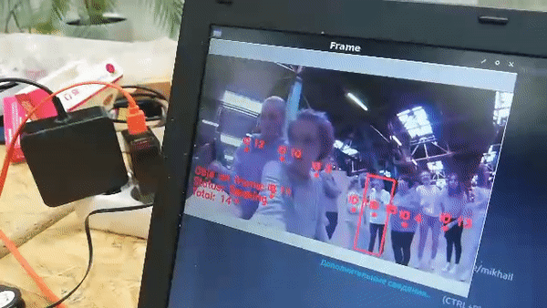

# Система распознавания и подсчета количества объектов

## Введение

Системы компьютерного зрения все шире используются для решения повседневных задач в самых различных сферах, начиная от промышленности, заканчивая медициной. Алгоритмы распознавания образов позволяют идентифицировать объекты, определять их тип, предоставляют необходимую качественную и количественную информацию. Целью данного проекта было создание системы подсчета количества объектов (людей, машин), используя технологии компьютерного зрения.

## Установка

Для начала нужно установить все необходимые библиотеки:

```bash
pip install opencv-contrib-python imutils matplotlib dlib
```

***Библиотека dlib устанавливается достаточно долго, так что не стоит пугаться того, что процесс зависает.***

Затем скачать программу из репозитория:

```bash
git clone https://github.com/mmkuznecov/objects_counting_from_clever.git
```

## Примеры работы

Система может быть адаптирована для разных условий, съёмка может производиться как из статичного положения:

<iframe width="560" height="315" src="https://www.youtube.com/embed/RUVNRlA_dwY" frameborder="0" allow="accelerometer; autoplay; encrypted-media; gyroscope; picture-in-picture" allowfullscreen></iframe>

Так и в динамическом полёте:

<iframe width="560" height="315" src="https://www.youtube.com/embed/jNcQ9aJZUh8" frameborder="0" allow="accelerometer; autoplay; encrypted-media; gyroscope; picture-in-picture" allowfullscreen></iframe>

## Использование

Подключитесь к Клеверу и проверьте, передается ли изображение с камеры. Для использования скрипта просто перейдите в папку, куда был скачан скрипт и пропишите в консоли, где op - название выходного видео:

```bash
python count.py -o op.avi
```

По умолчанию программа будет считать количество людей. Для того чтобы прописать распознавание только определенного объекта, нужно приписать в конце тип объекта для распознавания, например, следующая команда позволит распознавать машины:

```bash
python count.py -o op.avi -t car
```

Полный список распознаваемых объектов приведен ниже:

background, aeroplane, bicycle, bird, boat,
bottle, bus, car, cat, chair, cow, diningtable,
dog, horse, motorbike, person, pottedplant, sheep,
sofa, train, tvmonitor

Итогом работы программы будет записанное видео с метками, отмечающими распознавание объектов и их номер, а также .png изображение, на котором показана информация о времени записи видео, количестве распознанных объектов в разное время.


По вопросам пишите в Telegram @mmkuznecov.

## Версия с HD-Link

Если имеется настроенная система HD-Link для передачи видео в хорошем качестве на большие расстояния, можно использовать следующие скрипты для обработки поступающего видео.

Для установки и настройки оборудования можно обратиться к [документации](https://github.com/HD-Fpv/Open.HD). Там можно найти подробную информацию о настройке конфигурации, а также ссылку для скачивания образа для Raspberry Pi. Подключиться к GroundPi можно либо по Ethernet, либо по Wi-Fi, предварительно настроив в образе соответствующие параметры подключения. Во втором случае, после подключения к питанию GroundPi, должна появиться сеть Open.HD. Пароль для подключения к ней **wifiopenhd**

## Для поштучного подсчета

Для запуска этой версии необходимо скачать программу из репозитория:

```bash
git clone https://github.com/mmkuznecov/HD_Link_counting.git
```

На пк должен быть установлен Python. Для установки всех необходимых модулей, нужно перейти в папку, куда была скачана программа и, чтобы установить все необходимые модули, прописать в консоли:

```bash
pip install -r requirements.txt
```

Перед тем, как запускать программу, надо убедиться, что ПК связан с GroundPi по Ethernet или Wi-Fi.

Если работать из под операционной системы Windows, чтобы запустить работу программы, достаточно дважды кликнуть по файлу run.bat.

На обработанных кадрах отображается количество распознанных с начала работы объектов (Total), а также количество объектов в конкретном кадре (Objs on frame).

Пример работы:



***На изображении есть еще один параметр - Status, но он был убран.***

## Для обработки больших групп людей

Скачиваем программу из репозитория:

```bash
git clone https://github.com/mmkuznecov/HD_Link_crowd.git
```

Аналогичным образом устанавливаем все необходимые модули через requirements.txt, проверяем подключение, запускаем программу. Также надо будет [скачать модель](https://drive.google.com/file/d/1KY11yLorynba14Sg7whFOfVeh2ja02wm/view?usp=sharing) и поместить ее в папку.

Через определенные промежутки времени, программа сохраняет снимки, полученные с камеры, при этом обрабатывет их и выводит данные о количестве людей.

Пример работы:

Оригинал изображения:


Тепловая карта плотности скопления людей:


В итоге получается примерно 1562 человека:


